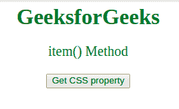
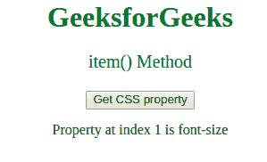

# CSSStyleDeclaration item()方法

> 原文:[https://www . geesforgeks . org/csstyle declaration-item-method/](https://www.geeksforgeeks.org/cssstyledeclaration-item-method/)

**项()**方法用于**通过索引从 CSS 声明块中返回***CSS 的属性名。*

**语法:**

```html
style.item(index)
```

**参数:**接受单个参数:

*   **索引:**这是一个必需的参数，包含一个代表 CSS 属性索引的数字。

**返回值:**以字符串的形式返回 CSS 属性的名称。

**例:**展示**工作项()方法**:

```html
<html>

<head>
    <style>
        body {
            text-align: center;
        }

        h1 {
            color: green;
        }
    </style>
</head>

<body>
    <h1>
      GeeksforGeeks
  </h1>

    <p id="p1"
       style="color:green; 
              font-size:20">
      item() Method
  </p>

    <button onclick="myFunction()">
        Get CSS property
    </button>

    <p id="gfg"></p>

    <!-- Script to get the property -->
    <script>
        function myFunction() {
            var x =
                document.getElementById("p1").style;

            var propertyName = x.item(1);
            document.getElementById("gfg").innerHTML =
                "Property at index 1 is " + propertyName;
        }
    </script>
</body>

</html>
```

**输出:**
**点击按钮前:**


**点击按钮后:**


**支持的浏览器:**

*   谷歌 Chrome
*   Internet Explorer 9.0
*   火狐浏览器
*   旅行队
*   歌剧