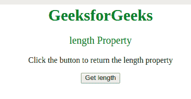
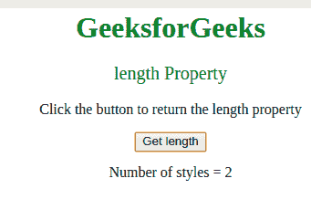

# CSS 样式声明长度属性

> 原文:[https://www . geesforgeks . org/CSS style declaration-length-property/](https://www.geeksforgeeks.org/cssstyledeclaration-length-property/)

**长度**属性用于查找*用于特定元素*的样式声明的数量。

**语法:**用于返回长度属性。

```html
element.style.length
```

**返回值:**以整数形式返回为元素指定的样式声明数。

**示例:**显示**长度属性**的工作情况:

```html
<html>

<head>
    <tiltle>
        CSS StyleDeclaration length Property
    </title>
    <style>
        body {
            text-align: center;
        }

        h1 {
            color: green;
        }
    </style>
</head>

<body>
    <h1>GeeksforGeeks</h1>

    <!-- Adding inline style -->
    <p id="p1" style=" color:green; 
            font-size:20;">
      length Property
  </p>

    <p>
      Click the button to 
      return the length property
  </p>

    <button onclick="myFunction()">
        Get length
    </button>

    <p id="gfg"></p>
    <!-- Script to get length property -->
    <script>
        function myFunction() {
            var x = document.getElementById(
              "p1").style.length;

            document.getElementById("gfg").innerHTML =
                "Number of styles = " + x;
        }
    </script>
</body>

</html>
```

**输出:**

*   点击按钮前:
    *   After clicking on the button:
    

    **支持的浏览器:***风格声明长度属性*支持的浏览器如下:

    *   谷歌 Chrome
    *   微软公司出品的 web 浏览器
    *   火狐浏览器
    *   歌剧
    *   旅行队