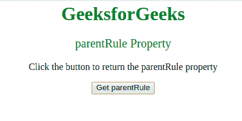
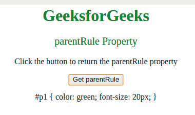

# CSS style declaration parent rule 属性

> 原文:[https://www . geesforgeks . org/csstyle declaration-parent rule-property/](https://www.geeksforgeeks.org/cssstyledeclaration-parentrule-property/)

**parentRule** 属性用于**返回** *表示包含选择器和声明块*的 CSS 规则集的 CSS 规则对象。

**语法:**用于返回 parentRule 属性。

```html
object.parentRule
```

**返回值:**返回 CSSRule 对象。

**示例:**要返回**父规则属性**:

```html
<html>

<head>
    <title>
        CSS | Style Declaration parentRule Property
    </title>
    <style>
        body {
            text-align: center;
        }

        h1 {
            color: green;
        }

        #p1 {
            color: green;
            font-size: 20;
        }
    </style>
</head>

<body>
    <h1>
      GeeksforGeeks
  </h1>

    <p id="p1">
      parentRule Property
  </p>

    <p>
      Click the button to 
      return the parentRule property
  </p>

    <button onclick="myFunction()">
        Get parentRule
    </button>

    <p id="gfg"></p>
    <!-- Script to get parentRule property -->
    <script>
        function myFunction() {
            var x = 
                document.styleSheets[
                  0].rules[2].style.parentRule.cssText;
            document.getElementById("gfg").innerHTML = x;
        }
    </script>
</body>

</html>
```

**输出:**

*   点击按钮前:
    
*   点击按钮后:
    

**支持的浏览器:**下面列出了*风格声明父规则属性*支持的浏览器:

*   谷歌 Chrome
*   Internet Explorer 9.0+
*   火狐浏览器
*   歌剧
*   旅行队