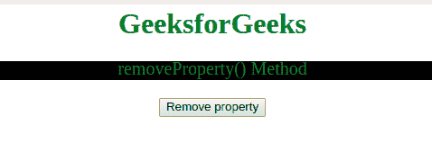
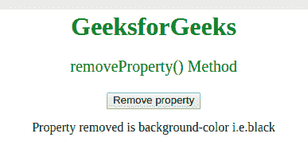

# CSS |样式声明 removeProperty()方法

> 原文:[https://www . geesforgeks . org/csstyle declaration-remove property-method/](https://www.geeksforgeeks.org/cssstyledeclaration-removeproperty-method/)

**removeProperty()** 方法用于**移除现有 CSS 属性**。

**语法:**用于移除指定的 CSS 属性。

```css
object.removeProperty(propertyname)
```

**参数:**接受单个参数:

*   **propertyname:** 它是一个必需的参数，包含一个代表要删除的属性名称的字符串。

**返回值:**以字符串形式返回被移除属性的值。

**示例:**展示 **removeProperty()方法**的工作原理:

```css
<html>

<head>
    <title>
        CSS | Style Declaration removeProperty() Method
    </title>
    <style>
        body {
            text-align: center;
        }

        h1 {
            color: green;
        }

        #p1 {
            color: green;
            font-size: 20;
            background-color: black;
        }
    </style>
</head>

<body>
    <h1>GeeksforGeeks</h1>

    <p id="p1"> removeProperty() Method</p>

    <button onclick="myFunction()">
        Remove property
    </button>

    <p id="gfg"></p>

    <!-- Script to remove the property -->
    <script>
        function myFunction() {
            var x = 
              document.styleSheets[
                0].cssRules[2].style;

            //  Remove the background color property.
            var propertyRemoved = 
                x.removeProperty(
                  "background-color");

            document.getElementById(
              "gfg").innerHTML =
                "Property removed is background-color i.e." 
            + propertyRemoved;
        }
    </script>
</body>

</html>
```

**输出:**

*   点击按钮前:
    
*   点击按钮后:
    

**支持的浏览器:**下面列出了*风格声明 removeProperty()方法*支持的浏览器:

*   谷歌 Chrome
*   Internet Explorer 9.0
*   火狐浏览器
*   歌剧
*   旅行队