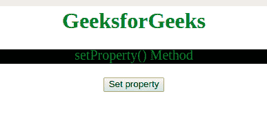

# CSS style declaration set property()方法

> 原文:[https://www . geesforgeks . org/csstyle declaration-set property-method/](https://www.geeksforgeeks.org/cssstyledeclaration-setproperty-method/)

**setProperty()** 方法用于*修改现有 CSS 属性或在声明块*中设置新 CSS。

**语法:**用于返回长度属性。

```html
object.setProperty(propertyname, value, priority)
```

**参数:**接受三个参数:

*   **propertyname:** 它是一个必需的参数，包含一个代表要设置的属性名称的字符串。
*   **值:**它是一个可选参数，包含一个代表新值的字符串。
*   **优先级:**它是一个可选参数，包含一个字符串，表示属性的优先级是否应该设置为重要。

**示例:**展示**使用 setProperty()方法**:

```html
<html>

<head>
    <style>
        body {
            text-align: center;
        }

        h1 {
            color: green;
        }

        #p1 {
            color: green;
            font-size: 20;
        }
    </style>
</head>

<body>
    <h1>GeeksforGeeks</h1>

    <p id="p1">
      setProperty() Method
  </p>

    <button onclick="myFunction()">
        Set property
    </button>

    <p id="gfg"></p>

    <!-- Script to set the property -->
    <script>
        function myFunction() {
            var x = 
              document.styleSheets[0].cssRules[2].style;

            x.setProperty("background-color", "black");
        }
    </script>
</body>

</html>
```

**输出:**
**点击按钮前:**


**点击按钮后:**


**支持的浏览器:**

*   谷歌 Chrome
*   Internet Explorer 9.0
*   火狐浏览器
*   旅行队
*   歌剧