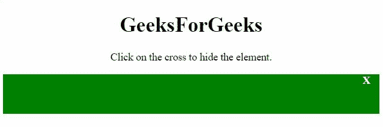

# 使用纯 CSS

设计关闭按钮

> 原文:[https://www . geesforgeks . org/deesign-a-close-button-using-pure-CSS/](https://www.geeksforgeeks.org/deesign-a-close-button-using-pure-css/)

任务是使用**纯 CSS** 使**关闭**按钮。下面讨论两种方法。

**方法 1:** 在另一个<分区>内创建一个<分区>，其中有字母“X”，有助于显示**关闭**按钮。当“点击”事件发生在“X”上时，执行操作。在本例中，当事件发生时，外部< div >已被隐藏。

**示例:**该示例实现了上述方法。

```css
<!DOCTYPE HTML>
<html>

<head>
    <style>
        .outer {
            background: green;
            height: 60px;
            display: block;
        }

        .button {
            margin-left: 93%;
            color: white;
            font-weight: bold;
            cursor: pointer;
        }
    </style>
</head>

<body style="text-align:center;">

    <h1>GeeksForGeeks</h1>

    <p>
        Click on the cross to 
        hide the element.
    </p>

    <div class="outer">
        <div class="button">X</div>
    </div>
    <br>

    <p id="GFG"></p>

    <script>
        var down = document.getElementById("GFG");
        var el = document.querySelector('.button');

        el.addEventListener('click', function () {
            var el2 = document.querySelector('.outer');
            el2.style.display = "none";
        });
    </script>
</body>

</html>
```

**输出:**


**方法 2:** 该方法使用 jQuery。在另一个包含字母“X”的<分区>内创建一个<分区>，以显示**关闭**按钮。当“点击”事件发生在“X”上时，执行操作。在本例中，当事件发生时，外部< div >已被隐藏。

**示例:**该示例实现了上述方法。

```css
<!DOCTYPE HTML>
<html>

<head>
    <style>
        .outer {
            background: green;
            height: 60px;
            display: block;
        }

        .button {
            margin-left: 93%;
            color: white;
            font-weight: bold;
            cursor: pointer;
        }
    </style>
    <script src=
"https://ajax.googleapis.com/ajax/libs/jquery/3.4.0/jquery.min.js">
    </script>
</head>

<body style="text-align:center;">
    <h1>
        GeeksForGeeks
    </h1>
    <p>
        Click on the cross to 
        hide the element.
    </p>
    <div class="outer">
        <div class="button">X</div>
    </div>
    <br>
    <p id="GFG">
    </p>

    <script>
        var down = document.getElementById("GFG");
        $('.button').on('click', function () {
            $('.outer').hide();
        });
    </script>
</body>

</html>
```

**输出:**
