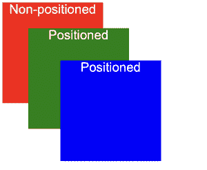
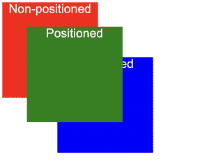
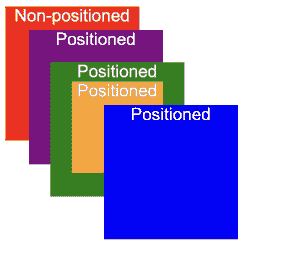
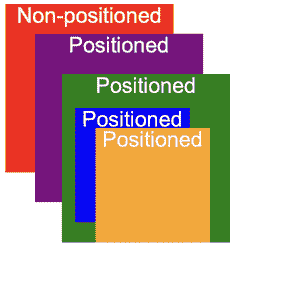

# 描述 z-index 以及在 CSS 中如何形成堆叠上下文

> 原文:[https://www . geesforgeks . org/description-z-index-and-how-a-stacking-context-is-in-CSS/](https://www.geeksforgeeks.org/describe-z-index-and-how-a-stacking-context-is-formed-in-css/)

**堆叠顺序**描述了 HTML 元素的放置顺序。默认情况下，HTML 元素按以下顺序放置:

*   根元素()
*   未按定义顺序放置的元素(没有位置描述的元素，即静态元素)
*   按照定义的顺序定位元素(位置不是静态的元素)

让我们尝试了解默认堆叠顺序是如何工作的:

**示例 1:默认堆叠顺序**

下面是理解默认堆叠顺序的 HTML 和 CSS 代码:

## 超文本标记语言

```html
<!DOCTYPE html>
<html>

<head>
    <title>Default stacking order</title>

    <style>
        .box {
            box-sizing: border-box;
            font-family: Arial;
            color: #eee;
            width: 125px;
            height: 125px;
            text-align: center;
        }

        .blue,
        .green {
            position: absolute;
        }

        .red {
            background: red;
        }

        .green {
            background: green;
            top: 40px;
            left: 40px;
        }

        .blue {
            background: blue;
            top: 80px;
            left: 80px;
        }
    </style>
</head>

<body>
    <div class="box green">Positioned</div>
    <div class="box blue">Positioned</div>
    <div class="box red">Non-positioned</div>
</body>

</html>
```

**输出:**



上述代码片段的输出

**说明:**从输出中可以看到，虽然我们最终定义了红框，但它仍然出现在绿框和蓝框的顶部，因为它没有定位，而其他两个框是定位的。

**z-index:** 为了改变堆叠顺序，我们可以使用 **z-index** 。z 指数较高的元素被放置在 z 指数较低的元素之上。让我们用同样的方法。需要注意的一点是，为了使用 z-index，元素应该被定位**。**要了解更多关于 CSS，positions，[请参考本文](https://www.geeksforgeeks.org/css-positioning-elements/)。

**例 2:z 指数叠加**

我们使用前面的例子，但是这次我们将对绿色和蓝色框应用 z 索引值。

## 超文本标记语言

```html
<!DOCTYPE html>
<html>

<head>
    <title>Stacking with z-index</title>

    <style>
        .box {
            box-sizing: border-box;
            font-family: Arial;
            color: #eee;
            width: 125px;
            height: 125px;
            text-align: center;
        }

        .blue,
        .green {
            position: absolute;
        }

        .red {
            background: red;
            z-index: 100;
            /*No effect since red is non-positioned*/
        }

        .green {
            background: green;
            top: 40px;
            left: 40px;
            z-index: 3;
        }

        .blue {
            background: blue;
            top: 80px;
            left: 80px;
            z-index: 2;
        }
    </style>
</head>

<body>
    <div class="box green">Positioned</div>
    <div class="box blue">Positioned</div>
    <div class="box red">Non-positioned</div>
</body>

</html>
```

**输出:**



带有 z 索引的输出

**说明:**我们观察到绿色方框放在蓝色方框的上面，是因为绿色方框的 z 指数值(3)比蓝色方框(2)高。此外，请注意，红框的 z 索引值为 100，但没有效果，因为它是非定位元素。

**示例 3:** 现在为了理解堆叠上下文，假设我们在布局中添加了另一个框，我们希望蓝色框位于其后面。

## 超文本标记语言

```html
<!DOCTYPE html>
<html>

<head>
    <title>Stacking context</title>

    <style>
        .box {
            box-sizing: border-box;
            font-family: Arial;
            color: #eee;
            width: 125px;
            height: 125px;
            text-align: center;
        }

        .blue,
        .green,
        .orange,
        .purple {
            position: absolute;
        }

        .red {
            background: red;
            z-index: 100;
        }

        .green {
            background: green;
            top: 60px;
            left: 50px;
            z-index: 1;
        }

        .orange {
            width: 85px;
            height: 85px;
            left: 20px;
            background-color: orange;
            font-family: Arial;
            z-index: 3;
        }

        .purple {
            background-color: purple;
            top: 30px;
            left: 30px;
            z-index: 0;

        }

        .blue {
            background: blue;
            top: 100px;
            left: 100px;
            z-index: 2;
        }
    </style>
</head>

<body>
    <div class="box green">Positioned
        <div class="orange">Positioned</div>
    </div>
    <div class="box purple">Positioned</div>
    <div class="box blue">Positioned</div>
    <div class="box red">Non-positioned</div>
</body>

</html>
```

**输出:**



堆叠上下文

**说明:**我们新增了两个盒子:橙色和紫色。不出所料，绿框在紫框之上，因为绿框的 z 指数值比紫框高。然而，尽管具有较高的 z 指数值，橙色框仍然在蓝色框的后面。为什么会这样？通过将 z 索引值应用于元素，形成了**堆叠上下文**。形成堆叠上下文的事实意味着它也影响其子元素(在这种情况下，橙色框是绿色框的子元素)。我们可以更改子元素的堆叠顺序，但它只会在该堆叠上下文中有意义。所以，橙色框仍然在蓝色框后面，因为它们不再处于堆叠上下文中。

**例 4:** 如果我们想把蓝色盒子放在橙色盒子上面，我们可以做两件事:

*   要么使蓝色框成为绿色框的子元素
*   在绿色框外定义橙色框

在这里，我们将使蓝色框成为绿色框的子元素。

## 超文本标记语言

```html
<!DOCTYPE html>
<html>

<head>
    <title>Modified stacking context</title>

    <style>
        .box {
            box-sizing: border-box;
            font-family: Arial;
            color: #eee;
            width: 125px;
            height: 125px;
            text-align: center;
        }

        .blue,
        .green,
        .orange,
        .purple {
            position: absolute;
        }

        .red {
            background: red;
            z-index: 100;
        }

        .green {
            background: green;
            top: 60px;
            left: 50px;
            z-index: 1;
        }

        .orange {
            width: 85px;
            height: 85px;
            top: 40px;
            left: 25px;
            background-color: orange;
            font-family: Arial;
            z-index: 3;
        }

        .purple {
            background-color: purple;
            top: 30px;
            left: 30px;
            z-index: 0;

        }

        .blue {
            background: blue;
            width: 85px;
            height: 85px;
            top: 25px;
            left: 10px;
            z-index: 2;
        }
    </style>
</head>

<body>
    <div class="box green">Positioned
        <div class="orange">Positioned</div>
        <div class="blue">Positioned</div>
    </div>
    <div class="box purple">Positioned</div>
    <div class="box red">Non-positioned</div>
</body>

</html>
```

**输出:**


**说明:**在上面的例子中，我们看到蓝色方框位于橙色方框的后面，因为它们处于相同的堆叠上下文中。还有其他属性也会导致形成新的堆叠上下文。例如:变换、滤波等。