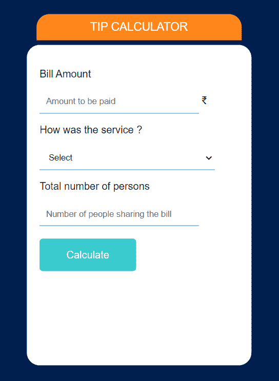
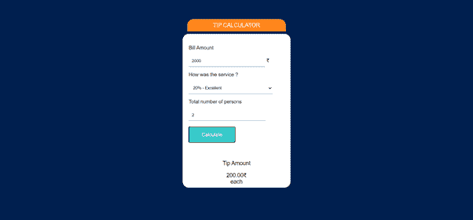

# 使用 HTML、CSS 和 JavaScript 设计一个提示计算器

> 原文:[https://www . geesforgeks . org/design-a-tip-calculator-use-html-CSS-and-JavaScript/](https://www.geeksforgeeks.org/design-a-tip-calculator-using-html-css-and-javascript/)

小费是作为良好服务的礼物送给在餐馆为你服务的人的钱。在这个项目中，制作了一个简单的小费计算器，它将账单金额、服务类型和人数作为输入。根据这三个输入，它为服务人员生成一个提示。

**进场:**

*为了找出提示，我们将从用户那里获得输入:*账单金额(它是账单总额的金额，我们将其纳入金额变量中)，对于服务类型，我们使用一个下拉菜单，其中质量作为百分比选项(如好、差、优等)。)，最后，我们将人数作为输入(这将有助于在所有人之间平均分配小费)。a 根据用户的输入，我们计算小费，然后使用 console.log()函数打印。

> 总额基本上是金额乘以服务类型除以人数。

使用 HTML 我们给出了想要的结构、输入选项和提交按钮。在 CSS 的帮助下，我们通过赋予颜色和想要的字体等来美化我们的结构。

在 JavaScript 部分，我们正在处理获取的输入，并在计算之后，打印相应的输出。

**示例:**

**文件名:index.html**

## 超文本标记语言

```
<html>

<head>
    <link rel="stylesheet" href="style.css">
    <script type="text/javascript" src="app.js">
      </script>
</head>

<body>
    <div class="container">
        <h1>TIP CALCULATOR</h1>
        <div class="wrapper">

<p>Bill Amount</p>

            <input type="text" id="amount"
                   placeholder="Amount to be paid"> ₹

<p>How was the service ?</p>

            <select id="services">
                <option selected disabled hidden>
                    Select
                </option>
                <option value="0.25">25% - Top Notch</option>
                <option value="0.20">20% - Excellent</option>
                <option value="0.15">15% - Good</option>
                <option value="0.10">10% - Bad</option>
                <option value="0.05">5% - Worst</option>
            </select>

<p>Total number of persons</p>

            <input type="text" id="persons"
                placeholder="Number of people sharing the bill">
            <button id="calculate">Calculate</button>
        </div>

        <div class="tip">

<p>Tip Amount</p>

            <span id="total">0</span>₹
            <span id="each">each</span>
        </div>
    </div>
</body>

</html>
```

**文件名:style.css**

## 半铸钢ˌ钢性铸铁(Cast Semi-Steel)

```
body {
    background-color: #001f4f;
    font-family: "Raleway", sans-serif;
}

.container {
    width: 350px;
    height: 500px;
    background-color: #fff;
    position: absolute;
    left: 50%;
    top: 50%;
    transform: translateX(-50%) translateY(-50%);
    border-radius: 20px;
}

h1 {
    position: absolute;
    left: 50%;
    top: -60px;
    width: 300px;
    transform: translateX(-50%);
    background-color: #ff851b;
    color: #fff;
    font-weight: 100;
    border-top-left-radius: 20px;
    border-top-right-radius: 20px;
    font-size: 18px;
    text-align: center;
    padding: 10px;
}

.wrapper {
    padding: 20px;
}

input,
select {
    width: 80%;
    border: none;
    border-bottom: 1px solid #0074d9;
    padding: 10px;
}

input:focus,
select:focus {
    border: 1px solid #0074d9;
    outline: none;
}

select {
    width: 88% !important;
}

button {
    margin: 20px auto;
    width: 150px;
    height: 50px;
    background-color: #39cccc;
    color: #fff;
    font-size: 16px;
    border: none;
    border-radius: 5px;
}

.tip {
    text-align: center;
    font-size: 18px;
    display: none;
}
```

**文件名:app.js**

## java 描述语言

```
window.onload = () =>
    //the function called when Calculate button is clicked.
    {
        /*calling a function calculateTip
         which will calculate the tip for the bill.*/
        document.querySelector('#calculate').onclick = calculateTip;
    }

function calculateTip() {
    /*assign values of ID : amount, person and service to
    variables for further calculations.*/
    let amount = document.querySelector('#amount').value;
    let persons = document.querySelector('#persons').value;
    let service = document.querySelector('#services').value;

    console.log(service);
    /*if statement will work when user presses
          calculate without entering values. */
    //so will display an alert box and return.
    if (amount === '' && service === 'Select') {
        alert("Please enter valid values");
        return;
    }

    //now we are checking number of persons
    if (persons === '1')
    //if there is only one person then we need not to display each.
        document.querySelector('#each').style.display = 'none';
    else
    //if there are more than one person we will display each. 
        document.querySelector('#each').style.display = 'block';

    /*calculating the tip by multiplying total-bill and type of
     service; then dividing it by number of persons.*/
    //fixing the total amount upto 2 digits of decimal
    let total = (amount * service) / persons;
    total = total.toFixed(2);

    //finally displaying the tip value
    document.querySelector('.tip').style.display = 'block';
    document.querySelector('#total').innerHTML = total;
}
```

**完整代码:**

## 超文本标记语言

```
<html>

<head>
    <style>
        body {
            background-color: #001f4f;
            font-family: 'Raleway', sans-serif;
        }

        .container {
            width: 350px;
            height: 500px;
            background-color: #fff;
            position: absolute;
            left: 50%;
            top: 50%;
            transform: translateX(-50%) translateY(-50%);
            border-radius: 20px;
        }

        h1 {
            position: absolute;
            left: 50%;
            top: -60px;
            width: 300px;
            transform: translateX(-50%);
            background-color: #FF851B;
            color: #fff;
            font-weight: 100;
            border-top-left-radius: 20px;
            border-top-right-radius: 20px;
            font-size: 18px;
            text-align: center;
            padding: 10px;
        }

        .wrapper {
            padding: 20px;
        }

        input,
        select {
            width: 80%;
            border: none;
            border-bottom: 1px solid #0074D9;
            padding: 10px;
        }

        input:focus,
        select:focus {
            border: 1px solid #0074D9;
            outline: none;
        }

        select {
            width: 88% !important;
        }

        button {
            margin: 20px auto;
            width: 150px;
            height: 50px;
            background-color: #39CCCC;
            color: #fff;
            font-size: 16px;
            border: none;
            border-radius: 5px;
        }

        .tip {
            text-align: center;
            font-size: 18px;
            display: none;
        }
    </style>
</head>

<body>
    <div class="container">
        <h1>TIP CALCULATOR</h1>
        <div class="wrapper">

<p>Bill Amount</p>

            <input type="text"
                   id="amount"
                   placeholder="Amount to be paid"> ₹

<p>How was the service ?</p>

            <select id="services">
                <option selected disabled hidden>Select</option>
                <option value="0.25">25% - Top Notch</option>
                <option value="0.20">20% - Excellent</option>
                <option value="0.15">15% - Good</option>
                <option value="0.10">10% - Bad</option>
                <option value="0.05">5% - Worst</option>
            </select>

<p>Total number of persons</p>

            <input type="text"
                   id="persons"
                   placeholder="Number of people sharing the bill">
            <button id="calculate">Calculate</button>
        </div>

        <div class="tip">

<p>Tip Amount</p>

            <span id="total">0</span>₹
            <span id="each">each</span>
        </div>
    </div>
    <script>
        //the function called when Calculate button is clicked.
        window.onload = () =>
            {
                /*calling a function calculateTip which
                 will calculate the tip for the bill.*/
                document.querySelector('#calculate').onclick =
                calculateTip;
            }

        function calculateTip() {
            /*assign values of ID : amount, person and
            service to variables for further calculations.*/
            let amount = document.querySelector('#amount').value;
            let persons = document.querySelector('#persons').value;
            let service = document.querySelector('#services').value;

            console.log(service);
            /*if statement will work when user
               presses calculate without entering values. */
            //so will display an alert box and return.
            if (amount === '' && service === 'Select') {
                alert("Please enter valid values");
                return;
            }

            //now we are checking number of persons
            if (persons === '1')
//if there is only one person then we need not to display each.
                document.querySelector('#each').style.display = 'none';
            else
            //if there are more than one person we will display each. 
                document.querySelector('#each').style.display = 'block';

    /*calculating the tip by multiplying total-bill and type of service;
     then dividing it by number of persons.*/
            //fixing the total amount upto 2 digits of decimal
            let total = (amount * service) / persons;
            total = total.toFixed(2);

            //finally displaying the tip value
            document.querySelector('.tip').style.display = 'block';
            document.querySelector('#total').innerHTML = total;
        }
    </script>
</body>

</html>
```

**输出:**

  