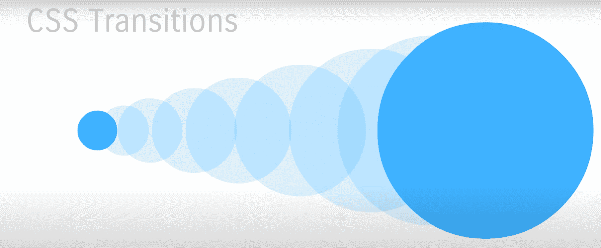
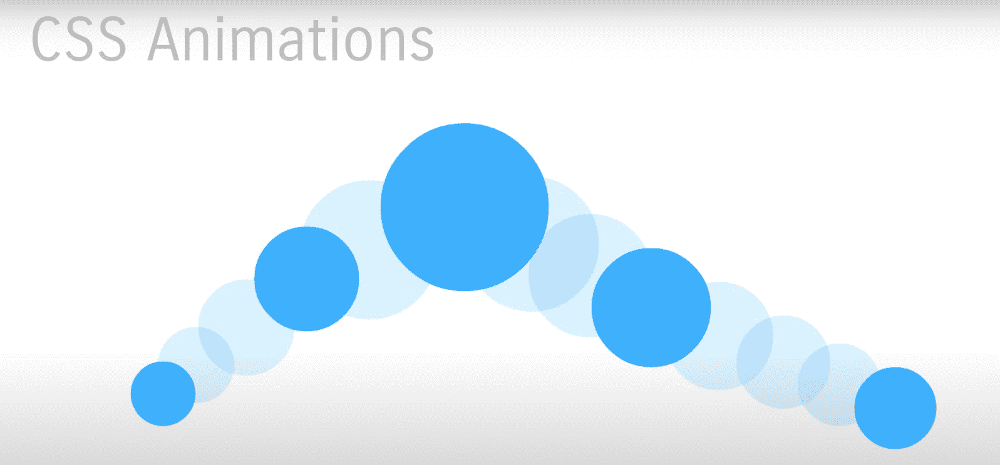
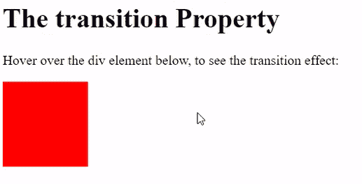
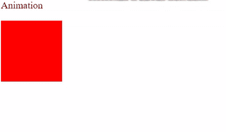

# CSS 中动画和转场的区别

> 原文:[https://www . geesforgeks . org/CSS 中动画和过渡的区别/](https://www.geeksforgeeks.org/difference-between-animation-and-transition-in-css/)

CSS **[转场](https://www.geeksforgeeks.org/css-transitions/)** 让你可以流畅的改变属性值，但是它们总是需要**像悬停一样触发**。属性更改不会立即生效。一段时间后，财产发生变化。例如，如果将元素的颜色从白色更改为黑色，更改会立即发生。CSS 变化按照可定制的加速曲线的时间间隔发生。

在两个状态之间转换的动画称为**隐式转换**，因为开始和最终状态之间的状态是由浏览器隐式定义的。



图 1:过渡从 A 点开始，在 B 点结束，没有中间点。

CSS **[动画](https://www.geeksforgeeks.org/css-animations/)** 允许 HTML 元素的动画化，不像转场只执行 A 点到 B 点的操作，还可以在两者之间进行更多的操作。动画由两个步骤组成，样式表中定义的 CSS 动画和一组指示动画开始和结束状态的关键帧。



图 2:从 A 点开始的动画在 B 点结束，其他点在中间。

**转场和动画的区别:**

<figure class="table">

| cut to | animation |
| Transitions cannot be cycled (you can cycle them, but they are not designed for this purpose). | There is no problem with the animation. |
| A transition requires a trigger to run like a mouse hover. | The animation just started. They don't need any external trigger source. |
| Transition is easy to implement in JavaScript. | Animation is difficult to accomplish with JavaScript. The syntax for manipulating keyframes and assigning new values to them is very complicated. |
| Animate the transition object from one point to another. | Animation allows you to define keyframes, which have different attributes and time ranges in different states. |
| Use transitional JavaScript to manipulate values. | Flexibility is provided by having multiple keyframes and easy loops. |

</figure>

**示例 1:** 以下示例演示了在应用*悬停*后改变颜色的过渡效果。

## 超文本标记语言

```html
<!DOCTYPE html>
<html>

<head>
    <style>
        div {
            width: 100px;
            height: 100px;
            background: red;
            transition: width 2s;
        }

        div:hover {
            background: yellow;
        }
    </style>
</head>

<body>
    <h1>The transition Property</h1>

    <p>
        Hover over the div element below, 
        to see the transition effect:
    </p>
    <div></div>
</body>

</html>
```

**输出:**



**示例 2:** 以下示例演示了使用动画更改颜色。

## 超文本标记语言

```html
<!DOCTYPE html>
<html>

<head>
    <style>
        div {
            width: 100px;
            height: 100px;
            background-color: red;
            animation-name: example;
            animation-duration: 2s;
        }

        @keyframes example {
            0% {
                background-color: red;
            }

            50% {
                background-color: blue;
            }

            100% {
                background-color: yellow;
            }
        }
    </style>
</head>

<body>
    <p>Animation</p>
    <div></div>
</body>

</html>
```

**输出:**



使用动画改变颜色