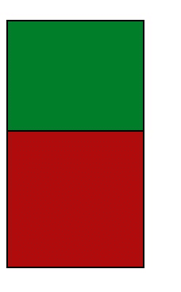
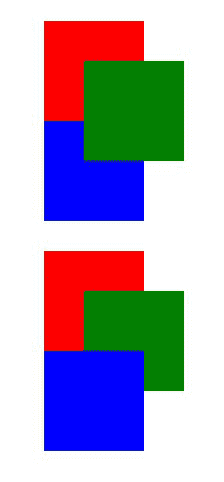

# CSS 中自动、0 和无 z 索引的区别

> 原文:[https://www . geesforgeks . org/auto-0 和-no-z-index-in-css/](https://www.geeksforgeeks.org/difference-between-auto-0-and-no-z-index-in-css/) 之间的差异

当我们必须在 z 轴上排列元素时，我们使用 **z 索引**属性。在 CSS 中， **z-index** 属性只适用于位置值不是静态的元素。在本文中，我们将了解 z-index 属性及其值，auto、number、initial 和 inherit。我们还将看到所有值之间的差异。

**语法:**

```html
z-index: auto | integer | initial | inherit;
```

**属性:**如上所述，该属性具有以下值，如下所述。

*   **auto:** 它将堆栈顺序设置为等于其父级。这是默认值。
*   **整数:**设置元素的堆叠顺序。我们也可以用负数。
*   **初始值:**将该属性设置为默认值。
*   **inherit:** 它从其父元素继承该属性。

**注意:**z-index 属性对静态位置元素不起作用。

以下示例将有助于理解属性值之间的差异。

**示例 1:** 在本例中，我们将在元素上使用 z-index 属性。

## 超文本标记语言

```html
<!DOCTYPE html>
<html lang="en">

<head>
    <style>
        .box {
            width: 170px;
            height: 170px;
            border: 2px solid black;
        }

        #box-1 {
            top: 69px;
            position: relative;
            background-color: rgb(0, 126, 42);
            z-index: auto;
        }

        #box-2 {
            top: 34px;
            position: relative;
            background-color: rgb(175, 13, 13);
        }
    </style>
</head>

<body>
    <div class="box" id="box-1"></div>
    <div class="box" id="box-2"></div>
</body>

</html>
```

**输出:**



**示例 2:** 在本例中，我们将在两个元素上使用 z-index 属性。

## 超文本标记语言

```html
<!DOCTYPE html>
<html lang="en">

<head>
    <style>
        .box {
            width: 170px;
            height: 170px;
            border: 2px solid black;
        }

        #box-1 {
            top: 69px;
            position: relative;
            background-color: rgb(0, 126, 42);
            z-index: auto;
        }

        #box-2 {
            top: 34px;
            position: relative;
            background-color: rgb(175, 13, 13);
            z-index: auto;
        }
    </style>
</head>

<body>
    <div class="box" id="box-1"></div>
    <div class="box" id="box-2"></div>
</body>

</html>
```

**输出:**我们可以清楚的看到，z 指标 auto 和没有 z 指标没有区别。


**示例 3:** 当我们将 z-index 指定为 0 时，它会创建一个堆叠上下文。

## 超文本标记语言

```html
<!DOCTYPE html>
<html lang="en">

<head>
    <style>
        .z {
            position: relative;
            width: 100px;
            height: 100px;
            top: 40px;
            left: 40px;
        }

        .red {
            background: red;
        }

        .green {
            background: green;
        }

        .blue {
            background: blue;
        }

        #example2 {
            margin-top: 30px;
        }
    </style>
</head>

<body>
    <div id="example1">
        <div class="z red">
            <div class="z green" 
                 style="z-index: 1"></div>
        </div>
        <div class="z blue"></div>
    </div>

    <div id="example2">
        <div class="z red" 
             style="z-index: 0">
            <div class="z green" 
                 style="z-index: 1">
              </div>
        </div>
        <div class="z blue"></div>
    </div>

</body>

</html>
```

**输出:**



**示例说明:**在第一个示例中，我们可以看到绿色位于蓝色和红色之上，这是由于绿色的 z 指数为 1 的原因。因此，创建了堆叠上下文。

但是在第二个例子中，由于红色的 z 指数为 0，绿色位于红色之上，但低于蓝色。因此，堆叠上下文是在与蓝色相同的级别创建的。