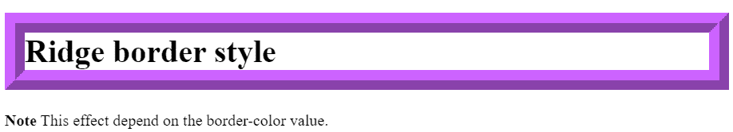
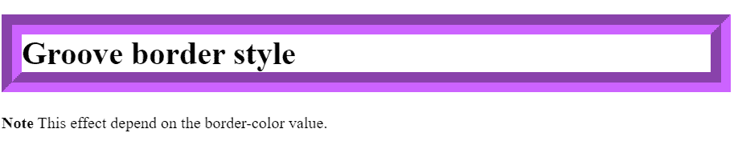

# CSS 中边框和凹槽样式的区别

> 原文:[https://www . geeksforgeeks . org/边框-脊-槽-样式-in-css/](https://www.geeksforgeeks.org/difference-between-border-ridge-and-groove-styles-in-css/)

[CSS 边框样式](https://www.geeksforgeeks.org/css-border-style-property/)设置元素四个边框的样式。

该属性可以有一到四个值。只有一个值时，该值将应用于所有四个边框；否则，这将作为每个*边框-顶部样式*、*边框-右侧样式*、*边框-底部样式*、*边框-左侧样式*的简写属性，其中每个边框样式都分配有单独的值。

此属性是以下 CSS 属性的简写:

*   [边框底部式](https://www.geeksforgeeks.org/css-border-bottom-style-property/)
*   [左边框样式](https://www.geeksforgeeks.org/css-border-left-style-property/)
*   [右边框样式](https://www.geeksforgeeks.org/css-border-right-style-property/)
*   [边框顶式](https://www.geeksforgeeks.org/css-border-top-style-property/)

#### 语法:

```
/* Keyword values */
border-style: groove;
border-style: ridge;

/* top and bottom | left and right */
border-style: dotted solid;

/* top | left and right | bottom */
border-style: hidden double dashed;

/* top | right | bottom | left */
border-style: none solid dotted dashed;

/* Global values */
border-style: inherit;
border-style: initial;
border-style: unset;
```

**脊边框样式:**

这是 CSS 的一个**边框样式的**属性。它显示具有拉伸外观的边框。它是*槽*边框*T5 风格的反面。效果取决于边框颜色值。它看起来好像是从画布里出来的。*脊*中的边框阴影位置是从**左上**开始的。它反转颜色值，使元素看起来凸起。*

**语法:**

```
border-style: ridge; 
```

**示例:**

## 超文本标记语言

```
<!DOCTYPE html>
<html>

  <style>
    h1.ridge {
     border-width: 20px;
     border-style: ridge; 
     border-color: #CC63FF
   }
  </style>
  <body>
   <h1 class="ridge">Ridge border style</h1>
   <p>
     <strong>Note</strong> 
     This effect depend on the border-color value.
   </p>

  </body>
</html>
```

**输出:**



**凹槽边框样式:**

这是 CSS 的一个**边框样式的**属性。它以雕刻的外观显示边框。它是*岭*风格的反面。效果取决于边框颜色值。它看起来就像是雕刻在画布上一样。(这通常是通过从比边框颜色稍亮和稍暗的两种颜色创建“阴影”来实现的)。岭中的边框阴影位置是从**右下角**开始的。它根据颜色值添加一个斜面，使元素看起来像是被压入了文档中。

**语法:**

```
border-style: groove;
```

**示例:**

## 超文本标记语言

```
<!DOCTYPE html>
<html>

  <style>
    h1.groove {
    border-width: 10px;
    border-style: groove; 
    border-color: #CC63FF
   }
  </style>
  <body>
   <h1 class="groove">Groove border style</h1>
   <p>
     <strong>Note</strong> 
     This effect depend on the border-color value.
   </p>

  </body>
</html>
```

**输出:**



**结论:**

*   当我们仔细观察这两个结果时，我们会发现在*凹槽*边框样式中，内边框的上边距和左边距是浅色的。内边框的右下边是深色的，在*岭*T4【边框式】正好相反。
*   Groove 是一种 3D 效果，给人的印象是边框被雕刻到画布上。脊是一种 3D 效果，与凹槽的效果相反，在凹槽中，边框似乎从画布中突出。