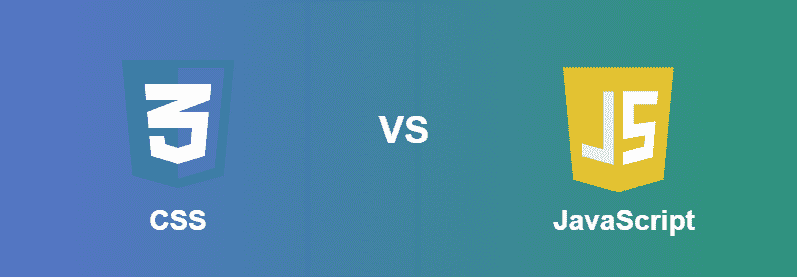

# CSS 和 JavaScript 的区别

> 原文:[https://www . geesforgeks . org/CSS 和 javascript 的区别/](https://www.geeksforgeeks.org/difference-between-css-and-javascript/)

CSS 和 JavaScript 都用于带有 HTML 的网页，但用于不同的角色。CSS 用于为用户设计更好的网页布局，使用户对网页感到舒适。JavaScript 用于创建网页和用户之间的交互。

****[CSS:](https://www.geeksforgeeks.org/css-tutorials/)**** CSS 代表**层叠样式表**，它是一种样式表语言，用于塑造将作为网页显示在浏览器中的 HTML 元素。不使用 CSS，用 HTML 创建的网站看起来会很枯燥。基本上，CSS 为任何 HTML 元素提供了外壳。如果你认为 HTML 是网页的骨架，那么 CSS 就是骨架的皮肤。CSS 的互联网媒体类型(MIME 类型)是文本/CSS。

**CSS 特性:**

*   CSS 兼容所有的设备。
*   在 CSS 的帮助下，网站维护变得简单快捷。
*   CSS 支持一致和自发的变化。
*   CSS 使网站更快，增强了搜索引擎抓取网页的能力。
*   它有一个特别的特点，那就是能够重新定位。

**[JavaScript:](https://www.geeksforgeeks.org/introduction-to-javascript/)** 它是一种轻量级、跨平台、可解释的脚本语言。它以开发网页而闻名，许多非浏览器环境也使用它。JavaScript 可以用于客户端开发和服务器端开发。JavaScript 包含一个标准的对象库，如数组、日期和数学，以及一组核心语言元素，如运算符、控制结构和语句。JavaScript 可以作为**客户端**和**服务器端**使用。

**JavaScript 特性:**

*   JavaScript 最初是为 DOM 操作而创建的。早期的网站大多是静态的，在 JavaScript 之后，它被创建为动态网站。
*   JS 中的函数是对象。它们可能像另一个对象一样具有属性和方法。它们可以作为参数在其他函数中传递。
*   它可以处理日期和时间。
*   执行表单验证，尽管表单是使用 HTML 创建的。
*   不需要编译器。

**CSS 和 JavaScript 的区别:**

| 半铸钢ˌ钢性铸铁(Cast Semi-Steel) | java 描述语言 |
| --- | --- |
| CSS 使网页的组件风格化。 | JavaScript 对于网页的交互性是可靠的。 |
| 当涉及到网页格式和设计时，CSS 要简单和基本得多。 | 在这种情况下，JavaScript 比 CSS 更难。 |
| CSS 直接在 HTML 中的 |  |
| CSS 不能批准形状，可以用来识别访客浏览器，也可以用来恢复和存储访客计算机上的数据。 | JavaScript 可以批准形状，可以用来识别访客浏览器，还可以用来恢复和存储访客计算机中的数据。 |