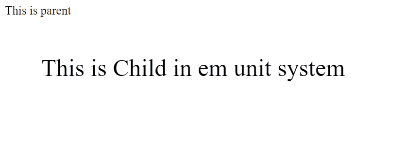
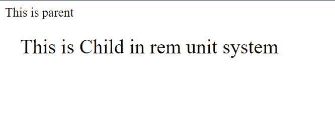

# CSS 中 em 和 rem 单位的区别

> 原文:[https://www . geesforgeks . org/em-和-rem-units-in-css/](https://www.geeksforgeeks.org/difference-between-em-and-rem-units-in-css/)

在 CSS 中设置任何元素的大小时，我们有两个选择。第一个是绝对单位，第二个是相对单位。绝对单位是固定的，不相对于其他任何东西。它们在任何情况下都是相同的。它们涉及厘米、毫米、像素等。另一方面，相对单位是相对于其他东西的。可能是父元素的大小，也可能是主 HTML 的大小。相关单位包括 em、r em、vw、vh 等。这些是可扩展的单元，有助于响应设计。我们很多人可能会对相对单位感到困惑，尤其是 **em** 和 **rem** 单位。让我们来分析一下这两者之间的区别。基本上 rem 和 em 都是可伸缩的和相对的大小单位，但是有了 em，单位是相对于其父元素的字体大小，而 rem 单位只是相对于 HTML 文档的根字体大小。rem 中的“r”代表“根”。

让我们详细了解两者。

**1。em 单位:**em 单位允许相对于其父元素的字体大小来设置元素的字体大小。当父元素的大小改变时，子元素的大小会自动改变。

注意:当 em 单位用于 font-size 属性时，大小是相对于父字体大小的。当用于其他属性时，它与元素本身的字体大小有关。这里，只有第一个声明引用了父声明。

*   的字体大小。子元素将为 **40px** (2*20px)。
*   的边缘。子将为 **60px** 。这是我们元素字体大小的 1.5 倍(1.5*40px)。

**示例:**

## 超文本标记语言

```css
<!DOCTYPE html>
<html>

<head>
    <title>Em vs Rem</title>
</head>

<style>
    .parent {
        font-size: 20px;
    }

    .child-em {
        font-size: 2em;
        margin: 1.5em;
    }
</style>

<body>
    <div class="parent">
        This is parent
        <div class="child-em">
            This is Child in em unit system
        </div>
    </div>
</body>

</html>
```

**输出:**



在单位中

**2。rem 单位:**rem 基于根元素的字体大小值，根元素是< html >元素。如果< html >元素没有指定的字体大小，则使用浏览器默认值 16px。所以这里只考虑根的值，与父元素没有关系。

与 em 不同，这里的大小是所有声明的相对大小，而不仅仅是第一个。让我们用前面的例子来理解这一点。

*   的字体大小。子元素将是 **60px** (2*30px)。
*   的边缘。子将为 **45px** 。这是 html 元素字体大小的 1.5 倍(1.5*30px)。

**示例:**

## 超文本标记语言

```css
<!DOCTYPE html>
<html>

<head>
    <title>Em vs Rem</title>
</head>

<style>
    .html {
        font-size: 30px;
    }

    .parent {
        font-size: 20px;
    }

    .child-rem {
        font-size: 2rem;
        margin: 1.5rem;
    }
</style>

<body>
    <div class="parent">
        This is parent
        <div class="child-rem">
            This is Child in rem unit system
        </div>
    </div>
</body>

</html>
```

**输出:**



快速眼动单位

em 和 rem 单位的区别如下:

<figure class="table">

| parameter | 

em

 | 

rem

 |
| --- | --- | --- |
| **Relativity** | Em is the immediate or nearest parent relative to it. | Rem is the font size relative to HTML (root) |
| of |

</figure>

希望你能搞清楚 em 和 rem 的区别。很容易记住，r 在 rem 中表示根，是相对于根的(HTML)，em 是相对于父的。