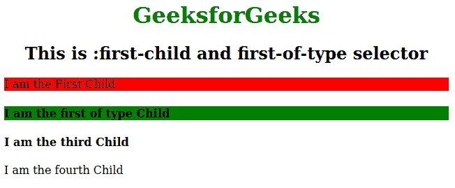

# CSS 中:第一个子选择器和:第一个类型选择器的区别

> 原文:[https://www . geesforgeks . org/第一个孩子和第一个 css 中类型选择器的区别/](https://www.geeksforgeeks.org/difference-between-first-child-and-first-of-type-selector-in-css/)

它们都是 CSS 中用来选择特定子对象的 HTML 的选择器。
<u>[**<u>:第一子:</u>**](https://www.geeksforgeeks.org/css-first-child-selector/) :第一子选择器用于选择那些为第一子元素的元素。适用:第一个孩子选择器<！对于 IE8 及更早版本，必须声明 DOCTYPE >。
<u>[**<u>:第一类型:</u>**](https://www.geeksforgeeks.org/css-first-of-type-selector/) :第一类型选择器用于定位其父元素的每个元素的第一个子元素。如果我们想在不给类的情况下对元素的第一个子元素进行样式化，我们可以使用它。
**例:**</u></u> 

## <u><u>超文本标记语言</u></u>

```
<u><!DOCTYPE html>
<html>

<head>
    <title>:first-child and first-of-type selector</title>
    <style>
        h1 {
            color: green;
        }

        h1,
        h2 {
            text-align: center;
        }

        p:first-child {
            background: red;
        }

        h4:first-of-type {
            background: green;
        }
    </style>
</head>

<body>
    <h1>GeeksforGeeks</h1>
    <h2>This is :first-child and first-of-type selector</h2>
    <div>

<p>I am the First Child</p>

        <h4>I am the first of type Child</h4>
        <h4>I am the third Child</h4>

<p>I am the fourth Child</p>

    </div>

</body>

</html></u>
```

<u><u>**输出:**</u></u>

<u><u></u></u>

<u><u>**的区别:第一个子元素和:第一个类型选择器:**</u></u>

<figure class="table"> <u><u>| : the first child element | : the first type |
| --- | --- |
| If the element is the first child element of the parent element, the selector only selects the definition element. If the definition element is in the second position, the selector cannot select the element. | If the element appears in the second, third or fourth position, but it must be the first of its type, the selector selects the definition element. |
| In the above example, you can see that the children in the div tag are P, h4, h4 and P. If you change the 1st p tag into another tag, then the first child selector cannot select any children. | In the above example, you can see that the sub-elements in the div tag are P, h4, h4 and P. If you change the first p tag to h4 tag, then the first selector of child elements will select the first child element of the parent element, which is also the first child element of the define element. |</u></u> </figure>