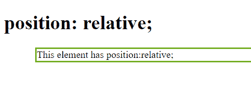
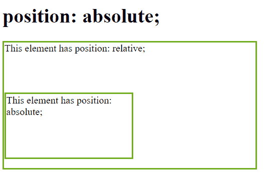
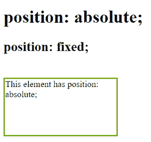

# CSS 中相对、绝对、固定位置的区别

> 原文:[https://www . geesforgeks . org/相对位置和绝对位置之差 css/](https://www.geeksforgeeks.org/difference-between-relative-and-absolute-position-in-css/)

[**相对位置:**](https://www.geeksforgeeks.org/css-positioning-elements/) 用*位置设置元素的上、右、下、左属性:相对；*属性会使其从正常位置进行调整。其他对象或元素不会填充该间隙。

**语法:**

```css
position: relative;
```

[**绝对位置:**](https://www.geeksforgeeks.org/css-positioning-elements/#:~:text=An%20element%20with%20position%3A%20absolute, which%20are%20at%20same%20level.) 一个带*位置的元素:绝对；*将使其调整相对于其父对象的位置。如果没有父级，则它使用文档正文作为父级。

```css
position: absolute;
```

[**固定位置:**](https://www.geeksforgeeks.org/css-positioning-elements/)

位置:固定；属性将使元素始终停留在同一位置，即使页面滚动也是如此。为了定位元素，我们使用顶部、右侧、底部、左侧属性。

**语法:**

```css
position: fixed;
```

下面的例子说明了相对位置和绝对位置之间的区别。

**相对位置:**

## 超文本标记语言

```css
<!DOCTYPE html>
<html>

<head>
    <style>
        div.relative {
            position: relative;
            left: 50px;
            border: 3px solid #73AD21;
        }
    </style>
</head>

<body>
    <h1>position: relative;</h1>

    <div class="relative">
        This element has position:relative;
    </div>
</body>

</html>
```

**输出:**



**绝对位置:**

## 超文本标记语言

```css
<!DOCTYPE html>
<html>

<head>
    <style>
        div.relative {
            position: relative;
            width: 400px;
            height: 200px;
            border: 3px solid #73AD21;
        }

        div.absolute {
            position: absolute;
            top: 80px;
            right: 80px;
            width: 200px;
            height: 100px;
            border: 3px solid #73AD21;
        }
    </style>
</head>

<body>
    <h1>position: absolute;</h1>

    <div class="relative">
        This element has position: relative;
        <div class="absolute">
            This element has position: absolute;
        </div>
    </div>
</body>

</html>
```

**输出:**



**固定位置:**

## 超文本标记语言

```css
<!DOCTYPE html>
<html>

<head>
  <style>
    div.fixed {
  position: fixed;
  bottom: 0;
  right: 0;
  width: 300px;
  border: 3px solid #73AD21;
}
    div.absolute {
      position: absolute;
      top: 150px;
      right: 80;
      width: 200px;
      height: 100px;
      border: 3px solid #73AD21;
    }
  </style>
</head>

<body>

  <h1>position: absolute;</h1>

    <h2>position: fixed;</h2>
    <div class="absolute">This element has position: absolute;</div>
  </div>

</body>

</html>
```

**输出:**

