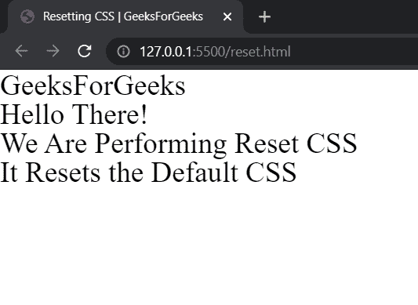
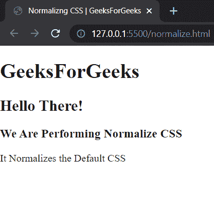

# CSS 中“重置”和“正常化”的区别

> 原文:[https://www . geeksforgeeks . org/CSS 中重置和正常化的区别/](https://www.geeksforgeeks.org/difference-between-resetting-and-normalizing-in-css/)

**CSS(层叠样式表)**是一种用于描述 HTML 或 XML 文档(包括 SVG、MathML 或 XHTML 等 XML 方言)表示的样式表语言。CSS 指定元素应该如何出现在屏幕上、纸上、语音中或其他形式的媒体中。

使用 CSS 时，开发人员可能会遇到浏览器设置不一致的情况，例如默认的行高、边距和标题字体大小等。例如，一些浏览器使用左边距来缩进无序和有序的列表，而另一些浏览器则使用左边距。标题的上边距和下边距略有不同，缩进距离也各不相同，等等。这就是**重置**和**规范化** CSS 的作用，使默认设置在不同浏览器之间看起来更加一致，从而减少与浏览器默认设置斗争的时间。

让我们简单了解一下这些技术:

**重置 CSS:**CSS 重置是在其他样式移除内置浏览器样式之前加载的一组样式。每个浏览器都有自己的**用户代理**样式表，它使用这个样式表使没有样式的网站更易读。例如，大多数浏览器默认将链接设为蓝色，将访问过的链接设为紫色，为表格添加边框和填充，为**、H1、H2、H3、**和几乎所有内容应用各种字体大小，并为几乎所有内容应用特定数量的填充。

你有没有想过为什么提交按钮在不同的浏览器中会有不同的表现？

显然，这给 CSS 作者带来了很多悲伤，因为他们不知道如何让他们的网站在每个浏览器中看起来都一样。CSS 作者可以使用 CSS 重置将每个浏览器的样式重置为空，尽可能减少跨浏览器的差异。然后，您可以使用您通过重置建立的一致基础来重新设计您的内容，放心地保证浏览器默认呈现的 HTML 中的差异不会影响您！

**使用 CSS 重置，CSS 作者可以强制每个浏览器将其所有样式重置为空，从而尽可能避免跨浏览器的差异。**

例如，为了将所有元素设置为具有相同的字体粗细和样式，我们使用:

```html
font-weight: inherit;
font-style:  inherit;
font-family: inherit;
```

但是，Internet Explorer 浏览器不支持**继承，**因此，在 IE 上查看时，不会出现值的自动继承，UI 会显得破碎。重置有助于在维护用户界面的同时克服类似的问题。

**示例:**在这个示例中，我们将看到如何使用重置 CSS 技术，该技术将在我们的其他样式之前加载，以移除内置的浏览器样式。

**reset.html**

## 超文本标记语言

```html
<!DOCTYPE html>
<html lang="en">
<head>
    <title>
        Resetting CSS | GeeksForGeeks
    </title>

      <!-- Import the CSS Reset -->
    <link rel=
"stylesheet" href="http://meyerweb.com/eric/tools/css/reset/reset.css">
</head>

<body>
<!-- HTML Content -->
  <h1>GeeksForGeeks</h1>
  <h2>Hello There!</h2>
  <h3>We Are Performing Reset CSS</h3>
  <p>It Resets the Default CSS</p>

</body>
</html>
```

**输出:**



重置 CSS

**规范 CSS:** 规范 CSS 可以提高浏览器用户代理的 HTML 元素默认样式的跨浏览器一致性。这是一个 HTML5 友好的标准 CSS 重置的替代品。

正常化的目的是:

*   保留默认的有用浏览器，而不是删除它们。
*   为各种各样的 HTML 元素标准化样式。
*   纠正常见浏览器的错误和不一致。
*   通过细微的改进提高可用性。
*   使用注释和详细的文档来解释代码。

现在让我们继续解决这两种技术中哪一种更好以及应该使用什么来平滑 CSS 的疑问。规范化保持了有用的默认值，而不是非风格化的一切，它不会弄乱你的开发工具窗口。此外，重置意味着去除元素上的所有默认浏览器样式。例如，对于边距、填充，所有元素的字体大小都被重置为相同。另一方面，规范化保留了有用的默认样式，而不是剥离所有样式。规范化 CSS 是一种比旧的重置 CSS 更新的技术，所以它是模块化的，易于使用。最后，现在我们知道了重置和正常化之间的区别，我们知道它们没有太大的不同，因为两者都在努力防止网页用户界面的破坏。这只是一个方法的问题，这两种技术使用的基础上，你可以决定其中你应该使用你的工作。

**示例:**在这个示例中，我们将看到如何使用 normalize CSS 技术。

**normalize.html**

## 超文本标记语言

```html
<!DOCTYPE html>
<html lang="en">

<head>
    <title>
        Normalizng CSS | GeeksForGeeks
    </title>
      <!-- Import Normalize.css -->
    <link rel="stylesheet" href=
"https://necolas.github.io/normalize.css/7.0.0/normalize.css">
</head>

<body>
<!-- HTML Content -->
    <h1>GeeksForGeeks</h1>
    <h2>Hello There!</h2>
    <h3>We Are Performing Normalize CSS</h3>
    <p>It Normalizes the Default CSS</p>

</body>
</html>
```

**输出:**



规范化 CSS

下面是**重置**和**正常化**之间的差异表:

<figure class="table">

| **重置** | **正常化** |
| Reset all styles that come with the browser user agent. | Provide cross-browser consistency in the default style of HTML elements provided by the browser's user agent. |
| There are a lot of selectors in the reset, and they do a lot of unnecessary overwriting on the style. | Due to the use of the style of user agent, there are not many large chains of CSS selectors to be seen in standardization. |
| It is difficult to debug because it is almost impossible to identify bugs. | Debugging is easy, and normalization |
| Reset is non-modular (there is no segmentation break in the style) | Normalization is modular (style is divided into sections for convenience) |

</figure>