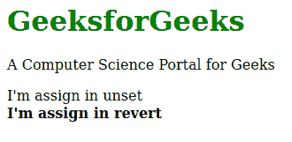

# CSS 中恢复和取消设置关键字的区别

> 原文:[https://www . geesforgeks . org/revert-and-unset-关键字 in-css/](https://www.geeksforgeeks.org/difference-between-revert-and-unset-keyword-in-css/)

两者都是 CSS 中的关键词。这两者在 web 开发中的行为相似，但在某些元素的某些属性上有所不同。

**Revert:**Revert 关键字是 CSS 中的一个内置关键字，用于将层叠样式还原到其父元素。如果任何相似的元素拥有相同的层叠样式，但是一个子元素拥有 revert 关键字，则层叠样式将被移除，并将从父元素继承层叠。

**Unset:**Unset 关键字是 CSS 中的一个内置关键字，用于将层叠样式取消设置到其父元素。在第一种情况下，它的行为类似于 inherit 关键字，在第二种情况下，它的行为类似于初始关键字。

以下示例说明了恢复和未设置关键字之间的区别:

**注:**编码差异只在 Mozilla Firefox 和 Apple Safari 中可见。

**示例:**

```
<!DOCTYPE html>
<html>
    <head>
        <title>CSS revert keyword</title>
        <style>

            /* Color for h1 element */
            h1 {
                color: green;
            }

            /* Performing revert for child */
            b {
                font-weight: normal;
            }
        </style>
    </head>
    <body>

        <!-- Parent elements -->
        <div class="container">

            <!-- Child elements -->
            <h1>GeeksforGeeks</h1>
            <p>A Computer Science Portal for Geeks</p>
            <b style="font-weight: unset;">
                I'm assign in unset
            </b>
            <br>
            <b style="font-weight: revert;">
                I'm assign in revert
            </b>
        </div>
    </body>
</html>
```

**输出:**


**CSS 中恢复和取消设置关键字的区别:**

| 归还 | 未设置 |
| 此关键字会将层叠还原为父层叠。 | 该关键字将取消层叠样式。 |
| 如果元素包含 h3 和它将跟随其后的任何其他全局级联样式，则此关键字将恢复级联。 | 此关键字将取消级联样式，如果元素包含 h3 和任何其他全局级联样式，它将仅遵循 h3 效果。 |