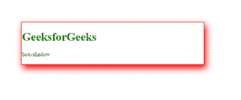

# CSS

中-WebKit-box-shadow&box-shadow 的区别

> 原文:[https://www . geesforgeks . org/difference-web kit-box-shadow-box-shadow-in-CSS/](https://www.geeksforgeeks.org/difference-between-webkit-box-shadow-box-shadow-in-css/)

在本文中，我们将发现 CSS 中“webkit-box-shadow”和“box-shadow”的区别。

**Webkit-box-shadow:**CSS 中的 Webkit-box-shadow 属性用于应用一个 box-shadow。webkit-box-shadow 是针对像谷歌 Chrome 和 Safari 这样的 webkit 浏览器的特定于浏览器的实现。

*   **语法:**

    ```css
    webkit-box-shadow: h-offset v-offset blur;
    ```

*   **优势:**如果我们使用-webkit-box-shadow 旧版本的浏览器支持它。

**框影:**CSS 中的框影属性用于应用框影。盒子阴影是 CSS 标准实现。

*   **语法:**

    ```css
    box-shadow: h-offset v-offset blur;
    ```

*   **优势:**如果我们使用框影最新版本的浏览器支持它。

box-shadow 和-webkit-box-shadow 属性有如下区别:

<figure class="table">

| **框影** | **网络工具包-盒子-阴影** |
| Box-shadow is a standard implementation of CSS. | Webkit-box-shadow is a specific browser implementation for WebKit browsers such as Google Chrome and Safari . |
| This box shadow attribute is for the latest version. | While the webkit-box-shadow attribute is used for the old version. |

</figure>

**示例:**

## 超文本标记语言

```css
<!DOCTYPE html>
<html>

<head>
    <style>
        .gfg1{
            color: green;
            cursor: zoom-in;
            border: solid 2px red;
            margin: 10% 30%;
            width: 50%;
            box-shadow: 5px 10px 18px red;
            -webkit-box-shadow: 5px 10px 18px red;
        }
    </style>
</head>

<body>
    <div class="gfg1">
        <h1>GeeksforGeeks</h1>
        <p>box-shadow</p>

    </div>
</body>

</html>
```

**输出:**
