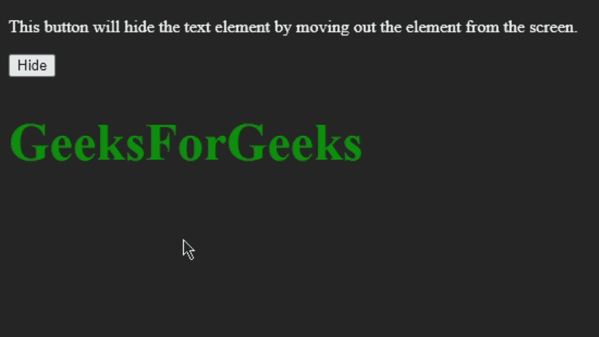
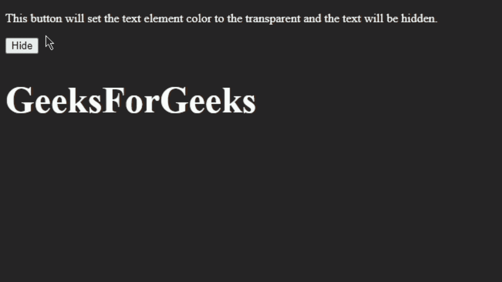
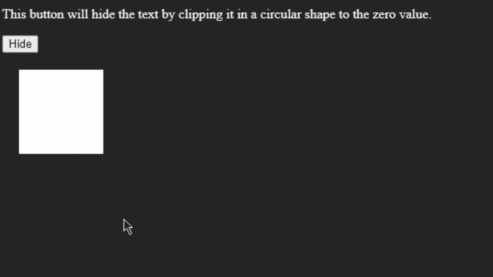
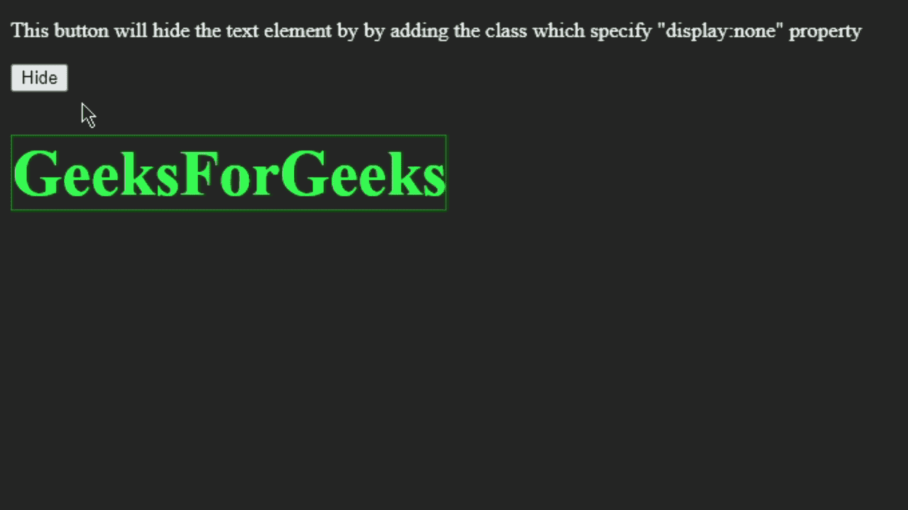
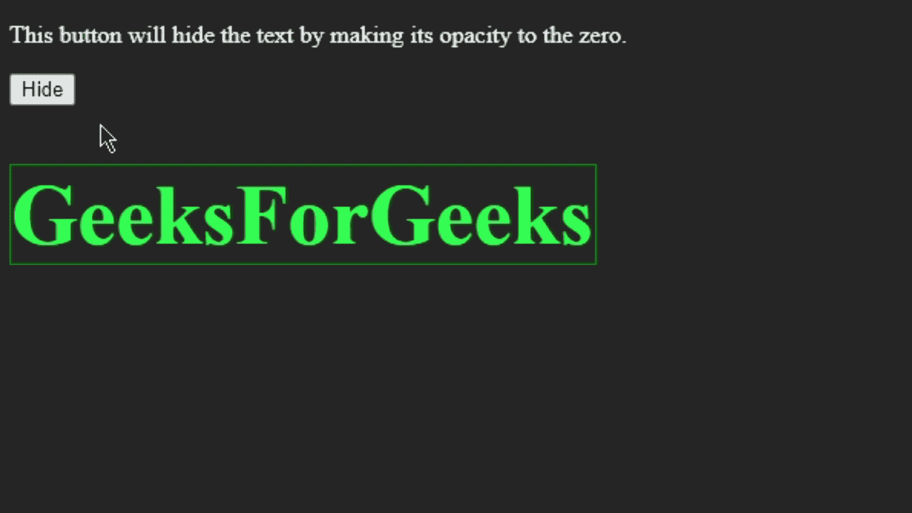
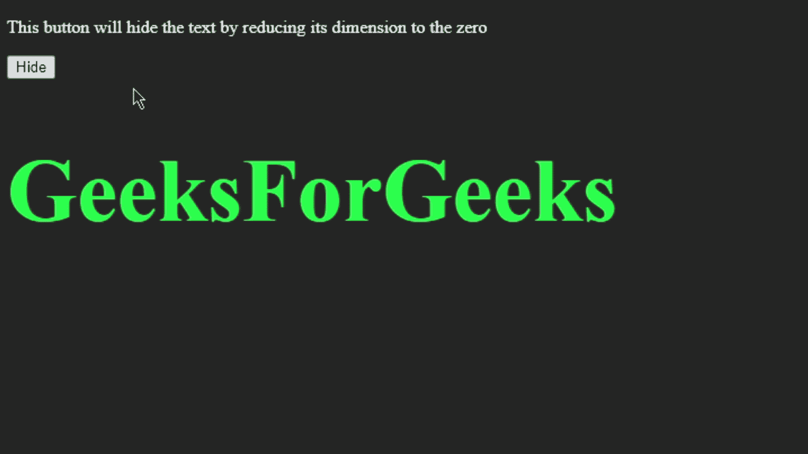
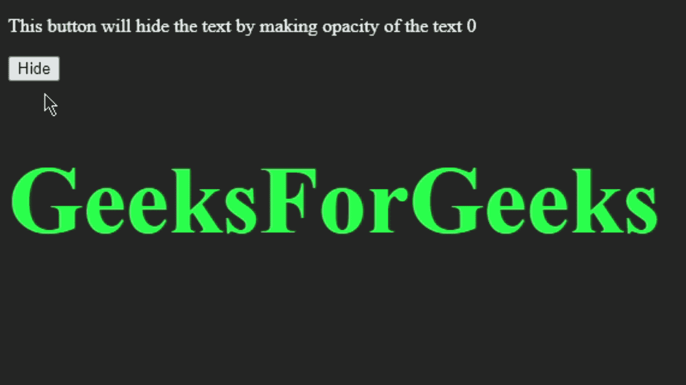
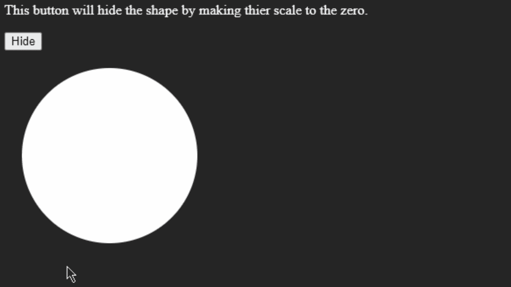
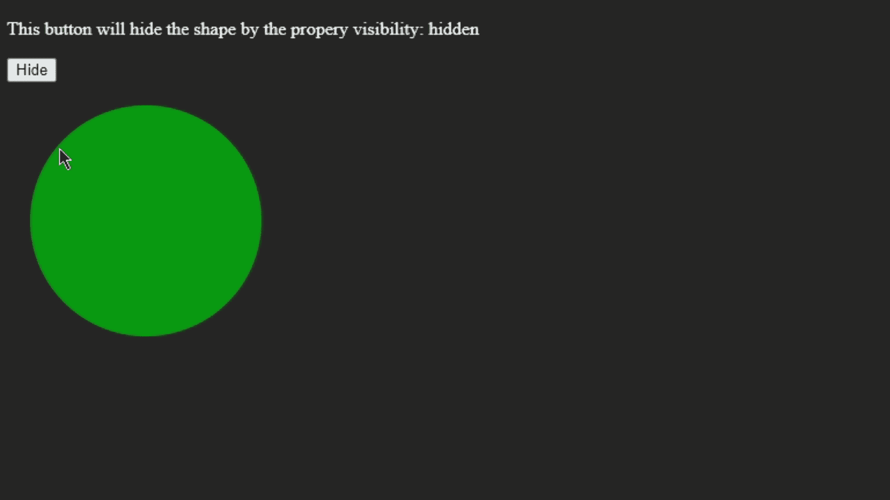

# 使用 CSS 隐藏元素的不同方式

> 原文:[https://www . geeksforgeeks . org/不同方式隐藏元素-使用-css/](https://www.geeksforgeeks.org/different-ways-to-hide-elements-using-css/)

在进行用户界面/UX 的工作时，我们必须注意网页上出现的每一个网络元素，以使用户体验更容易。在设计这样的页面时，我们经常需要在任何事件或任何特定时间间隔隐藏或显示一些特定的 HTML 元素。在本文中，我们可以通过一些 javascript 代码轻松做到这一点，但是在本文中，我们将看到有多少种方法可以仅使用 [CSS](https://www.geeksforgeeks.org/css-introduction/) 隐藏 HTML 元素。

**有以下 CSS 属性用于隐藏元素。**

1.  绝对位置
2.  颜色
3.  剪辑路径
4.  显示
5.  过滤器
6.  衡量
7.  不透明
8.  改变
9.  能见度

我们将看到上面提到的隐藏元素的所有方法以及 CSS 代码。

**1。绝对位置:**当我们在 CSS 中对一个元素使用 Position: absolute 属性时，它仅仅意味着该元素的位置固定到它的父容器，如果没有可用的容器，那么文档体就被用作它的父容器。现在我们可以使用顶部、底部、左侧、右侧属性来更改该元素的位置。我们将使用这些属性之一来隐藏文档主体中的元素。

**示例:**在本例中，我们将通过将文本元素移出屏幕来隐藏它。我们将把 h1 标签的位置设置为绝对的，点击一个按钮，我们将添加一个类，其中我们将使用 left 属性，并将值设置为-999px。通过这样做，文本将从显示屏中移出。我们还可以使用其他“顶部”、“底部”和“右侧”属性来隐藏文档中的元素。

## 超文本标记语言

```css
<!DOCTYPE html>
<html lang="en">

<head>
    <script src=
"https://ajax.googleapis.com/ajax/libs/jquery/3.6.0/jquery.min.js">
    </script>

    <style>
        body {
            background-color: rgb(37, 37, 37);
        }

        h1 {
            font-size: 3rem;
            color: green;
            position: absolute;
        }

        p {
            color: white;
        }

        h1.hide {
            left: -999px;
        }
    </style>
</head>

<body>
    <p>
        This button will hide the text element 
        by moving out the element from the screen.
    </p>

    <button id="btn">Hide</button>

    <div class="textbox">
        <h1>GeeksForGeeks</h1>
    </div>

    <script>
        $("#btn").click(function () {

            $("h1").addClass("hide");
        });
    </script>
</body>

</html>
```

**输出:**



2.颜色属性也可以通过使元素透明来使其不可见，我们将使用 alpha 通道应用颜色。我们可以用下面的方法设置 alpha 通道。

1.  颜色:透明
2.  颜色:hsla(色相、饱和度、明度、alpha)；
3.  颜色:rgba(红、绿、蓝、alpha)；
4.  颜色:#RRGGBBAA
5.  颜色:#RBGA

**注意:**我们也可以使用颜色以外的这些值，例如背景色、边框色、背景等。

**示例:**在本例中，我们将通过使元素透明来隐藏元素。

## 超文本标记语言

```css
<!DOCTYPE html>
<html lang="en">

<head>
    <script src=
"https://ajax.googleapis.com/ajax/libs/jquery/3.6.0/jquery.min.js">
    </script>

    <style>
        body {
            background-color: rgb(37, 37, 37);
        }

        h1 {
            font-size: 3rem;
            color: rgb(255, 255, 255);
        }

        p {
            color: white;
        }

        h1.hide {
            color: transparent;
        }
    </style>
</head>

<body>

    <p>
        This button will set the text element 
        color to the transparent and the text 
        will be hidden.
    </p>

    <button id="btn">Hide</button>

    <div class="textbox">
        <h1>GeeksForGeeks</h1>
    </div>

    <script>
        $("#btn").click(function () {

            $("h1").addClass("hide");
        });
    </script>
</body>

</html>
```

**输出:**



**3。剪辑路径属性:**该属性用于根据给定的形状创建剪辑原因，我们将使用该属性隐藏元素。剪辑路径属性有各种值，其中之一是圆()。当我们使用**剪辑路径:圆圈(0)** 时，特定元素将被完全隐藏。

**示例:**在本例中，我们将使用 clip-path 属性隐藏一个 div，我们将使用其中一个值 circle()并将其设置为 circle(0)。通过这样做，它将完全剪辑掉 div，div 将被隐藏。

## 超文本标记语言

```css
<!DOCTYPE html>
<html lang="en">

<head>
    <script src=
"https://ajax.googleapis.com/ajax/libs/jquery/3.6.0/jquery.min.js">
    </script>

    <style>
        body {
            background-color: rgb(37, 37, 37);
        }

        .rect {
            margin: 20px;
            height: 100px;
            width: 100px;
            background-color: #fff;
        }

        p {
            color: white;
        }

        .rect.hide {
            clip-path: circle(0);
        }
    </style>
</head>

<body>

    <p>
        This button will hide the text by 
        clipping it in a circular shape to 
        the zero value.
    </p>

    <button id="btn">Hide</button>

    <div class="textbox">
        <div class="rect"></div>
    </div>

    <script>
        $("#btn").click(function () {

            $(".rect").addClass("hide");
        });
    </script>
</body>

</html>
```

**输出:**



**4。显示属性:**CSS 的显示属性也可以用来隐藏 DOM 中的元素。我们将使用它的一个被称为**显示的值:无，**这可能是最常用的属性来隐藏网页中的 HTML 元素。

**示例:**隐藏显示元素:无。

## 超文本标记语言

```css
<!DOCTYPE html>
<html lang="en">

<head>
    <script src=
"https://ajax.googleapis.com/ajax/libs/jquery/3.6.0/jquery.min.js">
    </script>

    <style>
        body {
            background-color: rgb(37, 37, 37);
        }

        h1 {
            font-size: 3rem;
            color: rgb(24, 255, 63);
            border: 1px solid green;
            width: 17%;
        }

        p {
            color: white;
        }

        h1.hide {
            display: none;
        }
    </style>
</head>

<body>

    <p>
        This button will hide the text 
        element by adding the class 
        which specify "display:none" 
        property
    </p>

    <button id="btn">Hide</button>

    <div class="textbox">
        <h1>GeeksForGeeks</h1>
    </div>

    <script>
        $("#btn").click(function () {
            $("h1").addClass("hide");
        });
    </script>
</body>

</html>
```

**输出:**



**5。滤镜:**CSS 中的滤镜属性用于对 HTML 元素应用一些图形失真。Filter 属性有几个值，但是为了隐藏元素，我们将使用它的一个属性，称为**不透明度()**。顾名思义，我们将使用最低的不透明度值来使元素透明，这样就可以隐藏任何特定的元素。

**示例:**使用滤镜隐藏元素:不透明度()属性。

## 超文本标记语言

```css
<!DOCTYPE html>
<html lang="en">

<head>
    <script src=
"https://ajax.googleapis.com/ajax/libs/jquery/3.6.0/jquery.min.js">
    </script>

    <style>
        body {
            background-color: rgb(37, 37, 37);
        }

        h1 {
            font-size: 3.5rem;
            color: rgb(24, 255, 63);
            border: 1px solid green;
            width: 20%;
        }

        p {
            color: white;
        }

        h1.hide {
            filter: opacity(0);
        }
    </style>
</head>

<body>

    <p>
        This button will hide the text by 
        making its opacity to the zero.
    </p>

    <button id="btn">Hide</button>

    <div class="textbox">
        <h1>GeeksForGeeks</h1>
    </div>

    <script>
        $("#btn").click(function () {
            $("h1").addClass("hide");
        });
    </script>
</body>

</html>
```

**输出:**



**6。测量:**这也可能是隐藏任何元素的最简单方法之一。我们将借助**高度、宽度、字体大小**等属性来缩小元素的尺寸。请注意，当我们使用维度来减少或完全隐藏元素时，不要忘记使用**溢出:隐藏**属性，以便元素的完整内容被隐藏。

**示例:**通过缩小元素的维度来隐藏元素。

## 超文本标记语言

```css
<!DOCTYPE html>
<html lang="en">

<head>
    <script src=
"https://ajax.googleapis.com/ajax/libs/jquery/3.6.0/jquery.min.js">
    </script>

    <style>
        body {
            background-color: rgb(37, 37, 37);
        }

        h1 {
            font-size: 5rem;
            color: rgb(24, 255, 63);
            width: 20%;
        }

        p {
            color: white;
        }

        h1.hide {
            height: 0px;
            width: 0px;
            overflow: hidden;
        }
    </style>
</head>

<body>
    <p>
        This button will hide the text by 
        reducing its dimension to the zero
    </p>

    <button id="btn">Hide</button>

    <div class="textbox">
        <h1>GeeksForGeeks</h1>
    </div>

    <script>
        $("#btn").click(function () {
            $("h1").addClass("hide");
        });
    </script>
</body>

</html>
```

**输出:**



**7。不透明度:**我们可以直接使用 CSS 中的不透明度属性，给元素应用一个透明效果。我们将使用不透明度值从 0 到 1 或百分比从 0%到 100%。但是在这种情况下，我们将使用**不透明度(0)** 或**不透明度(0%)** 来使元素透明或完全隐藏元素。

**示例:**通过将不透明度设置为 0 来隐藏元素。

## 超文本标记语言

```css
<!DOCTYPE html>
<html lang="en">

<head>
    <script src=
"https://ajax.googleapis.com/ajax/libs/jquery/3.6.0/jquery.min.js">
    </script>

    <style>
        body {
            background-color: rgb(37, 37, 37);
        }

        h1 {
            font-size: 5rem;
            color: rgb(24, 255, 63);
            width: 20%;
        }

        p {
            color: white;
        }

        h1.hide {
            opacity: 0;
        }
    </style>
</head>

<body>
    <p>
        This button will hide the text by 
        making opacity of the text 0
    </p>

    <button id="btn">Hide</button>

    <div class="textbox">
        <h1>GeeksForGeeks</h1>
    </div>

    <script>
        $("#btn").click(function () {
            $("h1").addClass("hide");
        });
    </script>
</body>

</html>
```

**输出:**



**8。变换:**CSS 的变换属性可以用来缩放、旋转、移动 HTML 元素。为了从文档中隐藏元素，我们将使用 scale()来隐藏元素。scale()方法将有助于设置元素的大小，因此我们可以通过使用 scale()的最低值来完全隐藏元素。

**示例:**用变换隐藏元素:比例()。

## 超文本标记语言

```css
<!DOCTYPE html>
<html lang="en">

<head>
    <script src=
"https://ajax.googleapis.com/ajax/libs/jquery/3.6.0/jquery.min.js">
    </script>

    <style>
        body {
            background-color: rgb(37, 37, 37);
        }

        .crcl {
            margin: 20px;
            height: 200px;
            width: 200px;
            border-radius: 100px;
            background-color: #fff;
        }

        p {
            color: white;
        }

        .crcl.hide {
            transform: scale(0);
        }
    </style>
</head>

<body>

    <p>
        This button will hide the shape 
        by making thier scale to the zero.
    </p>

    <button id="btn">Hide</button>

    <div class="textbox">
        <div class="crcl"></div>
    </div>

    <script>
        $("#btn").click(function () {
            $(".crcl").addClass("hide");
        });
    </script>
</body>

</html>
```

**输出:**



**9。可见性:**该属性只有两个值**隐藏**和**可见。**对于隐藏页面中的元素，我们将简单地使用**可见性:隐藏。**这是对 DOM 隐藏 HTML 元素最简单的方法之一。

**示例:**隐藏可见性元素:隐藏属性

## 超文本标记语言

```css
<!DOCTYPE html>
<html lang="en">

<head>
    <script src=
"https://ajax.googleapis.com/ajax/libs/jquery/3.6.0/jquery.min.js">
    </script>

    <style>
        body {
            background-color: rgb(37, 37, 37);
        }

        .crcl {
            margin: 20px;
            height: 200px;
            width: 200px;
            border-radius: 100px;
            background-color: rgb(3, 134, 10);
        }

        p {
            color: white;
        }

        .crcl.hide {
            visibility: hidden;
        }
    </style>
</head>

<body>
    <p>
        This button will hide the shape by 
        the property visibility: hidden
    </p>

    <button id="btn">Hide</button>

    <div class="textbox">
        <div class="crcl"></div>
    </div>

    <script>
        $("#btn").click(function () {
            $(".crcl").addClass("hide");
        });
    </script>
</body>

</html>
```

**输出:**

