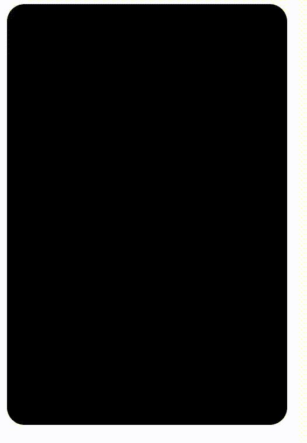

# 使用 CSS 在悬停卡片上显示内容

> 原文:[https://www . geesforgeks . org/display-content-on-悬停-card-using-css/](https://www.geeksforgeeks.org/display-content-on-hovering-card-using-css/)

在本文中，我们将看到如何使用 HTML 和 CSS，使用*悬停*属性创建一个在悬停时显示内容的卡片。

**HTML 代码:**在本节中，我们将创建我们的 HTML 卡的结构。

1.  用类名“card”创建一个“div”。
2.  在主“div”中创建另一个“div”，类名为“card__inner”。
3.  在第二个“div”中添加标题“h2”和段落，并添加一些随机内容。

## 超文本标记语言

```css
<!DOCTYPE html>
<html>

<body>
    <!-- div with class which will act
        as a container for us  -->
    <div class="card">

        <!--  Content of card to be
            display on hovering -->
        <div class="card__inner">
            <h2>GeeksforGeeks</h2>

<p>
                A Computer Science portal for
                geeks. It contains well written,
                well thought and well explained
                computer science and programming
                articles, quizzes and ...
            </p>

        </div>
    </div>
</body>

</html>
```

**CSS 代码:**在本节中，我们将使用 CSS 为元素分配常规属性。

## 半铸钢ˌ钢性铸铁(Cast Semi-Steel)

```css
<style>
    /* Assigning general property to card  */
    .card {
        position: relative;
        width: 20rem;
        height: 30rem;
        background-size: cover;
        background-color: black;
        background-image: url('one.png');
        border-radius: 20px;
        background-position: center center;
        overflow: hidden;
    }

    /*  Assigning properties to inner
        content of card  */
    .card__inner {
        background-color: rgba(0, 0, 0, 0.9);
        color: #fff;
        position: absolute;
        top: 0px;
        bottom: 0px;
        left: 0px;
        right: 0px;
        z-index: 1;
        opacity: 0;
        padding: 2rem 1.3rem 2rem 2rem;
        transition: all 0.4s ease 0s;
    }

    /*  On hovering card opacity
        of content must be 1*/
    .card:hover .card__inner {
        opacity: 1;
    }

    /*  General property for heading
        and paragraph*/
    .card__inner h2 {
        margin-top: 1rem;
    }

    .card__inner p {
        overflow-y: scroll;
        height: 87%;
        padding-right: 1rem;
        font-weight: 200;
        line-height: 2.5rem;
        margin-top: 1.5rem;
    }
</style>
```

**完整代码:**在本节中，我们将结合以上两段代码。

## 超文本标记语言

```css
<!DOCTYPE html>
<html>

<head>
    <style type="text/css">
        /* Assigning general property to card  */
        .card {
            position: relative;
            width: 20rem;
            height: 30rem;
            background-size: cover;
            background-color: black;
            background-image: url('one.png');
            border-radius: 20px;
            background-position: center center;
            overflow: hidden;
        }

        /* Assigning properties to inner
            content of card  */
        .card__inner {
            background-color: rgba(0, 0, 0, 0.9);
            color: #fff;
            position: absolute;
            top: 0px;
            bottom: 0px;
            left: 0px;
            right: 0px;
            z-index: 1;
            opacity: 0;
            padding: 2rem 1.3rem 2rem 2rem;
            transition: all 0.4s ease 0s;
        }

        /* On hovering card opacity of
            content must be 1*/
        .card:hover .card__inner {
            opacity: 1;
        }

        /* General property for heading
            and paragraph*/
        .card__inner h2 {
            margin-top: 1rem;
        }

        .card__inner p {
            overflow-y: scroll;
            height: 87%;
            padding-right: 1rem;
            font-weight: 200;
            line-height: 2.5rem;
            margin-top: 1.5rem;
        }
    </style>
</head>

<body>
    <!--  div with class which will
        act as a container for us -->
    <div class="card">

        <!--   Content of card to be
            display on hovering -->
        <div class="card__inner">
            <h2>GeeksforGeeks</h2>

<p>
                GeeksforGeeks: Computer Science portal
                for geeks. It contains well written,
                well thought and well explained
                computer science and programming
                articles, quizzes etc. It contains many
                free and premium contents.
                GeeksforGeeks: Computer Science portal
                for geeks. It contains well written,
                well thought and well explained
                computer science and programming
                articles, quizzes etc. It contains many
                free and premium contents.
            </p>

        </div>
    </div>
</body>

</html>
```

**输出:**

