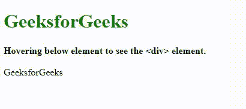

# 使用 CSS

在悬停在

> 原文:[https://www . geesforgeks . org/display-div-element-on-悬停-over-a-tag-using-css/](https://www.geeksforgeeks.org/display-div-element-on-hovering-over-a-tag-using-css/)

在本文中，我们将了解如何使用 CSS 通过将鼠标悬停在 [< a >标记](https://www.geeksforgeeks.org/html-a-tag/)上来渲染 div 元素，&将通过示例了解其实现。我们可以将一个*相邻的兄弟 CSS 选择器*属性应用到<一个>标签上，该标签将显示隐藏的 div 元素的内容，同时将其悬停在上面。相邻同级选择器是一个 CSS Combinators，用于选择相邻的元素或指定选择器标签旁边的元素。 [**CSS 组合子**](https://www.geeksforgeeks.org/css-combinators/) 解释两个选择器之间的关系。 [CSS 选择器](https://www.geeksforgeeks.org/css-selectors-complete-reference/)用于基于模式将各种样式属性应用于所选元素&它可以是简单的选择器，也可以是由多个使用组合器连接的选择器组成的复杂选择器。

这里，这个组合器将只选择 1 个紧挨着指定标签的标签。要在悬停标记时使用 CSS 显示 div 元素:

*   首先，将 div 元素设置为不可见，即*显示:无；*。
*   通过使用相邻的同级选择器并悬停在标记上来显示 div 元素。

**示例:**这个示例说明了如何在悬停标签时显示 div 元素。

## 超文本标记语言

```html
<!DOCTYPE html>
<html>

<head>
    <style>
    h1 {
        color: green;
    }

    div {
        display: none;
    }

    a:hover + div {
        display: block;
        color: green;
        font-size: 25px;
    }
    </style>
</head>

<body style="text:align:center;">
    <h1>GeeksforGeeks</h1> <b>
      Hovering below element to see 
      the <div> element.
    </b>
    <br>
    <br> <a>GeeksforGeeks</a>
    <div> A computer science portal for Geeks. </div>
</body>

</html>
```

**输出:**



**支持的浏览器:**浏览器的*相邻兄弟 CSS 选择器* *属性，*如下所示:

*   谷歌 Chrome 1.0
*   微软边缘 12.0
*   Firefox 1.0
*   Internet Explorer 7.0
*   歌剧 3.5
*   Safari 1.0

CSS 是网页的基础，通过设计网站和网络应用程序用于网页开发。你可以通过以下 [CSS 教程](https://www.geeksforgeeks.org/css-tutorials/)和 [CSS 示例](https://www.geeksforgeeks.org/css-examples/)从头开始学习 CSS。