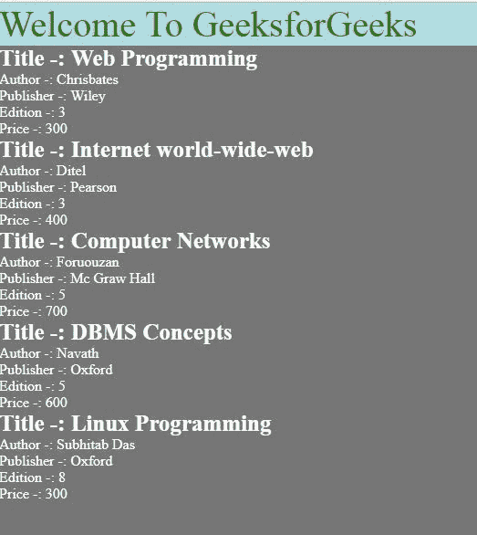
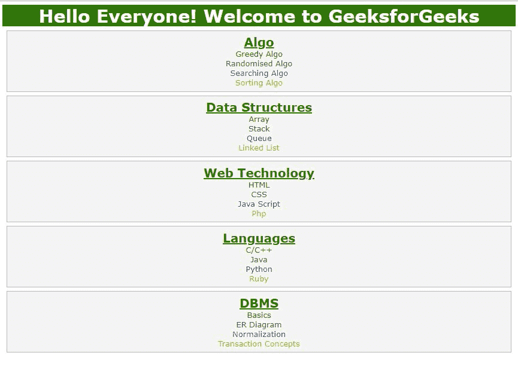

# 使用 CSS 显示 XML

> 原文:[https://www.geeksforgeeks.org/displaying-xml-using-css/](https://www.geeksforgeeks.org/displaying-xml-using-css/)

XML 代表 **E** 扩展 **M** arkup **L** 语言。它是一种动态标记语言。它用于将数据从一种形式转换为另一种形式。
一个 XML 文件可以用两种方式显示。这些措施如下

1.  级联样式表
2.  Extensible Stylesheet Language Transformation

    **使用 CSS 显示 XML 文件:**
    CSS 可以清晰、精确地显示 XML 文档的内容。它给出了整个 XML 文档的设计和风格。

    *   **定义 XML CSS 样式表的基本步骤:**
        为了定义 XML 文档的样式规则，应该做以下事情:-
        1.  定义文本元素的样式规则，如字体大小、颜色、字体粗细等。
        2.  使用 CSS 的显示属性，将每个元素定义为块、内联或列表元素。
        3.  确定标题并加粗。
    *   **用 CSS 链接 XML:**
        为了用 CSS 显示 XML 文件，用 CSS 链接 XML 文件。下面是链接 XML 文件和 CSS 的语法:

        ```
        <?xml-stylesheet type="text/css" href="name_of_css_file.css"?>
        ```

    *   **实施例 1。**
        在本例中，创建了包含五本书信息的 XML 文件，并使用 CSS 显示该 XML 文件。

    *   **XML file :**
        Creating Books.xml as :-

        ```
        <?xml version="1.0" encoding="UTF-8"?>
        <?xml-stylesheet type="text/css" href="Rule.css"?>
        <books>
            <heading>Welcome To GeeksforGeeks </heading>
            <book>
                <title>Title -: Web Programming</title>
                <author>Author -: Chrisbates</author>
                <publisher>Publisher -: Wiley</publisher>
                <edition>Edition -: 3</edition>
                <price> Price -: 300</price>
            </book>
            <book>
                <title>Title -: Internet world-wide-web</title>
                <author>Author -: Ditel</author>
                <publisher>Publisher -: Pearson</publisher>
                <edition>Edition -: 3</edition>
                <price>Price -: 400</price>
            </book>
            <book>
                <title>Title -: Computer Networks</title>
                <author>Author -: Foruouzan</author>
                <publisher>Publisher -: Mc Graw Hill</publisher>
                <edition>Edition -: 5</edition>
                <price>Price -: 700</price>
            </book>
            <book>
                <title>Title -: DBMS Concepts</title>
                <author>Author -: Navath</author>
                <publisher>Publisher -: Oxford</publisher>
                <edition>Edition -: 5</edition>
                <price>Price -: 600</price>
            </book>
            <book>
                <title>Title -: Linux Programming</title>
                <author>Author -: Subhitab Das</author>
                <publisher>Publisher -: Oxford</publisher>
                <edition>Edition -: 8</edition>
                <price>Price -: 300</price>
            </book>
        </books>
        ```

        在上面的例子中，Books.xml 与 Rule.css 相链接，后者包含相应的样式表规则。

    *   **CSS 文件:**
        创建规则. CSS 为:-

        ```
        books {
             color: white;
             background-color : gray;
             width: 100%;
        }
         heading {
             color: green;
             font-size : 40px;
             background-color : powderblue;
        }
         heading, title, author, publisher, edition, price {
             display : block;
        }
         title {
             font-size : 25px;
             font-weight : bold;
        }
        ```

    *   **输出:**
        
    *   **例 2。**
        在本例中，创建了一个 XML 文件，其中包含了极客的极客中各个部分的信息以及它们包含的主题，然后使用 CSS 显示该 XML 文件。
        *   **XML file :**
            Creating Section.xml as :-

            ```
            <?xml version="1.0" encoding="UTF-8"?>
            <?xml-stylesheet type="text/css" href="Geeks.css"?>
            <Geeks_for_Geeks>
                <title>Hello Everyone! Welcome to GeeksforGeeks</title>
                <geeks_section>
                    <name>Algo</name>
                    <topic1>Greedy Algo</topic1>
                    <topic2>Randomised Algo</topic2>
                    <topic3>Searching Algo</topic3>
                    <topic4>Sorting Algo</topic4>
                </geeks_section>
                <geeks_section>
                    <name>Data Structures</name>
                    <topic1>Array</topic1>
                    <topic2>Stack</topic2>
                    <topic3>Queue</topic3>
                    <topic4>Linked List</topic4>
                </geeks_section>
                <geeks_section>
                    <name>Web Technology</name>
                    <topic1>HTML</topic1>
                    <topic2>CSS</topic2>
                    <topic3>Java Script</topic3>
                    <topic4>Php</topic4>
                </geeks_section>
                <geeks_section>
                    <name>Languages</name>
                    <topic1>C/C++</topic1>
                    <topic2>Java</topic2>
                    <topic3>Python</topic3>
                    <topic4>Ruby</topic4>
                </geeks_section>
                <geeks_section>
                    <name>DBMS</name>
                    <topic1>Basics</topic1>
                    <topic2>ER Diagram</topic2>
                    <topic3>Normalization</topic3>
                    <topic4>Transaction Concepts</topic4>
                </geeks_section>
            </Geeks_for_Geeks>
            ```

            在上面的例子中，Section.xml 与 Geeks.css 相链接，后者包含相应的样式表规则。

        *   **CSS 文件:**
            创建极客. CSS 为:-

            ```
            Geeks_for_Geeks 
                          {
                          font-size:80%;
                          margin:0.5em;
                          font-family: Verdana;
                          display:block;
                          }
            geeks_section {
                          display:block; 
                          border: 1px solid silver;
                          margin:0.5em; 
                          padding:0.5em; 
                          background-color:whitesmoke;
                          }
            title {
                  display:block;
                  font-weight:bolder;
                  text-align:center;
                  font-size:30px;
                  background-color: green;
                  color: white;

                  }
            name, topic1, topic2, topic3, topic4 {
                                             display:block;
                                             text-align:center;
                                             }
            name {
                 color:green; 
                 text-decoration: underline  ;
                 font-weight:bolder;
                 font-size:20px;
                 }
            topic1 {
                   color:green
                   }
            topic2 {
                   color:brown
                   }
            topic3 {
                   color:blue
                   }
            topic4 { 
                   color:orange
                   }
            ```

        *   **输出:**
            

    **使用 CSS 显示 XML 的优势:**

    1.  CSS 用在 XML 或 HTML 中来装饰页面。
    2.  交互界面采用 CSS，用户可以理解。
    3.  CSS 允许多个页面共享格式，并减少结构内容的复杂性和重复。所以页面加载器更快。

    **使用 CSS 显示 XML 的缺点:**

    1.  使用 CSS，不能对 XML 文档应用任何转换。
    2.  CSS 用不同的浏览器使用不同的维度。因此，程序员必须在不同的浏览器中运行代码，并测试其兼容性，才能实时发布。
    3.  CSS 有不同级别的版本，所以对浏览器和用户来说都很混乱。

    CSS 是网页的基础，通过设计网站和网络应用程序用于网页开发。你可以通过以下 [CSS 教程](https://www.geeksforgeeks.org/css-tutorials/)和 [CSS 示例](https://www.geeksforgeeks.org/css-examples/)从头开始学习 CSS。