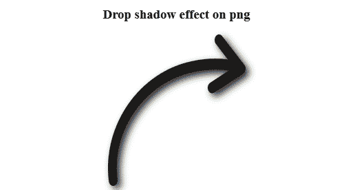
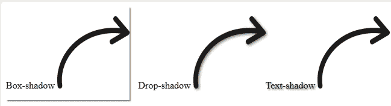

# 使用 CSS 为 PNG 图像投下阴影

> 原文:[https://www . geesforgeks . org/drop-shadow-for-png-image-using-CSS/](https://www.geeksforgeeks.org/drop-shadow-for-png-image-using-css/)

有一种基本的方法可以在图像上添加阴影效果，但是这种效果会表现得像图像是正方形一样，所以有另一种方法可以在 PNG 图像上添加阴影。正常的阴影效果将总是为图像放置一个正方形的图像阴影，它可以是正方形的或者不能是正方形的，但是阴影将总是正方形的。**滤镜:投影()；**和**文字-阴影()；**属性比**框影:()**属性更赏心悦目。

**语法:**

```html
filter: drop-shadow();
```

**示例 1:** 本示例使用 filter: drop-shadow()属性在 pngimage 上添加阴影效果。

```html
<!DOCTYPE html>
<html>

<head>

    <!-- CSS style to add shadow -->
    <style>
        img {
            filter: drop-shadow(5px 5px 5px #222);
            width:200px;
            height:220px;
        }
    </style>
</head>

<body style="text-align:center;">
    <h3>Drop shadow effect on png</h3>
    
</body>

</html>                                  
```

**输出:**


**示例 2:** 本示例区分**滤镜:投影()；**、**文-影()；**和**框影:()；**属性。

```html
<!DOCTYPE html> 
<html> 

<head> 
    <style> 
        img {
            width:120px;
        }
        .Box-shadow {
            float:left;
            box-shadow:2px 2px 2px gray;
        }

        .Text-shadow {
            float:right;
            text-shadow:2px 2px 2px gray;
        }
        .Drop-shadow {
            float:right;
        }
        .Drop-shadow img {
            filter:drop-shadow(2px 2px 2px gray);
        }
    </style> 
</head> 

<body> 

    <div class = "images"> 
        <div class="Box-shadow">
            <p>Box-shadow
                
            </p>
        </div>

        <div class="Text-shadow">
            <p>Text-shadow
                
            </p>
        </div>

        <div class="Drop-shadow">
            <p>Drop-shadow
                
            </p> 
        </div>
    </div> 
</body> 

</html>                                                    
```

**输出:**
