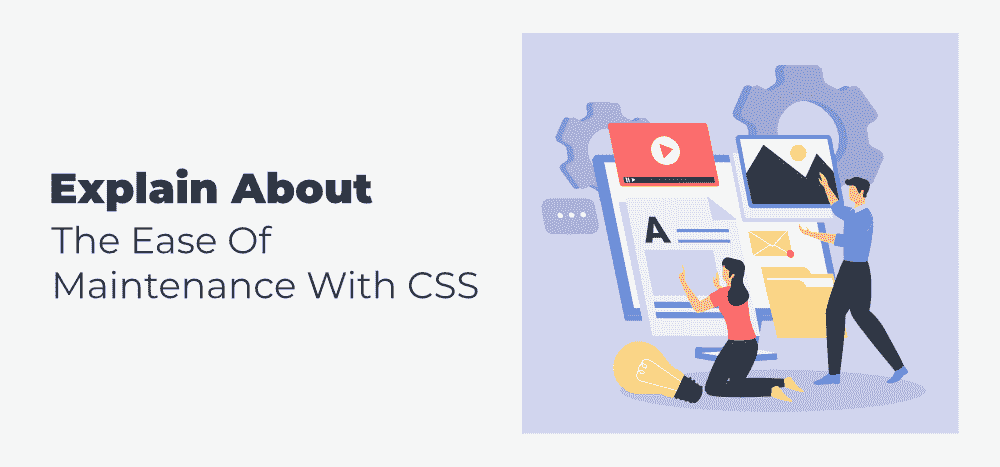

# 用 CSS 解释维护的简易性

> 原文:[https://www . geesforgeks . org/explain-about-easy-of-maintenance-with-CSS/](https://www.geeksforgeeks.org/explain-about-the-ease-of-maintenance-with-css/)

**简介:** [CSS](https://www.geeksforgeeks.org/css-tutorials/) 是 ***层叠样式表的缩写。*** CSS 用于增强 [HTML](https://www.geeksforgeeks.org/html-tutorials/) 标签中包含的内容的呈现。CSS 负责网页的外观和感觉。CSS 可以用来改变文本的颜色、字体样式、段落间距、列的大小和布局等等。我们可以使用 CSS 来定义基于媒体显示内容的不同方式。

**使用 CSS 的优势:**

1.  **CSS 帮你节省时间:** CSS 可以写一次，然后在多个 HTML 页面中重用。您可以为每个 HTML 元素定义一种样式，并将其应用于无限数量的网页。
2.  **导致更少的代码:**我们使用更少的代码，因为我们在一个公共样式类中用一个值定义属性，并在多个地方使用同一个类。更少的代码意味着更少的带宽消耗和更容易的内容维护。
3.  **易于维护:**因为我们在全局或公共位置定义样式，所以任何更改都很简单。例如，在网站上，所有产品名称都使用特定的样式属性显示。现在，我们可以通过更改产品名称的外部样式表中的样式类来更改整个站点的样式。我们可以保留多个样式表，并根据情况使用它们。属性继承方法的使用使得维护同一标签的多种样式变得简单。
4.  **世界各地的 Web 标准:**HTML 属性现在已经被弃用，建议改用 CSS。因此，最好开始在所有 HTML 页面中使用 CSS，以确保与未来浏览器的兼容性。
5.  **页面下载很快:**因为浏览器缓存了样式表页面，页面加载变得更快。当同一站点的不同页面使用相同的 CSS 时，样式类不会从服务器加载。
6.  **平台的独立性:**脚本提供了一致的平台独立性，可以支持最新的浏览器。
7.  **风格可以有多种定义方式:**层叠这个名字意味着我们可以使用多种风格，局部风格优先。我们可以覆盖全局样式声明，并在本地将样式分配给标签。

我们已经看到了使用 CSS 的许多优点，但同时它也有一些缺点，如下所述:

**CSS 的缺点:**

1.  CSS，从 CSS 1 到 CSS3，在网页浏览器中引起混乱。
2.  说到 CSS，在一个浏览器中起作用的东西在另一个浏览器中可能并不总是起作用。web 开发人员必须通过在多个浏览器中运行来测试程序的兼容性。
3.  缺乏安全。
4.  进行更改后，如果出现兼容性，我们必须进行确认。所有浏览器都受到相同变化的影响。
5.  对于非开发人员和初学者来说，编程语言的世界是复杂的。CSS 级别，如 CSS、CSS 2 和 CSS 3，可能会相当混乱。
6.  与浏览器的兼容性(支持某些样式表，不支持某些样式表)。
7.  CSS 在不同的浏览器中表现不同。IE 和 Opera 使用不同的逻辑支持 CSS。
8.  使用 CSS 时，可能会出现跨浏览器问题。
9.  有几个层次，让非开发人员和初学者感到困惑。

**结论:** Web 开发离不开 CSS。CSS 刚开始可能会显得很难，但是学了几个概念之后，CSS 就会觉得很简单很容易。主要目标(作为方法表语言)是将文档内容与文档表示分离，文档表示包括样式元素，如颜色、布局和字体。CSS 负责网页的外观和感觉。CSS 可以用来改变文本的颜色、字体设计、段落间距、列大小和布局等等。