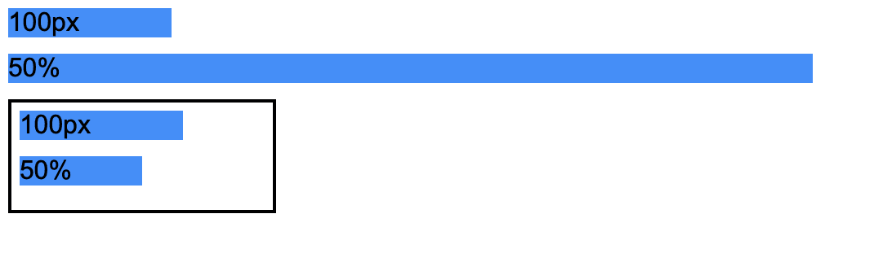
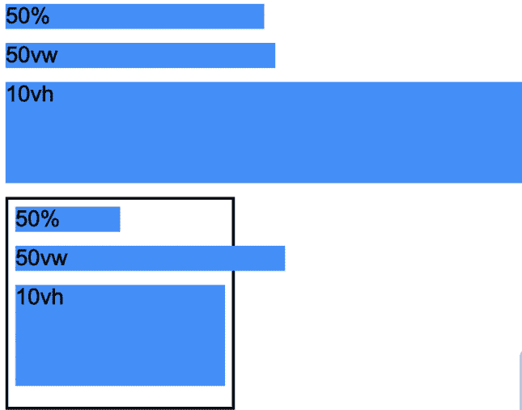
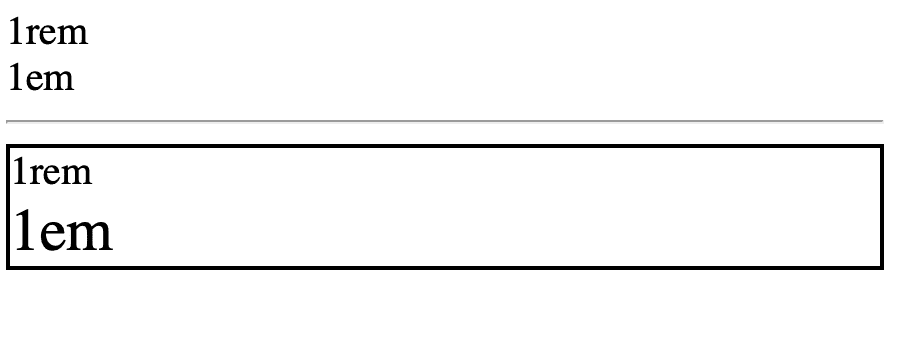

# 解释 CSS3

中的所有测量单位

> 原文:[https://www . geesforgeks . org/explain-all-the-measurement-in-css3/](https://www.geeksforgeeks.org/explain-all-the-measurement-units-in-css3/)

最常用的 [CSS 测量单位](https://www.geeksforgeeks.org/css-units/)如下:

*   **px:** 此单位虽小但可见。该单元相对于观察设备。
*   **百分比(%):** 表示百分比值。这定义了元素相对于父对象的大小。
*   **大众(视图宽度):**此单位表示相对于视口 1%宽度的视图宽度。
*   **vh(视图高度):**该单位表示相对于视口 1%高度的视图高度。
*   **em:** 此单位表示元素的计算 [*字号*](https://www.geeksforgeeks.org/css-font-size-property/) 。
*   **rem:** 这叫做根 em，表示根元素的 [*字号*](https://www.geeksforgeeks.org/css-font-size-property/) 值。

**示例 1:** 以下示例显示了 px 和百分比之间的比较。该示例清楚地显示了 px 和百分比之间的差异。px 是绝对单位，而百分比是相对单位。不管容器的大小如何，px 都不会改变它的大小，而%会根据容器的宽度动态地改变它的大小。

## 超文本标记语言

```css
<!DOCTYPE html>
<html>

<body>
  <div class="box pixel-units">
    100px
  </div>
  <div class="box percentage-units">
    50%
  </div>
  <div class="parent">
     <div class="box pixel-units">
     100px
     </div>
    <div class="box percentage-units">
      50%
    </div>
  </div>
</body>
</html>
```

## 半铸钢ˌ钢性铸铁(Cast Semi-Steel)

```css
body{
  font-family: Arial;
}
.box{
    background-color: dodgerblue;
    margin-bottom: 10px;
}
.pixel-units{
  width: 100px;
}
.percentage-units{
  width: 50%;
}
.parent{
  width: 150px;
  border: 2px solid black;
  padding: 5px;
}
```

**输出:**



**示例 2:** 以下示例显示了 vw、vh 和百分比之间的比较。另一种相关单位是大众和 vh。虽然百分比是相对于父容器的大小，大众和 vh 是相对于屏幕的大小。1vw 是屏幕尺寸 1%的宽度，而 1vh 是屏幕尺寸 1%的高度。下面的例子将说明大众，vh 和百分比之间的差异。

## 超文本标记语言

```css
<!DOCTYPE html>
<html>

<body>
    <div class="box percentage-units">
      50%
    </div>
    <div class="box vw-unit">
      50vw
    </div>
    <div class="box vh-unit">
      10vh
    </div>

   <div class="parent">
      <div class=" box percentage-units">
        50%
      </div>
      <div class="box vw-unit">
        50vw
      </div>
      <div class="box vh-unit">
          10vh
      </div>
    </div>
</body>
</html>
```

## 半铸钢ˌ钢性铸铁(Cast Semi-Steel)

```css
body{
  font-family: Arial;
}
.box{
    background-color: dodgerblue;
    margin-bottom: 10px;
}
.percentage-units{
  width: 50%;
}
.vw-unit{
  width: 50vw;
}
.vh-unit{
  height: 10vh;
}
.parent{
  width: 150px;
  border: 2px solid black;
  padding: 5px;
}
```

**输出:**



**示例 3:** 以下示例显示了 em 和 rem 之间的比较。

em 和 rem 是应用于字体大小的相对单位。这些单位是由我们指定的字体大小定义的。em 和 rem 的主要区别在于，em 是相对于根元素()的，而 em 是相对于父容器中指定的字体大小的。下面的例子应该有助于你理解这些单位之间的区别。

**注意:**根元素默认字体大小为 16px。可以通过在 HTML 中更改[*字号*](https://www.geeksforgeeks.org/css-font-size-property/) 值来覆盖。

## 超文本标记语言

```css
<!DOCTYPE html>
<html>

  <body>
    <!--children of root element -->
    <div class="one-rem">1rem</div>
    <div class="one-em">1em</div>
    <hr>
    <!--children of parent div element -->
    <div class="parent">
      <div class="one-rem">1rem</div>
      <div class="one-em">1em</div>
    </div>
  </body>
</html>
```

## 半铸钢ˌ钢性铸铁(Cast Semi-Steel)

```css
html{
  font-size: 20px;/*Default font size of 16px*/
}
.one-rem{
   font-size: 1rem;
}
.one-em{
   font-size: 1em;
}
.parent{
  font-size: 30px;
  border: 2px solid black;
}
```

**输出:**



在第一种情况下， [em 和 rem](https://www.geeksforgeeks.org/difference-between-em-and-rem-units-in-css/) 具有相同的字体大小，因为它们是同一元素(根元素)的子元素。然而，在第二种情况下，父容器中的 [*字体大小*](https://www.geeksforgeeks.org/css-font-size-property/) 被定义为 30px，这解释了 em 和 rem 之间*字体大小*的差异。