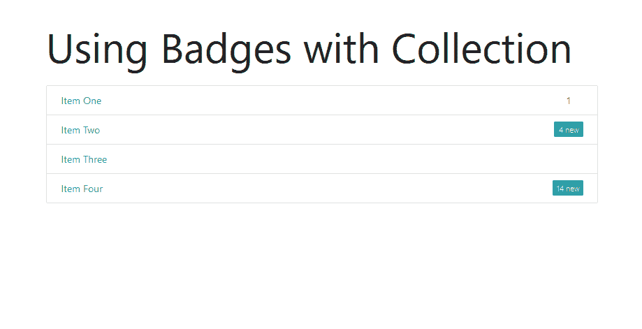
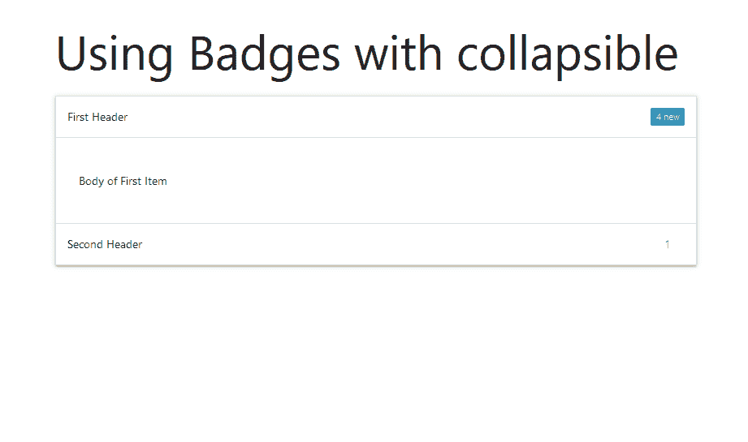
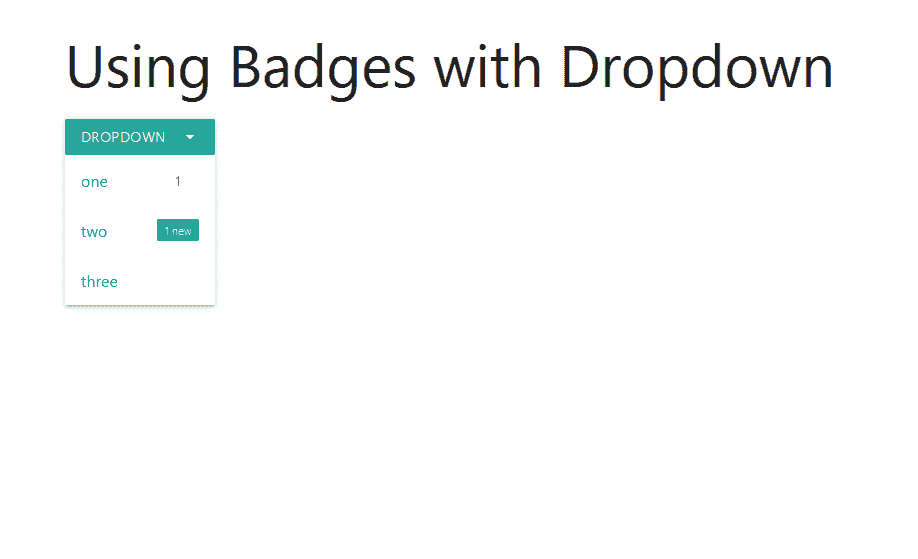
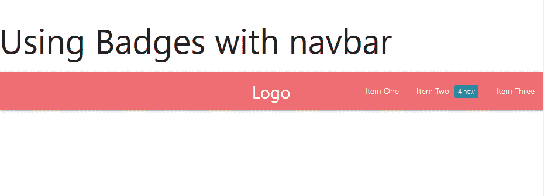
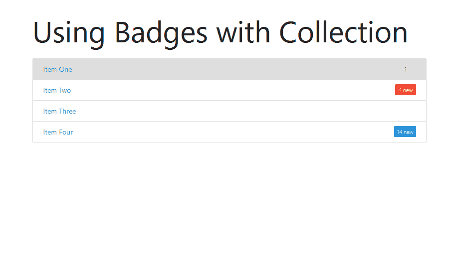

# 在物化 CSS 中解释徽章？

> 原文:[https://www . geesforgeks . org/explain-badge-in-物化-css/](https://www.geeksforgeeks.org/explain-badge-in-materialize-css/)

**徽章**是物化 CSS 非常有用的组件之一。它就像一个图标，帮助我们显示未读消息、通知、电子邮件和所有其他类似的东西。在本文中，我们将讨论如何在物化 CSS 中使用徽章。徽章可以通过在 span 元素中添加*徽章*类来定义。我们可以使用新类为徽章添加背景。

**语法:**

```css
<span class="badge">Badge Text</span>
<span class="badge new">New Badge Text</span>
```

以下示例显示了在物化 CSS 中添加徽章的多种方法。

**示例 1:** 在收藏中使用徽章。

## 超文本标记语言

```css
<!DOCTYPE html>
<html>

<head>
    <link href=
"https://fonts.googleapis.com/icon?family=Material+Icons"
          rel="stylesheet">
    <link href=
"https://cdnjs.cloudflare.com/ajax/libs/materialize/1.0.0/css/materialize.min.css"
          rel="stylesheet" >
</head>

<body class="container">
    <h1>Using Badges with Collection</h1>
    <div class="collection">
        <a href="#!" class="collection-item">
            <span class="badge">1</span>Item One
        </a>
        <a href="#!" class="collection-item">
            <span class="new badge">4</span>Item Two
        </a>
        <a href="#!" class="collection-item">
            Item Three
        </a>
        <a href="#!" class="collection-item">
            <span class="new badge">14</span>Item Four
        </a>
    </div>
    <script src=
"https://cdnjs.cloudflare.com/ajax/libs/materialize/1.0.0/js/materialize.min.js">
    </script>
</body>

</html>
```

**输出:**



**示例 2:** 在可折叠状态下使用徽章。

## 超文本标记语言

```css
<!DOCTYPE html>
<html>

<head>
    <link href=
"https://fonts.googleapis.com/icon?family=Material+Icons"
          rel="stylesheet">
    <link href=
"https://cdnjs.cloudflare.com/ajax/libs/materialize/1.0.0/css/materialize.min.css"
          rel="stylesheet">
</head>

<body class="container">
    <h1>Using Badges with collapsible</h1>
    <ul class="collapsible">
        <li>
            <div class="collapsible-header">
                First Header
                <span class="new badge">4</span>
            </div>
            <div class="collapsible-body">
                <p>Body of First Item</p>
            </div>
        </li>
        <li>
            <div class="collapsible-header">
                Second Header
                <span class="badge">1</span>
            </div>
            <div class="collapsible-body">
                <p>Body of Second Item</p>
            </div>
        </li>
    </ul>
    <script src=
"https://cdnjs.cloudflare.com/ajax/libs/materialize/1.0.0/js/materialize.min.js">
    </script>
    <script>
        document.addEventListener('DOMContentLoaded', function () {
            var elems = document.querySelectorAll('.collapsible');
            var instances = M.Collapsible.init(elems, {
                accordion: false
            });
        });
    </script>
</body>

</html>
```

**输出:**



**示例 3:** 在下拉列表中使用徽章

## 超文本标记语言

```css
<!DOCTYPE html>
<html>

<head>
    <link href=
"https://fonts.googleapis.com/icon?family=Material+Icons" 
          rel="stylesheet">
    <link rel="stylesheet" href=
"https://cdnjs.cloudflare.com/ajax/libs/materialize/1.0.0/css/materialize.min.css"
    >
</head>

<body class="container">
    <h1>Using Badges with Dropdown</h1>
    <!-- Dropdown Trigger -->
    <a class='dropdown-trigger btn' 
       href='#' 
       data-target='dropdown2'>
        Dropdown
        <i class="material-icons right">
            arrow_drop_down
        </i>
    </a>

    <!-- Dropdown Structure -->
    <ul id='dropdown2' class='dropdown-content'>
        <li>
            <a href="#!">one
                <span class="badge">1</span>
            </a>
        </li>
        <li>
            <a href="#!">two
                <span class="new badge">1</span>
            </a>
        </li>
        <li>
            <a href="#!">three</a>
        </li>
    </ul>

    <script src=
"https://cdnjs.cloudflare.com/ajax/libs/materialize/1.0.0/js/materialize.min.js">
    </script>
    <script>
        document.addEventListener(
            'DOMContentLoaded', function () {
                var elems =
                    document.querySelectorAll('.dropdown-trigger');
                var instances =
                    M.Dropdown.init(elems, { coverTrigger: false });
            });
    </script>
</body>

</html>
```

**输出:**



**示例 4:** 在导航栏中使用徽章

## 超文本标记语言

```css
<!DOCTYPE html>
<html>

<head>
    <link href=
"https://fonts.googleapis.com/icon?family=Material+Icons" 
          rel="stylesheet">
    <link href=
"https://cdnjs.cloudflare.com/ajax/libs/materialize/1.0.0/css/materialize.min.css" 
          rel="stylesheet">
</head>

<body>
    <h1>Using Badges with navbar</h1>
    <nav>
        <div class="nav-wrapper">
            <a href="" class="brand-logo">Logo</a>
            <ul id="nav-mobile" 
                class="right">
                <li><a href="">Item One</a></li>
                <li>
                  <a href="">Item Two
                      <span class="new badge">4</span>
                  </a>
                  </li>
                <li><a href="">Item Three</a></li>
            </ul>
        </div>
    </nav>
    <script src=
"https://cdnjs.cloudflare.com/ajax/libs/materialize/1.0.0/js/materialize.min.js">
    </script>
</body>

</html>
```

**输出:**



**示例 5:** 更改徽章的背景颜色

## 超文本标记语言

```css
<!DOCTYPE html>
<html>

<head>
    <link href=
"https://fonts.googleapis.com/icon?family=Material+Icons" 
          rel="stylesheet">
    <link href=
"https://cdnjs.cloudflare.com/ajax/libs/materialize/1.0.0/css/materialize.min.css" 
          rel="stylesheet" >
</head>

<body class="container">
    <h1>Using Badges with Collection</h1>
    <div class="collection">
        <a href="#!" class="collection-item">
          <span class="badge ">1</span>Item One
          </a>
        <a href="#!" class="collection-item">
          <span class="new badge red ">4</span>Item Two
          </a>
        <a href="#!" class="collection-item">
          Item Three
          </a>
        <a href="#!" class="collection-item">
          <span class=" new badge blue ">14</span>Item Four
          </a>
    </div>
    <script src=
"https://cdnjs.cloudflare.com/ajax/libs/materialize/1.0.0/js/materialize.min.js">
    </script>
</body>

</html>
```

**输出:**

