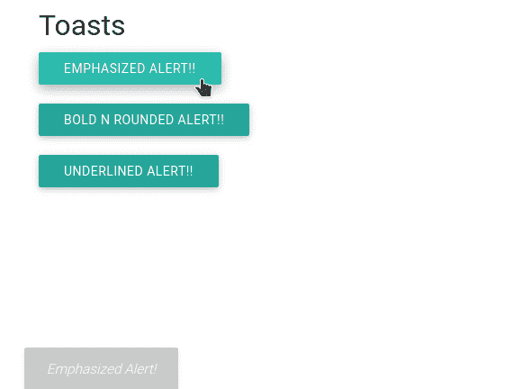

# 在物化 CSS 中解释对话框

> 原文:[https://www . geesforgeks . org/explain-dialogs-in-物化-css/](https://www.geeksforgeeks.org/explain-dialogs-in-materialize-css/)

物化 CSS 中的**对话框**在用户需要时向用户提供附加信息。这些在网页上是看不到的。对话框转换与该时间点所需的信息相关。物化提供了各种显示对话框的方法。

**语法:**

```html
Materialize.toast(string, time, styleClass,callback);
```

**参数:**

*   **字符串:**是需要在对话框中显示的字符串。
*   **时间:**显示消息字符串的时间。
*   **风格类:**这是添加各种风格。
*   **回调:**这个回调是吐司一出就要调用的方法。

**链接文件:**包括物化和 jQuery CDN 到 [<头>标签](https://www.geeksforgeeks.org/html-head-tag/)之前的所有其他样式表加载我们的 CSS 和 JavaScript。

> <link rel="“stylesheet”" href="“https://cdnjs.cloudflare.com/ajax/libs/materialize/0.97.3/css/materialize.min.css”">
> <脚本类型= " text/JavaScript " src = " https://code . jquery . com/jquery-2 . 1 . 1 . min . js "></脚本>
> <脚本 src = " https://cdnjs . cloudflare . com/Ajax/libs/物化/0 . 97 . 3/js/物化. min . js "></脚本>

**示例:**下面的示例展示了物化 CSS 中对话框的实现。

## 超文本标记语言

```html
<!DOCTYPE html>
<html>

<head>
    <link rel="stylesheet" href=
"https://cdnjs.cloudflare.com/ajax/libs/materialize/0.97.3/css/materialize.min.css">
    <script type="text/javascript" 
src="https://code.jquery.com/jquery-2.1.1.min.js"></script>
    <script src=
"https://cdnjs.cloudflare.com/ajax/libs/materialize/0.97.3/js/materialize.min.js">
    </script>

    <script>
        function Toast1(string, timeLength) {
            Materialize.toast(
                '<em>' + string + '</em>', timeLength
            );
        }
        function Toast2(string, timeLength) {
            Materialize.toast(
                '<b>' + string + '</b>', timeLength, 'rounded'
            );
        }
        function Toast3(string, timeLength) {
            Materialize.toast(
                '<u>' + string + '<u>', timeLength
            );
        }
    </script>
</head>

<body>
    <body class="container">
        <h4>Toasts</h4>
        <a class="btn" onclick=
            "Toast1('Emphasized Alert!', 1500)">
            Emphasized Alert!!
        </a><br><br>

        <a class="btn" onclick=
            "Toast2('Bold N rounded Alert!', 1500)">
            Bold N rounded Alert!!
        </a><br><br>

        <a class="btn" onclick=
            "Toast3('Underlined Alert!', 1500)">
            Underlined Alert!!
        </a><br><br>
    </body>
</body>

</html>
```

**输出:**

