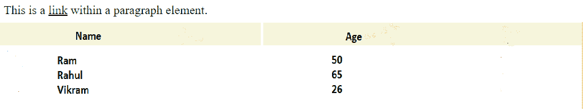

# 在 CSS 中解释嵌套和分组

> 原文:[https://www . geesforgeks . org/explain-nesting-and-group-in-CSS/](https://www.geeksforgeeks.org/explain-nesting-and-grouping-in-css/)

嵌套和分组概念对于 web 开发人员编写精确的代码非常重要。您可以对项目进行分组和嵌套，以减少您编写的代码量，这将减少代码的长度，并允许页面更快地加载。这是一种简化代码的方法。借助嵌套和分组，我们可以在代码中更加具体。在本文中，我们将看到嵌套和分组如何帮助优化代码，使其高效，增加可读性。

**嵌套:**CSS 中的嵌套属性便于将一个样式规则嵌套在另一个样式规则中，子规则的选择器相对于父规则的选择器。它有助于增加 CSS 样式表的模块化和可维护性&从而增加代码的整体可读性。例如，如果您编写一个结构化的 CSS 模块，而不是为每个 HTML 元素指定单独的选择器，即通过使用许多类或标识选择器，您可以简单地为其他选择器中的选择器指定属性。在嵌套 CSS 属性的同时，HTML 元素形成了一个树形结构。嵌套是为特定属性的多个选择器创建 CSS 规则的快捷方式。因此，我们可以简单地将选择器嵌套在其他选择器中，而不是为不同的选择器重写相同的属性集。由于这个原因，我们不仅减少了代码的大小，而且减少了总的加载时间。

**语法:**

```html
class1_selector class2_selector id_selector  {
  property: value;
}
```

**示例:**

```html
table tr th {
  background-color: beige;
}
```

**进场:**

*   选择 id/类选择器，并添加一个空格将两者分开。
*   添加元素的样式属性。

**注:**具体以嵌套顺序为准。

**示例:**在本例中，我们将在< p >标记内嵌套< a >标记，在< tr >标记内嵌套< th >标记。

## 超文本标记语言

```html
<!DOCTYPE html>
<html>

<head>
    <style>
        p a {
            color: green;
        }

        table tr th {
            background-color: beige;
        }
    </style>
</head>

<body>

    <p>
        This is a
        <a href="https://ide.geeksforgeeks.org/">link</a>
        within a paragraph element.
    </p>

    <table style="width: 100%">
        <tr>
            <th>Name</th>
            <th>Age</th>
        </tr>
        <tr>
            <td>Ram</td>
            <td>50</td>
        </tr>
        <tr>
            <td>Rahul</td>
            <td>65</td>
        </tr>
        <tr>
            <td>Vikram</td>
            <td>26</td>
        </tr>
    </table>
</body>

</html>
```

**输出:**我们使用嵌套获得了绿色的<标签和米色的<标签。



嵌套

**分组:**分组用于将多个元素选择在一起，以对其应用通用的样式属性。因此，它有助于减少具有多个具有相同属性的选择器的代码长度。这使得代码易于阅读。当使用分组时，页面加载时间和代码开发时间也减少了。

与其编写这么长的代码，不如为不同的选择器指定相同的属性:

```html
h1 {
  padding: 5px;
  color: grey;
}
p {
  padding: 5px;
  color: grey;
}
```

我们可以对它们进行分组并这样写&我们需要逗号(**、**)来对各种选择器进行分组。

```html
h1, p {
 padding: 5px;
 color: grey;
}
```

**进场:**

*   在标签内添加
*   在标签里面添加各种标签，里面有内容。
*   在

**示例:**在本例中，我们将各种选择器组合在一起。

## 超文本标记语言

```html
<!DOCTYPE html>
<html>

<head>
    <style>
        h1, h2, p, a {
            text-align: center;
            color: green;
        }
    </style>
</head>

<body>
    <h1>GeeksForGeeks</h1>
    <h2>Smaller heading!</h2>

    <p>This is
        <a href="https://ide.geeksforgeeks.org/">
            anchor tag
        </a>
    </p>

    <p>This is a paragraph.</p>
</body>

</html>
```

**输出:**


具有相同属性的分组选择器

**嵌套的区别&分组:**

<figure class="table">T21

| 

#### No.

 | 

#### Nested

 | 

#### Grouping

 |
| --- | --- | --- |
| 1。 | 嵌套属性有助于将一个样式规则嵌套在另一个样式规则中，子规则的选择器相对于父规则的选择器。 | 分组属性一次向多个选择器提供具有值的相同属性。 |
| 2。 | 这可能有助于简化&一次管理不同元素的属性，但是如果包含相同属性的嵌套元素的数量增加，这可能会变得复杂。管理这样的嵌套属性可能很困难。 | 一次将属性应用于不同元素的数量很简单&可以轻松管理。 |
| 3。 | 在这种情况下，如果我们需要修改任何特定元素的属性，即 CSS 中的父元素或子元素，我们需要为该特定元素手动更改它，如果它在嵌套中的话。对于大规模代码，管理 CSS 属性可能是一种低效的方式。 | 分组中没有这样的限制。 |

</figure>