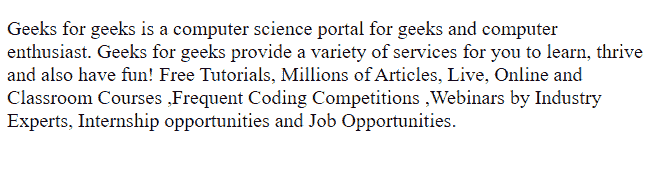

# 解释 CSS 中伪元素的概念

> 原文:[https://www . geesforgeks . org/解释 css 中伪元素的概念/](https://www.geeksforgeeks.org/explain-the-concept-of-pseudo-elements-in-css/)

CSS 伪元素用于为元素的指定部分设置样式，并用于为一些选择器添加特殊效果。为此，我们不需要像 javascript 这样的脚本来添加效果。

**语法:**

```html
selector::pseudo-element {
  property: value;
}
```

**注意:**在 CSS3 中，双冒号代替了伪元素的单冒号符号。单冒号也可以用在 CSS1 和 CSS2 中。

**应用:**

*   为选择器中文本的第一行添加特殊样式。
*   为选择器中文本的第一个字母添加特殊样式。
*   在元素前插入一些内容。
*   在元素后插入一些内容。
*   匹配用户选择的元素部分。
*   也可以组合多个伪元素。

现在我们将看到如何在 p 标签内的示例文本上使用上述效果。

**示例:**在本例中，我们将使用以下 HTML 代码来演示 CSS 效果。

## 超文本标记语言

```html
<!DOCTYPE html>
<html lang="en">

<head>
    <link rel="stylesheet" href="main.css">
</head>

<body>
    <p>
        Geeks for geeks is a computer science 
        portal for geeks and computer enthusiast.
        Geeks for geeks provide a variety of 
        services for you to learn, thrive and 
        also have fun! Free Tutorials, Millions 
        of Articles, Live, Online and Classroom
        Courses ,Frequent Coding Competitions,
        Webinars by Industry Experts, Internship 
        opportunities and Job Opportunities.
    </p>
</body>

</html>
```

**输出:**



现在我们将对上面的 HTML 代码应用 CSS。

**1。选择器::第一行:**第一行伪元素为选择器中文本的第一行**添加特殊样式。我们可以用这个给第一行添加各种样式。这里我们看到一个例子:**

## main . CSS-主文件

```html
/* Write CSS Here */
p::first-line{
  color: blue;
  font-size: 2rem;
}
```