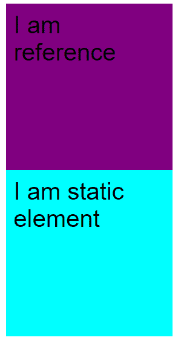
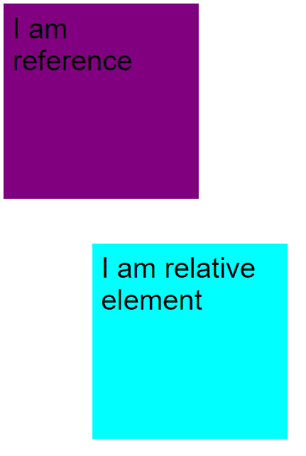
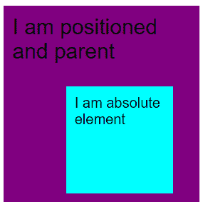
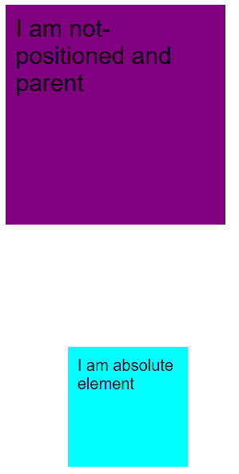
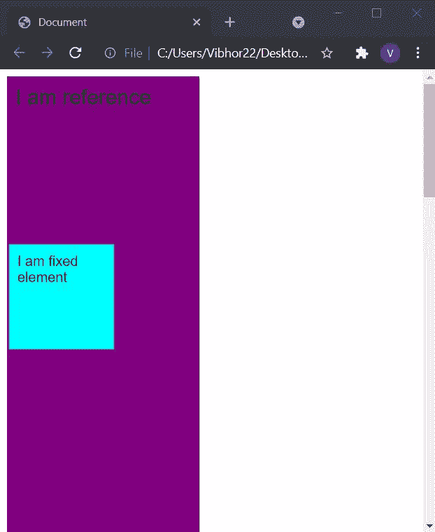
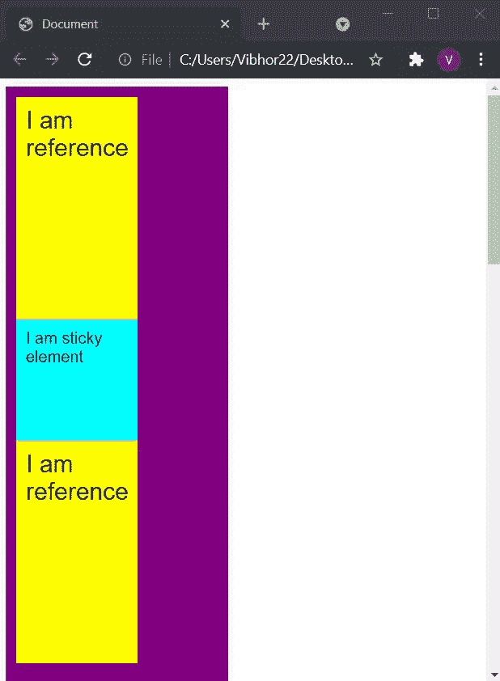

# 在 CSS 中解释位置属性

> 原文:[https://www . geesforgeks . org/explain-the-positions-property-in-CSS/](https://www.geeksforgeeks.org/explain-the-positions-property-in-css/)

在这篇文章中，我们将看到什么是位置属性，如何明智地使用这个属性来制作网页。position 属性用于对齐 HTML 页面中的不同元素。位置属性对于制作高质量的网页起着重要的作用。

CSS 中有 5 个位置属性:

*   静态(默认)
*   亲戚
*   绝对的
*   固定的；不变的
*   粘的

**语法:**

```html
selector{
    position: value;
}
value = static, relative, absolute, fixed, sticky
```

让我们逐一了解这些属性。

**1。位置:静态**是元素的默认位置值。在静态位置下，根据页面的正常流程定位元素。

**注意:**如果位置是静态的，左、右、上、下属性不会影响。

**示例:**

## 超文本标记语言

```html
<!DOCTYPE html>
<html lang="en">

<head>
    <style>
        .purple {
            height: 200px;
            width: 200px;
            color: black;
            font-size: 1.5rem;
            padding: 10px;
            background-color: purple;
        }

        .cyan {
            position: static;
            font-size: 1.5rem;
            padding: 10px;
            height: 200px;
            width: 200px;
            background-color: cyan;
        }
    </style>
</head>

<body>
    <div class="purple">
        I am reference
    </div>
    <div class="cyan">
        I am static element
    </div>
</body>

</html>
```

**输出:**



**2。位置:相对**在这种情况下，元素保留在文档的正常流程中，但会影响左、右、上、下。元素从它们在文档中的原始位置移动，从而产生空白空间，其他元素可以根据元素留下的空白空间进行自我调整。

**示例:**

## 超文本标记语言

```html
<!DOCTYPE html>
<html lang="en">

<head>
    <style>
        .purple {
            height: 200px;
            width: 200px;
            color: black;
            font-size: 1.5rem;
            padding: 10px;
            background-color: purple;
        }

        .cyan {
            position: relative;
            left: 100px;
            top: 90px;
            font-size: 1.5rem;
            padding: 10px;
            height: 200px;
            width: 200px;
            background-color: cyan;
        }
    </style>
</head>

<body>
    <div class="purple"> I am reference </div>
    <div class="cyan"> I am relative element </div>
</body>

</html>
```

**输出:**



**说明:**我们可以在这里看到元素从原来的位置向左上方变化，创造出一些空间。

**3。位置:绝对**绝对元素不遵循正常的流程文档，而是相对于最近的**定位祖先**定位自己。它的最终位置使用顶部、底部、左侧和右侧来确定。

**注:**定位元素是指位置属性不是静态的元素。

这些元素不占用任何空间，其他元素对待绝对元素就像没有元素一样。父元素应该是**定位和位置属性，而不是绝对的**，如果父元素没有定位，那么绝对元素根据最近定位的祖先来定位自己。使用绝对位置时，我们一般设置 **z 指数**。

**考虑两种情况了解绝对位置:**

**第 1 种情况:**当父属性值为**定位时**表示父的位置属性不等于静态。

## 超文本标记语言

```html
<!DOCTYPE html>
<html lang="en">

<head>
    <style>
        .purple {
            position: relative;
            height: 200px;
            width: 200px;
            color: black;
            font-size: 1.5rem;
            padding: 10px;
            background-color: purple;
        }

        .cyan {
            position: absolute;
            bottom: 10px;
            left: 70px;
            font-size: 1.5rem;
            padding: 10px;
            height: 100px;
            width: 100px;
            background-color: cyan;
        }
    </style>
</head>

<body>
    <div class="purple">
        I am positioned and parent
        <div class="cyan"> I am absolute element </div>
    </div>
</body>

</html>
```

**输出:**



**说明:**这里我们可以看到子元素已经根据父元素进行了自我调整，没有给它分配额外的空间。

**第二种情况:**当母元素为**未定位**时。

## 超文本标记语言

```html
<!DOCTYPE html>
<html lang="en">

<head>
    <style>
        .purple {
            position: static;
            height: 200px;
            width: 200px;
            color: black;
            font-size: 1.5rem;
            padding: 10px;
            background-color: purple;
        }

        .cyan {
            position: absolute;
            bottom: 10px;
            left: 70px;
            font-size: 1.5rem;
            padding: 10px;
            height: 100px;
            width: 100px;
            background-color: cyan;
        }
    </style>
</head>

<body>
    <div class="purple">
        I am not-positioned and parent
        <div class="cyan"> I am absolute element </div>
    </div>
</body>

</html>
```

**输出:**



**解释:**由于父元素没有定位，子元素会尝试相对于最近定位的祖先进行自身调整。这里位置最近的祖先是< HTML >，所以元素根据< HTML >进行调整。

**4。位置:固定**固定元素不遵循正常的文档流，相对于< HTML >标签定位自身。这个元素总是粘在屏幕上。

**示例:**

## 超文本标记语言

```html
<!DOCTYPE html>
<html lang="en">

<head>
    <style>
        .purple {
            position: relative;
            height: 2000px;
            width: 200px;
            color: black;
            font-size: 1.5rem;
            font-family: sans-serif;
            padding: 10px;
            background-color: purple;
        }

        .cyan {
            position: fixed;
            top: 200px;
            left: 10px;
            padding: 10px;
            font-size: 1rem;
            color: black;
            height: 100px;
            width: 100px;
            background-color: cyan;
        }
    </style>
</head>

<body>
    <div class="purple">
        I am reference
        <div class="cyan">
            I am fixed element
        </div>
    </div>
</body>

</html>
```

**输出:**



即使上下滚动，您也可以看到固定元素保持在原来的位置。

**5。位置:粘性**有点棘手，但是很容易理解。我们可以认为粘性是**相对**和**固定的组合。**记住在**中固定**元素在某个位置保持固定，但是在粘滞元素中相对于某个点表现为，之后表现为固定。

**示例:**

## 超文本标记语言

```html
<!DOCTYPE html>
<html lang="en">

<head>
    <style>
        .purple {
            position: absolute;
            height: 2000px;
            width: 200px;
            color: black;
            font-size: 1.5rem;
            font-family: sans-serif;
            padding: 10px;
            background-color: purple;
        }

        .cyan {
            position: sticky;
            top: 10px;
            left: 0px;
            padding: 10px;
            font-size: 1rem;
            color: black;
            height: 100px;
            width: 100px;
            background-color: cyan;
            z-index: 2;
        }

        .yellow {
            padding: 10px;
            position: relative;
            height: 100px;
            width: 100px;
            background-color: yellow;
        }
    </style>
</head>

<body>
    <div class="purple">
        <div class="yellow">I am reference</div>
        <div class="cyan">
            I am sticky element
        </div>
        <div class="yellow">I am reference</div>
    </div>
</body>

</html>
```

**输出:**



**解释:**在上面的输出中，您可以看到粘性元素的行为就像一个相对元素，直到它到达一个特定的偏移量。然后，超过这一点，它会粘在页面上，表现得像固定的一样(这里的偏移量是顶部的 10px)。

**注意:**在粘滞键中，左、右、上、下并不决定元素在相对状态下的位置，而是指定元素应该在什么位置表现得像固定的一样。