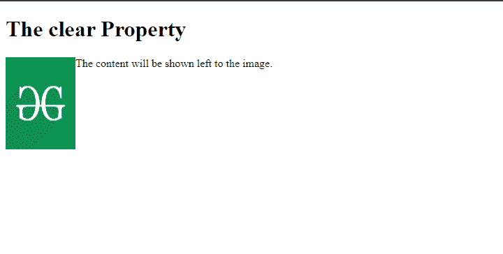
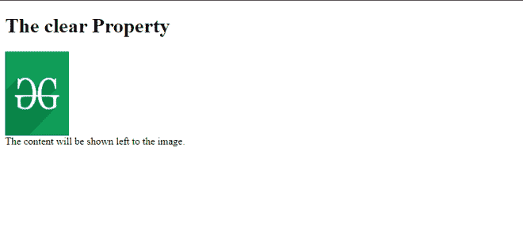

# 在 CSS

中说明清除浮动的目的

> 原文:[https://www . geesforgeks . org/explain-目的-清除 css 中的浮动/](https://www.geeksforgeeks.org/explain-the-purpose-of-clearing-floats-in-css/)

在本文中，我们将学习清除 float 以及在 CSS 中清除 float 的目的。在深入这个话题之前，我们先了解一下 CSS 中的 [float](https://www.geeksforgeeks.org/what-is-float-property-in-css/) 属性。CSS 中的 float 属性用于更改元素的正常流。[浮动](https://www.geeksforgeeks.org/what-is-float-property-in-css/)属性定义元素应该放在容器的左侧还是右侧。

**清除 CSS 中浮动的目的:**我们清除 float 属性，通过防止重叠来控制浮动元素。在我们的网页上，如果一个元素水平地放在浮动元素旁边，除非我们应用与浮动方向相同的 [clear](https://www.geeksforgeeks.org/css-clear-property/) 属性，否则这些元素将在浮动元素下面移动。

**语法:**

```css
clear: none|right|left|both|initial|inherit;
```

**属性值:**

*   **无:**是*清除*属性的默认值。使用此值后，元素将不会被向左或向右推送浮动元素。
*   **右侧:**该值将元素推到浮动元素的正下方。
*   **左侧:**该值将元素向左推到浮动元素的下方。
*   **两者:**该值将元素左右推到浮动元素。
*   **初始值:**将属性更改为默认值。
*   **继承:**将浮动属性继承到其父元素。

理解*概念，明确*的最好方法就是用一个例子。

**示例 1:** 我们在文本左侧浮动了一个图像，如下所示。我们可以看到，由于使用了*浮动*属性，元素被向左推到图像上。

## 超文本标记语言

```css
<!DOCTYPE html>
<html>

<head>
    <style>
        img {
            float: left;
        }
    </style>
</head>

<body>
    <h1>The clear Property</h1>
    

    <p>
        The content will be shown 
        left to the image.
    </p>
</body>

</html>
```

**输出:**



**示例 2:** 一旦我们使用带有左值的 clear 属性，元素将被推到图像下方。

## 超文本标记语言

```css
<!DOCTYPE html>
<html>

<head>
    <style>
        img {
            float: left;
        }

        p {
            clear: left;
        }
    </style>
</head>

<body>
    <h1>The clear Property</h1>
    

    <p>
        The content will be shown 
        left to the image.
    </p>
</body>

</html>
```

**输出:**

