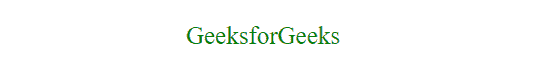
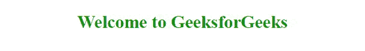
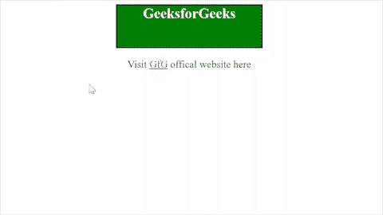

# 解释 CSS3

中的术语“伪类”

> 原文:[https://www . geesforgeks . org/explain-the-term-pseudo-class-in-css3/](https://www.geeksforgeeks.org/explain-the-term-pseudo-class-in-css3/)

[**层叠样式表**](https://www.geeksforgeeks.org/css-tutorials/) 简称 **CSS** 是一种样式表语言，用于设计和描述网页的呈现方式，使其具有吸引力。CSS 的主要用途是简化网页呈现的过程。

元素在屏幕上呈现的方式由 CSS 描述。CSS 将样式应用于网页。更重要的是，CSS 使这种风格独立于 [HTML](https://www.geeksforgeeks.org/html-tutorials/) 。

[**CSS** 主要分为 3 种类型](https://www.geeksforgeeks.org/types-of-css-cascading-style-sheet/)，具体如下。

*   内部 CSS
*   内嵌 CSS
*   外部 CSS

**语法**:CSS 包含样式规则，样式规则包含一个[选择器](https://www.geeksforgeeks.org/css-syntax-and-selectors/)，后跟一个声明块。这些样式规则由浏览器解释。

```css
h1 {
     font-size: 20px;
     background-color: blue;
}
```

*   **选择器:**选择器告知要设置样式的 HTML 元素。在这种情况下，选择器是“ [h1](https://www.geeksforgeeks.org/html-h1-to-h6-align-attribute/) 元素。
*   **声明:**每个声明包括一个 CSS 属性名和值，用分号分隔。在这种情况下，它的“字体大小”和“背景颜色”。

**示例:**在本例中，所有“p”元素内部的文本将居中对齐，它将具有 25px 的[字体大小](https://www.geeksforgeeks.org/css-font-size-property/)和“绿色”。

## 超文本标记语言

```css
<!DOCTYPE html>
<html>

<head>
    <style>
        p {
            text-align: center;
            font-size: 25px;
            color: green;
        }
    </style>
</head>

<body>
    <p>GeeksforGeeks</p>
</body>

</html>
```

**输出:**



**为什么用 CSS？**

*   **Web 开发基础:**每个 Web 开发人员都应该知道的基本技能是 HTML 和 CSS。
*   **代码的可重用性:** CSS 文件可以在我们想要应用一些样式的多个 HTML 页面中重用。
*   **吸引人的网站:**给我们的网站增加风格，肯定会让它更能呈现给用户。
*   **易于维护的代码:**代码的更改只需要在单个 CSS 文件中进行。
*   **提升用户体验:**简洁而美观的 UI 帮助用户轻松浏览网站。

**使用 CSS 的限制:**

*   网页浏览器之间的混乱是由于不同级别的 CSS 造成的，比如 CSS、CSS1 到 CSS3。
*   跨浏览器问题，它在不同的浏览器上工作方式不同。
*   由于其开放的基于文本的系统，缺乏安全性。

**参照 CSS3 解释术语“伪类”。**

如果我们想定义某个元素的特殊状态，我们必须使用伪类。

什么样的特殊状态？

1.  当[鼠标悬停在某个元素上时，为该元素设置样式。](https://www.geeksforgeeks.org/css-hover-selector/)
2.  为一些[类型的链接](https://www.geeksforgeeks.org/css-links/)设置样式，如已访问和未访问的链接。

要根据现有元素的状态为其添加效果，可以将其与 CSS 选择器结合使用。

**语法:**

```css
selector : pseudo-class{
         CSS property : value;
}
```

**示例:**当鼠标悬停在所有“h1”元素上时，字体大小变为 30px。

```css
h1 : hover{
   font-size:30px;
}
```

**伪类类别:**

1.  **语言伪类:**可以根据脚本方向或语言选择元素。例子有[:迪尔](https://www.geeksforgeeks.org/css-dir-selector/)、[:朗](https://www.geeksforgeeks.org/css-lang-selector/)。
2.  **用户动作伪类:**这些是特定于用户交互的，以便应用一种风格，例如鼠标悬停。例如[:悬停](https://www.geeksforgeeks.org/css-hover-selector/)、[:聚焦](https://www.geeksforgeeks.org/css-focus-selector/)。
3.  **资源状态伪类:**应用于能够处于可以描述为暂停、播放等状态的媒体元素。
4.  **结构伪类:**与文档树中某个元素的位置有关。例如[:末代](https://www.geeksforgeeks.org/css-last-child-selector/)、[:第 n 代](https://www.geeksforgeeks.org/css-nth-child-selector/)
5.  **输入伪类:**主要与表单等输入元素相关，支持基于 HTML 属性选择元素，说明字段在交互前后。例子有[:勾选](https://www.geeksforgeeks.org/css-checked-selector/)、[:有效](https://www.geeksforgeeks.org/css-valid-selector/)。
6.  **时间维伪类:**与轨迹等有时序的东西交互时应用。例子有:未来、当前
7.  **位置伪类:**它以当前文档中与链接相关的元素为目标。例子有[:范围](https://www.geeksforgeeks.org/css-scope-pseudo-class/)、[:参观](https://www.geeksforgeeks.org/css-visited-selector/)。

**示例 1:** 以下两个示例演示了伪类。**[:悬停](https://www.geeksforgeeks.org/css-hover-selector/)伪类属于用户动作伪类范畴。当用户使用指向设备与元素交互时，它适用，而不必激活它。当鼠标悬停在[“h1”](https://www.geeksforgeeks.org/html-h1-to-h6-align-attribute/)元素上时，文本会带有下划线。**

## **超文本标记语言**

```css
<!DOCTYPE html>
<html>
<head>
    <style>
        h1 {
            text-align: center;
            font-size: 30px;
            color: green;
        }        
        h1:hover {
            text-decoration: underline;
        }
    </style>
</head>
<body>
    <h1>
        Welcome to GeeksforGeeks
    </h1>
</body>
</html>
```

****输出:****

****

****示例 2:** 点击链接时页面加载颜色发生变化。[:参观过的](https://www.geeksforgeeks.org/css-visited-selector/)伪类属于位置伪类。它应用于用户已经访问过的链接。由于隐私的原因，它所应用的样式非常有限。一旦我们访问[“极客网站”](https://www.geeksforgeeks.org/)网站，链接的颜色就会变成“绿色”。**

## **超文本标记语言**

```css
<!DOCTYPE html>
<html>
<head>
  <style>
        h1 {
            width: 20%;
            height: 12vh;
            border: 2px solid black;
            background-color: green;
            color: white;
            font-size: 25px;
            margin: auto;
            text-align: center;
        }        
        p {
            font-size: 18px;
            text-align: center;
        }        
        a:visited {
            color: green;
        }
  </style>
</head>
<body>
    <h1>
        GeeksforGeeks
    </h1>
    <p>Visit 
       <a href="https://www.geeksforgeeks.org/" 
           target="_blank">GfG</a>
           offical website here
   </p>
</body>
</html>
```

****输出:****

****