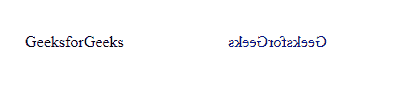
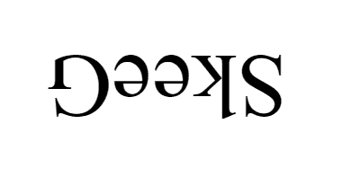
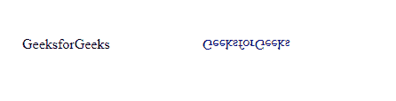
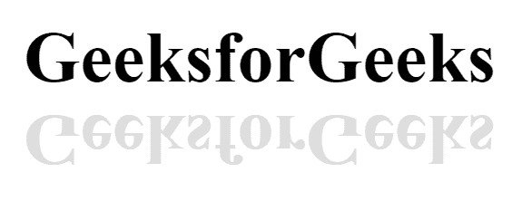

# 使用 CSS 翻转文本

> 原文:[https://www.geeksforgeeks.org/flip-the-text-using-css/](https://www.geeksforgeeks.org/flip-the-text-using-css/)

翻转效果创建文本的镜像。您可以水平和垂直翻转文本。CSS3 允许添加各种效果，包括由于其转换功能而导致的文本翻转。您可以在没有任何 JavaScript 代码的情况下翻转文本。

下面是不使用 JavaScript 翻转文本的例子，它只包括 HTML 和 CSS。

有各种类型的文本翻转:

*   水平翻转
*   垂直翻转
*   倒置翻转
*   文本的镜像

**按照步骤:**

*   **创建 HTML 文件:**
    使用类名为“abc”的< span >元素(根据您的选择)。
*   **创建 CSS 文件:**
    1.  指定<跨度>的**显示**和**边距**属性。
    2.  使用**变换**属性设置所需的翻转(如垂直文本翻转、水平文本翻转、上下文本翻转、文本镜像)
    3.  如果您希望翻转文本具有不同的颜色，请添加**颜色**。

下面的例子说明了这种方法:

**示例 1:** 水平翻转文本的 HTML CSS 代码

## 超文本标记语言

```html
<!DOCTYPE html>
<html>
  <head>
    <title> Title  you want </title>
    <style>
      span{
        display: Inline-block;
        margin: 50px;
      }

      .GFG{                 
        transform: scale(-1, 1);
        color: #000080;
        -moz-transform: scale(-1, 1);
        -webkit-transform: scale(-1, 1);
        -o-transform: scale(-1, 1);
        -ms-transform: scale(-1, 1);
        transform: scale(-1, 1);
      }
    </style>

  </head>
  <body>
    <!-- here write your text you want to flip -->
    <span>GeeksforGeeks</span>  
    <!-- your class name must be as you 
         above written with .class name -->
    <span class="GFG">GeeksforGeeks</span>  
  </body>

</html>
```

**输出:**



水平翻转文本

**示例 2:** 将文本上下颠倒的 HTML CSS 代码。

## 超文本标记语言

```html
<!DOCTYPE html>
<html>
  <head>
    <title>Title as you want</title>
    <style>
      .container {
        display: flex;
        justify-content: center;
        align-items: center;
        height: 100vh;
      }
      .backwards {
        display: inline;
        font-size: 100px;
        font-style: bold;
        -moz-transform: scale(-1, -1);
        -webkit-transform: scale(-1, -1);
        -o-transform: scale(-1, -1);
        -ms-transform: scale(-1, -1);
        transform: scale(-1, -1);
      }
    </style>
  </head>

  <body>
    <ul class="container">
      <li class="backwards">G</li>
      <li class="backwards">e</li>
      <li class="backwards">e</li>
      <li class="backwards">k</li>
      <li class="backwards">S</li>
    </ul>
  </body>

</html>
```

**输出**:



翻转过来

**示例 3:** 垂直翻转文本的 HTML CSS 代码。

## 超文本标记语言

```html
<!DOCTYPE html>

<html>

<head>

    <title> Title you want </title>
    <!-- write your title between title tag -->

    <style>
        span {
            display: Inline-block;
            margin: 50px;
        }

        .GFG {
            transform: scale(1, -1);
            color: #000080;
            -moz-transform: scale(1, -1);
            -webkit-transform: scale(1, -1);
            -o-transform: scale(1, -1);
            -ms-transform: scale(1, -1);
            transform: scale(1, -1);
        }
    </style>

</head>

<body>

    <span>GeeksforGeeks</span>
    <!-- here write your text you want to flip -->

    <span class="GFG">GeeksforGeeks</span>
    <!-- your class name must be as you above written with .class name -->

</body>

</html>
```

**输出:**



垂直翻转文本

**例 4:**

## 超文本标记语言

```html
<!DOCTYPE html>
<html>

<head>
    <title>Title as you want </title>
    <style>
        body {
            display: flex;
            justify-content: center;
        }

        .main {
            display: inline-flex;
        }

        .box {
            margin-top: 100px;
            font-size: 5em;
            color: #000;
            font-weight: 900;
        }

        #box1::after {
            content: "GeeksforGeeks";
            display: flex;
            transform: rotateX(180deg);
            -webkit-background-clip: text;
            color: #ddd;
        }
    </style>
</head>

<body>
    <div class="main">
        <div class="box" id="box1">GeeksforGeeks</div>
    </div>
</body>

</html>
```

**输出:**



镜像文本