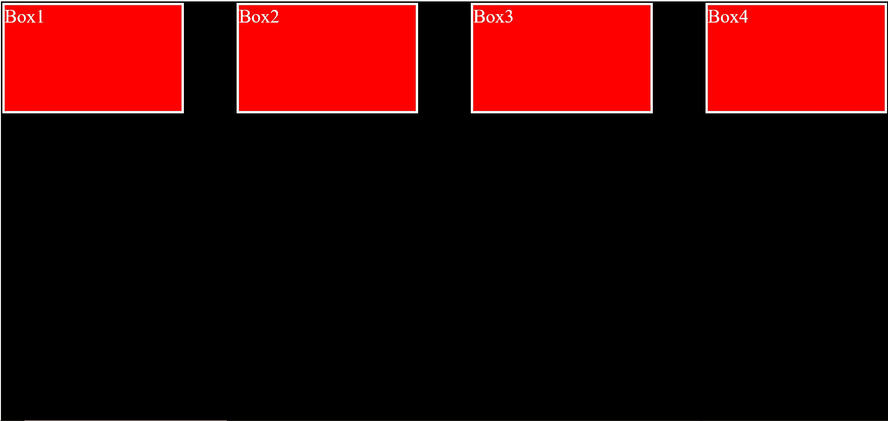
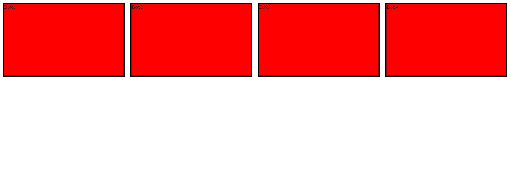

# 使用 CSS 等间距划分的流体宽度

> 原文:[https://www . geesforgeks . org/fluid-width-with-等距-div-using-css/](https://www.geeksforgeeks.org/fluid-width-with-equally-spaced-div-using-css/)

有两种方法可以使用 CSS 创建等间距的“div”元素。

**方法 1:** 在 CSS 中使用 Flexbox 技术

**方法:**我们可以制作一个容器，然后将*显示*属性设置为 *flex* 。它创建了一个弹性框。现在，我们可以将 flexbox 属性应用于容器的项目。因此，我们将*调整内容*属性设置为*间距*以创建大小相等的“div”元素。

**语法:**

```html
.container {
    display: flex;
    justify-content: space-between;
}
```

**示例 1:** 以下代码说明了上述概念。

## 超文本标记语言

```html
<!DOCTYPE html>
<html lang="en">

<head>
    <meta charset="UTF-8">
    <meta name="viewport" content=
        "width=device-width, initial-scale=1.0">

    <style>
        #container {
            width: 98vw;
            height: 100vh;
            border: 2px solid black;
            /*Making the container a flexbox*/
            display: flex;
            /*Making equal spaced divs*/
            justify-content: space-between;
            background-color: black;
        }

        .box {
            width: 20%;
            height: 25%;
            background-color: red;
            color: white;
            font-size: 2rem;
            border: 4px solid white;
        }
    </style>
</head>

<body>
    <div id="container">
        <div class="box">Box1</div>
        <div class="box">Box2</div>
        <div class="box">Box3</div>
        <div class="box">Box4</div>
    </div>
</body>

</html>
```

**输出:**



使用 flex 属性的等间距 div 元素

**方法 2:** 在 CSS 中使用网格属性

**进场:**首先我们将集装箱的*显示*设置为*网格*。然后使用 CSS 的*间隙*属性创建等间距的“div”元素。

**语法:**

```html
.container {
    display: grid;
    gap: 1rem;
}
```

**例 2:** 下面的代码说明了上面的概念。

## 超文本标记语言

```html
<!DOCTYPE html>
<html lang="en">

<head>
    <meta charset="UTF-8">
    <meta name="viewport" content=
        "width=device-width, initial-scale=1.0">

    <style>
        #container {

            /* Using the grid property */
            display: grid;
            grid-template-columns: 1fr 1fr 1fr 1fr;

            /* Making equal spaced divs */
            gap: 1rem;
        }

        .box {
            border: 4px solid black;
            background-color: red;
            height: 30vh;
        }
    </style>
</head>

<body>
    <div id="container">
        <div class="box">Box1</div>
        <div class="box">Box2</div>
        <div class="box">Box3</div>
        <div class="box">Box4</div>
    </div>
</body>

</html>
```

**输出:**

