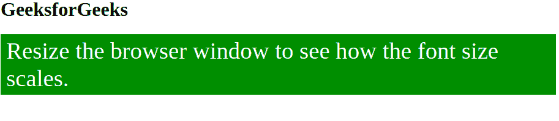
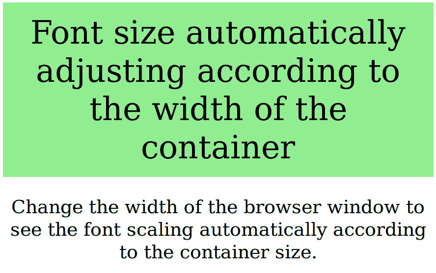

# 使用 CSS 基于容器宽度的字体缩放

> 原文:[https://www . geeksforgeeks . org/font-scaling-基于容器宽度-使用-css/](https://www.geeksforgeeks.org/font-scaling-based-on-width-of-container-using-css/)

字体大小可以用 vw(视口)单位设置，这意味着视口宽度。视口是浏览器窗口的大小。1vw =视口宽度的 1%。如果视窗是 50 厘米宽，1vw 是 0.5 厘米。这样字体大小将跟随浏览器窗口的大小。
**语法:**

```html
element {
    font-size: #vw;
    // CSS Property
}
```

其中#是相对于容器大小的数字。
**例 1:**

## 超文本标记语言

```html
<!DOCTYPE html>
<html>
  <head>
    <meta name="viewport" content="width=device-width, initial-scale=1" />
    <title>Font Scaling</title>
    <style>
      #container {
        display: inline-block;
        background-color: green;
        padding: 0.5vw 1vw;
      }
      .divtext {
        display: table;
        color: white;
        font-family: impact;
        font-size: 4.2vw;
      }
    </style>
  </head>
  <body>
    <h1>GeeksforGeeks</h1>
    <div id="container">
      <div class="divtext">
        Resize the browser window to see how the font size scales.
      </div>
    </div>
  </body>
</html>
```

**输出:**



**示例 2:** 媒体查询可用于在特定屏幕尺寸上更改元素的字体大小。

## 超文本标记语言

```html
<!DOCTYPE html>
<html>
    <head>
        <meta name="viewport" content="width=device-width, initial-scale=1">
        <title>Font Scaling</title>
        <style>
            h2 {
                text-align: center;
            }
            div.example {
                background-color: lightgreen;
                padding: 20px;
                text-align: center;
            }
            @media screen and (min-width: 601px) {
                div.example {
                    font-size: 40px;
                }
                .a{
                    font-size: 25px;
                    text-align: center;
                }
            }
            @media screen and (max-width: 600px) {
                div.example {
                    font-size: 30px;
                }
                .a{
                    font-size: 18px;
                    text-align: center;
                }
            }
            @media screen and (min-width: 800px) {
                div.example {
                    font-size: 60px;
                }
                .a{
                    font-size: 35px;
                }
            }
        </style>
    </head>
    <body>
        <div class="example">Font size automatically adjusting
        according to the width of the container</div>
        <p class = "a">Change the width of the browser window
        to see the font scaling automatically according to the
        container size.</p>

    </body>
</html>                   
```

**输出:**



**注意:**更改浏览器窗口大小，查看字体大小的变化。