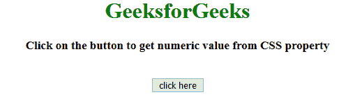
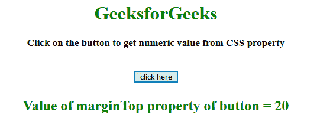
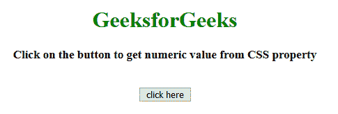
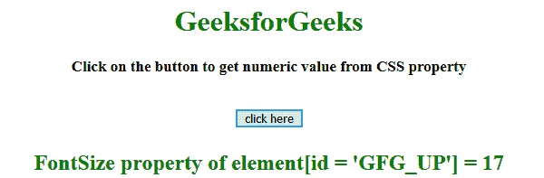

# 使用 jQuery

获取 CSS 属性的数值部分

> 原文:[https://www . geesforgeks . org/get-the-numeric-part-of-CSS-property-using-jquery/](https://www.geeksforgeeks.org/get-the-numeric-part-of-css-property-using-jquery/)

给定一个 HTML 文档，任务是获取 CSS 属性的数字部分。比如如果 margin-top = 10px，我们只需要提取 10。这里讨论的方法很少。
先了解几个方法。

*   **jQuery on() Method**
    This method adds one or more event handlers for the selected elements and child elements.
    **Syntax:**

    ```html
    $(selector).on(event, childSel, data, fun, map)

    ```

    **参数:**

    *   **事件:**此参数为必填项。它指定要添加到选定元素的一个或多个事件或命名空间。
        如果有多个事件值，用空格隔开。事件必须是有效的。
    *   **儿童选择:**该参数为可选参数。它指定事件处理程序应该只附加到已定义的子元素。
    *   **数据:**此参数为可选。它指定要传递给函数的附加数据。
    *   **乐趣:**这个参数是必须的。它指定事件发生时要运行的函数。
    *   **映射:**它指定了一个事件映射({event:func()，event:func()，…})，该事件映射有一个或多个要添加到所选元素的事件，以及事件发生时要运行的函数。
*   **jQuery text()方法**
    该方法设置/返回所选元素的文本内容。
    如果使用此方法返回内容，则提供所有匹配元素的文本内容(HTML 标签将被移除)。
    如果用这个方法设置内容，它会替换所有匹配元素的内容。
    **语法:**
    *   **返回文字内容:**

```html
$(selector).text()

```

*   **设置文字内容:**

    ```html
    $(selector).text(content)

    ```

    *   **使用功能设置文本内容:**

    ```html
    $(selector).text(function(index, curContent))

    ```

**参数:**

*   **内容:**此参数为必填项。它为选定的元素指定新的文本内容。
*   **功能(索引，curContent):** 此参数可选。它指定了一个函数，为选定的元素返回新的文本内容。
    *   **索引:**返回元素在集合中的索引位置。
    *   **curContent:** 返回当前选中元素的内容。

*   **jQuery css() Method**
    This method set/return one or more than one style properties for the defined elements.
    **Syntax:**
    *   **返回 CSS 属性:**

        ```html
        css("propertyname")

        ```

    *   **设置 CSS 属性:**

        ```html
        css("propertyname", "value")

        ```

    *   **设置多个 CSS 属性:**

        ```html
        css({"propertyname":"value", "propertyname":"value", ...});

        ```

    **参数:**

    *   **propertyName:** 指定元素的属性。
    *   **值:**指定元素的值。*   **replace() method**
    This method searches for strings for a defined value, or a regular expression, and returns a new string with the replaced defined value.
    **Syntax:**

    ```html
    string.replace(searchVal, newvalue)

    ```

    **参数:**

    *   **搜索值:**此参数为必填项。它指定将被新值替换的值或正则表达式。
    *   **新值:**此参数为必填项。它指定要替换搜索值的值。

    **返回值:**
    返回一个新字符串，其中定义的值已被新值替换。

    **示例 1:** 本示例选择元素，然后使用**提取其属性。css()方法**，一个**正则表达式**和**替换()方法**。

    ```html
    <!DOCTYPE html>
    <html>

    <head>
        <title>
            JQuery | Get numeric part of CSS property.
        </title>
        <style>
            #GFG_UP {
                font-size: 17px;
                font-weight: bold;
            }

            #GFG_DOWN {
                color: green;
                font-size: 24px;
                font-weight: bold;
            }

            button {
                margin-top: 20px;
            }
        </style>
    </head>
    <script src="https://ajax.googleapis.com/ajax/libs/jquery/3.4.0/jquery.min.js">
    </script>

    <body style="text-align:center;" id="body">
        <h1 style="color:green;"> 
                GeeksforGeeks 
            </h1>
        <p id="GFG_UP">
        </p>
        <button>
            click here
        </button>
        <p id="GFG_DOWN">
        </p>
        <script>
            $('#GFG_UP').text('Click on the button to get numeric value from CSS property');
            $('button').on('click', function() {
                var data = $('button').css('marginTop').replace(/[^-\d\.]/g, '');
                $('#GFG_DOWN').text("Value of marginTop property of button = " + data);
            });
        </script>
    </body>

    </html>
    ```

    **输出:**

    *   **点击按钮前:**
        
    *   **点击按钮后:**
        

    **示例 2:** 本示例选择具有[id = 'GFG_UP']的元素，然后使用**提取其 fontSize 属性。css()方法**，一个**正则表达式**和**替换()方法**。

    ```html
    <!DOCTYPE html>
    <html>

    <head>
        <title>
            JQuery | Get numeric part of CSS property.
        </title>
        <style>
            #GFG_UP {
                font-size: 17px;
                font-weight: bold;
            }

            #GFG_DOWN {
                color: green;
                font-size: 24px;
                font-weight: bold;
            }

            button {
                margin-top: 20px;
            }
        </style>
    </head>
    <script src="https://ajax.googleapis.com/ajax/libs/jquery/3.4.0/jquery.min.js">
    </script>

    <body style="text-align:center;" id="body">
        <h1 style="color:green;"> 
                GeeksforGeeks 
            </h1>
        <p id="GFG_UP">
        </p>
        <button>
            click here
        </button>
        <p id="GFG_DOWN">
        </p>
        <script>
            $('#GFG_UP').text('Click on the button to get numeric value from CSS property');
            $('button').on('click', function() {
                var data = $('#GFG_UP').css('fontSize').replace(/[^-\d\.]/g, '');
                $('#GFG_DOWN').text("FontSize property of element[id = 'GFG_UP'] = " + data);
            });
        </script>
    </body>

    </html>
    ```

    **输出:**

    *   **点击按钮前:**
        
    *   **点击按钮后:**
        