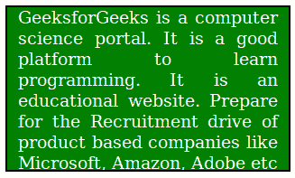

# 隐藏滚动条，但仍能使用 CSS 滚动

> 原文:[https://www . geeksforgeeks . org/hide-scroll-bar-但仍然能够使用-css 进行滚动/](https://www.geeksforgeeks.org/hide-scroll-bar-but-while-still-being-able-to-scroll-using-css/)

要隐藏滚动条，请使用 *-webkit-* ，因为它受到主要浏览器(谷歌浏览器、Safari 或 Opera 的更新版本)的支持。下面列出了其他浏览器的许多其他选项:

*   -webkit- (Chrome、Safari、新版 Opera):

    ```css
    .element::-webkit-scrollbar { width: 0 !important }
    ```

*   -moz- （火狐）：

    ```css
    .element { overflow: -moz-scrollbars-none; }
    ```

*   -ms- (Internet Explorer +10):

    ```css
    .element { -ms-overflow-style: none; }
    ```

**隐藏滚动条前需要考虑的要点:**

1.  优选地，仅当所有内容都可见时隐藏滚动条，否则用户可以跳过该内容
2.  避免在网页上水平滚动，不要隐藏水平滚动条，因为它们会使内容难以阅读
3.  If at all , hiding scroll is required : Display all important information above the fold. Users may often decide if they want to stay or not on what they can see without scrolling.

    **注意:**隐藏滚动条的实际例子是脸书聊天窗口。

    **示例:**

    ```css
    <!DOCTYPE html>
    <html>
        <head>
            <style>
                .content, .outer-border {
                    width: 240px;
                    height: 150px;
                    text-align:justify;
                    background-color:green;
                    color:white;
                    padding-left:10px;
                    padding-right:10px;
                }
                .outer-border {
                    border: 2px solid black;
                    position: relative;
                    overflow: hidden;
                }
                .inner-border {
                    position: absolute;
                    left: 0;
                    overflow-x: hidden;
                    overflow-y: scroll;
                }
                .inner-border::-webkit-scrollbar {
                    display: none;
                }
            </style>
        </head>
        <body>
            <div class="outer-border">
                <div class="inner-border">
                    <div class="content">
    GeeksforGeeks is a computer science portal. 
    It is a good platform to learn programming. It is an educational 
    website. Prepare for the Recruitment drive of product based 
    companies like Microsoft, Amazon, Adobe etc with a free online
    placement preparation course. The course focuses on various 
    MCQ's & Coding question likely to be asked in the interviews 
    & make your upcoming placement season efficient and successful. 
                    </div>
                </div>
            </div>
        </body>
    </html>                    
    ```

    **输出:**
    

    **示例:**

    ```css
    <!DOCTYPE html>
    <html>
        <head>
            <title>hide scrollbar</title>
            <style>
                .content, .outer-border {
                    width: 500px;
                    height: 210px;
                }
                .outer-border {
                    border: 2px solid black;
                    position: relative;
                    overflow: hidden;
                }
                .inner-border {
                    position: absolute;
                    left: 0;
                    overflow-x: hidden;
                    overflow-y: scroll;
                }
                .inner-border::-webkit-scrollbar {
                    display: none;
                }
            </style>
        </head>
        <body>
            <div class="outer-border">
                <div class="inner-border">
                <div class="content">
                
                
                </div>
                </div>
            </div>
        </body>
    </html>                    
    ```

    **输出:**
    

    HTML 是网页的基础，通过构建网站和网络应用程序用于网页开发。您可以通过以下 [HTML 教程](https://www.geeksforgeeks.org/html-tutorials/)和 [HTML 示例](https://www.geeksforgeeks.org/html-examples/)从头开始学习 HTML。

    CSS 是网页的基础，通过设计网站和网络应用程序用于网页开发。你可以通过以下 [CSS 教程](https://www.geeksforgeeks.org/css-tutorials/)和 [CSS 示例](https://www.geeksforgeeks.org/css-examples/)从头开始学习 CSS。