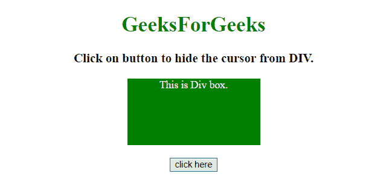
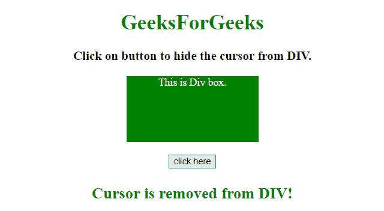
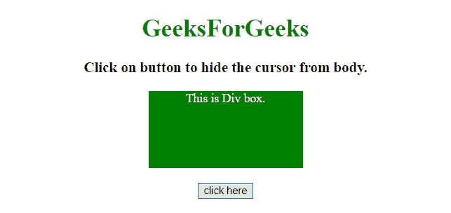
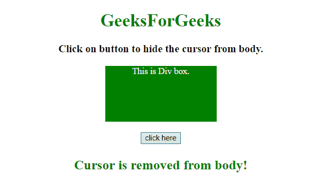

# 使用 CSS 和 JavaScript 隐藏网页中的光标

> 原文:[https://www . geesforgeks . org/hide-光标在网页中-使用-CSS-和-javascript/](https://www.geeksforgeeks.org/hide-the-cursor-in-a-webpage-using-css-and-javascript/)

给定一个 HTML 文档，任务是使用 CSS 和 JavaScript 隐藏给定元素的光标。

**进场:**

*   首先，选择光标元素需要隐藏的元素。
*   将 CSS 样式**光标:无**添加到 a 类中。
*   将类名(CSS 样式光标的类名:none)添加到要隐藏光标元素的特定元素中。

**示例 1:** 本示例对< div >元素隐藏光标。

```css
<!DOCTYPE HTML> 
<html> 
    <head> 
        <title> 
            Hide the cursor in a element
            using CSS and JavaScript
        </title>

        <style>
            #GFG_DIV {
                background: green;
                height: 100px;
                width: 200px;
                margin: 0 auto;
                color: white;
            }

            /* CSS style to hide cursor element */
            .newClass {
                cursor: none;
            }
        </style>
    </head> 

    <body style = "text-align:center;"> 

        <h1 style = "color:green;" > 
            GeeksForGeeks 
        </h1>

        <p id = "GFG_UP" style = 
            "font-size: 19px; font-weight: bold;">
        </p>

        <div id = "GFG_DIV">
            This is Div box.
        </div>
        <br>

        <button onClick = "GFG_Fun()">
            click here
        </button>

        <p id = "GFG_DOWN" style =
            "color: green; font-size: 24px; font-weight: bold;">
        </p>

        <!-- Script to hide cursor element -->
        <script>
            var up = document.getElementById('GFG_UP');
            var down = document.getElementById('GFG_DOWN');
            var div = document.getElementById('GFG_DIV');

            up.innerHTML = "Click on button to hide the cursor from DIV.";

            /* Function to add class name to hide cursor element */
            function GFG_Fun() {
                div.classList.add("newClass");
                down.innerHTML = "Cursor is removed from DIV!"; 
            }
        </script> 
    </body> 
</html>                    
```

**输出:**

*   **点击按钮前:**
    
*   **点击按钮后:**
    

**示例 2:** 本示例将光标隐藏在网页的<主体>之外。

```css
<!DOCTYPE HTML> 
<html> 
    <head> 
        <title> 
            Hide the cursor in a element
            using CSS and JavaScript
        </title>

        <style>
            #GFG_DIV {
                background: green;
                height: 100px;
                width: 200px;
                margin: 0 auto;
                color: white;
            }

            /* CSS style to hide cursor element */
            .newClass {
                cursor: none;
            }
        </style>
    </head> 

    <body style = "text-align:center;" id = "body"> 

        <h1 style = "color:green;" > 
            GeeksForGeeks 
        </h1>

        <p id = "GFG_UP" style =
            "font-size: 19px; font-weight: bold;">
        </p>

        <div id = "GFG_DIV">
            This is Div box.
        </div>
        <br>

        <button onClick = "GFG_Fun()">
            click here
        </button>

        <p id = "GFG_DOWN" style = 
            "color: green; font-size: 24px; font-weight: bold;">
        </p>

        <!-- Script to hide cursor element -->
        <script>
            var up = document.getElementById('GFG_UP');
            var down = document.getElementById('GFG_DOWN');
            var body = document.getElementById('body');

            up.innerHTML = "Click on button to hide the cursor from DIV.";

            /* Function to add class name to hide cursor element */
            function GFG_Fun() {
                body.classList.add("newClass");
                down.innerHTML = "Cursor is removed from body!"; 
            }
        </script> 
    </body> 
</html>                                
```

**输出:**

*   **点击按钮前:**
    
*   **点击按钮后:**
    