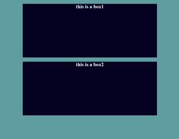

# 如何使用 CSS 将块元素居中？

> 原文:[https://www . geeksforgeeks . org/how-block-elements-can-centered-use-CSS/](https://www.geeksforgeeks.org/how-block-elements-can-be-centered-using-css/)

在本文中，我们将看到如何使用 CSS 使块级元素居中。

**方法:**将块级元素居中有两个步骤–

**第一步:定义外部宽度–**我们需要定义外部宽度。块级元素的默认宽度为网页的 100%，因此为了将块元素居中，我们需要在其周围留出空间。所以为了产生空间，我们给它一个宽度。

**第 2 步:将元素的左边距和右边距设置为自动–**因为我们通过提供外部宽度来产生剩余空间，所以现在我们需要正确对齐该空间，这就是为什么我们应该使用 margin 属性。边距是一个属性，它告诉如何对齐剩余的空间。因此，为了使元素居中，必须将左边距设置为自动，右边距设置为自动。

**语法:**

```html
element {
    width:200px;
    margin: auto;
}
```

以下示例表示如何将块级元素居中。

**示例 1:** 这里，单个元素(div)位于身体内部的中心。

## 超文本标记语言

```html
<!DOCTYPE html>
<html lang="en">

<head>
    <style>
        *{
            margin:0px;
            padding:0px;
            box-sizing: border-box;
        }

        body {
            background: brown;
        }

        #box {
            background: black;
            color:white;
            text-align: center;
        }

        /* For centering the element */
        #box {
            width:300px;
            margin:10rem auto;
        }
    </style>
</head>

<body>    
      <div id="box">
        <h3>this is a box</h3>
      </div>
</body>

</html>
```

**输出:**


**例 2:** 这里我们通过给定外部高度和宽度，一个接一个地将两个元素居中。

## 超文本标记语言

```html
<!DOCTYPE html>
<html lang="en">

<head>
    <style>
        *{
            margin:0px;
            padding:0px;
            box-sizing: border-box;
        }

        body {
            background: cadetblue;
        }

        .box {
            background: rgb(4, 2, 32);
            color: #eee;
            text-align: center;
            width: 500px;
            height: 200px;
            margin:1rem auto;
        }
    </style>
</head>

<body>
    <div id="box1" class="box">
        <h3>this is a box1</h3>
    </div>
    <div id="box1" class="box">
        <h3>this is a box2</h3>
    </div>
</body>

</html>
```

**输出:**

