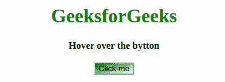

# CSS 转场如何使用线性渐变背景按钮？

> 原文:[https://www . geesforgeks . org/how-CSS-transition-work-with-linear-gradient-background-button/](https://www.geeksforgeeks.org/how-css-transition-work-with-linear-gradient-background-button/)

在 CSS 中，您可以在两种或多种颜色之间平滑过渡。CSS 有两种类型的渐变:

*   **线性渐变:**向下/向上/向左/向右/对角进行，颜色平滑过渡。要进行线性过渡，首先必须选择两个颜色停止。色标是您想要进行过渡的颜色。您也可以为过渡选择起点和方向(角度)。
    **背景-图像:线性-渐变(方向，颜色-stop1，颜色-stop2，…)；**
*   **径向梯度:**由中心定义。在这里，您还必须指定至少两个色点。

**语法:**

```html
background-image: radial-gradient(shape size at position, 
start-color, ...);
```

**示例:**

```html
<!DOCTYPE html>
<html>
    <head>
        <title>
            Transition work with linear gradient
            background button
        </title>
        <style>
            button {
                background-image: 
                linear-gradient(to bottom right, green, white);
            }
            button:hover {
                background-image: 
                linear-gradient(to bottom right, green, yellow);
            }

            h1 {
                color: green;
            }
        </style>
    </head>
    <body>
        <center>
            <h1>GeeksforGeeks</h1>
            <b>Hover over the bytton</b>
            <br>
            <br>
            <button>Click me</button>
        </center>
    </body>
</html>
```

**输出:**
