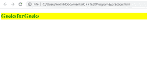
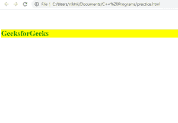

# 自动属性在边距中如何工作:CSS 中的 0 auto？

> 原文:[https://www . geesforgeks . org/how-do-auto-property-work-in-margin 0-auto-in-CSS/](https://www.geeksforgeeks.org/how-does-auto-property-work-in-margin0-auto-in-css/)

在本文中，我们将学习自动属性如何在 margin:0 自动在 CSS 中工作。margin 属性用于设置元素的边距。margin 属性有四个值:上边距、右边距、下边距和左边距。

**语法:**

```html
margin: top_margin right_margin bottom_margin left_margin;

/* We can also use the shortened syntax 
   of margin that takes only two parameters */

margin: top_and_bottom_margin left_and_right_margin;
```

所以在**边距:0 自动**中，上下边距为 0，左右边距为自动，其中自动是指浏览器根据容器自动设置左右边距，使元素居中。边距:0 自动等同于:

```html
margin-top:0;
margin-bottom:0;
margin-left:auto;
margin-right:auto;
```

**示例:**

## 超文本标记语言

```html
<!DOCTYPE html>
<html lang="en">

<head>
  <style>
    .parent{
      background-color: yellow;
      /* It set top and bottom margin to 5% and, the left and right
      are automatically set by browser */
      margin: 5% auto;
    }
    .h1{
      color: rgb(5, 138, 5);
      font-size: 50px;
    }
  </style>
</head>

<body>
  <div class="parent">
    <h1 class="h1">GeeksforGeeks</h1> 
  </div>
</body>

</html>
```

**输出:**

*   **设定边距前:**

    

*   **设定余量后:**

    