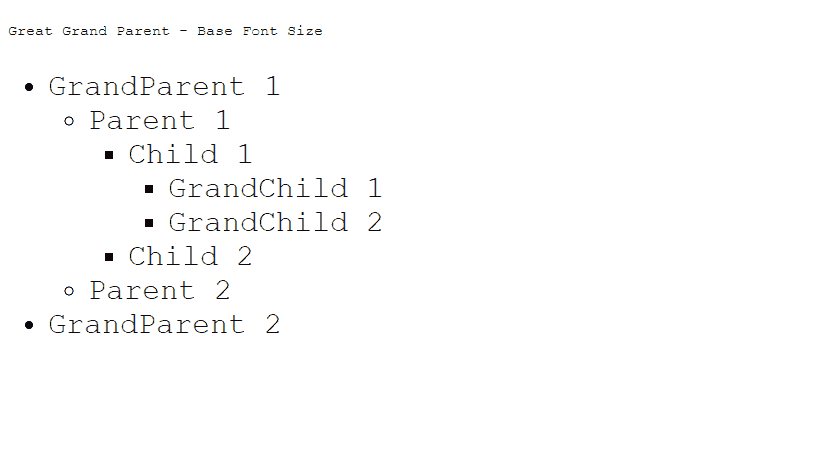

# 在 CSS 中 rem 和 em 有什么不同？

> 原文:[https://www . geeksforgeeks . org/how-to-rem-different-em-in-CSS/](https://www.geeksforgeeks.org/how-does-rem-differ-from-em-in-css/)

在这篇文章中，我们将了解 CSS 中的 *rem* & *em* ，它们是如何相互区别的。 ***em*** 和 ***rem*** 是 CSS 文档中可以用来使特定元素的字体大小相对于其父元素的相对长度 CSS 字体大小[单位](https://www.geeksforgeeks.org/css-units/)。

em 是一个 CSS [*字号*](https://www.geeksforgeeks.org/css-font-size-property/) 单位相对于其直接链接的父级， *rem* 与基本上是 HTML 元素的根元素的*字号*相关。

还有很多其他 [CSS 单位](https://www.geeksforgeeks.org/)也可以使用。让我们借助一个合适的例子来理解 em 和 rem 的区别。

**em CSS 单位:***em*单位是相对于其父单位的大小。

*   1 em =父代的大小
*   2 em =父代的两倍大
*   0.5em =父代的一半大小

**示例:**该示例演示了 CSS em 单元的使用，该单元指定了相对于直接元素或其父元素的字体大小。

## 超文本标记语言

```css
<!DOCTYPE html>
<html>

<head>
    <style>
    html {
        font-size: 15px;
        font-family: 'Courier New', Courier, monospace;
    }

    #grandPArent {
        font-size: 2em;
    }

    #parent {
        font-size: 2em;
    }

    #child {
        font-size: 2em;
    }

    #grandChild {
        font-size: 2em;
    }
    </style>
</head>

<body>

<p>Great Grand Parent - Base Font Size</p>

    <ul id="grandParent">
        <li>GrandParent 1</li>
        <ul id="garent">
            <li>Parent 1</li>
            <ul id="child">
                <li>Child 1</li>
                <ul id="grandChild">
                    <li>GrandChild 1</li>
                    <li>GrandChild 2</li>
                </ul>
                <li>Child 2</li>
            </ul>
            <li>Parent 2</li>
        </ul>
        <li>GrandParent 2</li>
    </ul>
</body>

</html>
```

**解释**:随着元素嵌套在一起，元素的相对大小继续以指数级的速度增长，在上面的例子中是 2x。

在本例中，子元素相对于父元素的相对大小为 2em(两倍于父元素的字体大小)，而父元素的相对大小又是 2em(两倍于父元素的父元素)w.r.t .祖父母的大小，现在是祖父母的 4 倍。

**输出:**


单位中的 CSS

*   基本元素(曾祖父)的大小:15px
*   爷爷 1，2 尺寸:30px
*   父 1，2 尺寸:60px
*   儿童 1，2 尺寸:120 像素
*   孙子 1，2:240 像素

**快速眼动 CSS 单位:***快速眼动*单位是相对于其基本根父元素的大小。

*   1 rem =根父元素(HTML 元素)的大小
*   2 rem =根父元素(HTML 元素)大小的两倍
*   0.5r em =根父元素(HTML 元素)大小的一半

在这种情况下，当元素嵌套在一起时，元素的相对大小保持不变，因为每个元素的大小与根 HTML 元素而不是其直接父元素成比例，因此属性不会向下传递给子代和孙代元素。

在这个特定的例子中，父元素的相对大小为 2rem(是根 HTML 元素字体大小的 2 倍)，与它的子元素和孙元素相同，因此即使在多级嵌套之后，其大小也保持不变。

**示例:**该示例演示了 CSS rem 单元的使用，该单元指定了相对于根元素的字体大小。

## 超文本标记语言

```css
<!DOCTYPE html>
<html>

<head>
    <style>
    html {
        font-size: 15px;
        font-family: 'Courier New', Courier, monospace;
    }

    #grandParent {
        font-size: 2rem;
    }

    #parent {
        font-size: 2rem;
    }

    #child {
        font-size: 2rem;
    }

    #grandChild {
        font-size: 2rem;
    }
    </style>
</head>

<body>

<p>Great Grand Parent - Base Font Size</p>

    <ul id="grandParent">
        <li>GrandParent 1</li>
        <ul id="garent">
            <li>Parent 1</li>
            <ul id="child">
                <li>Child 1</li>
                <ul id="grandChild">
                    <li>GrandChild 1</li>
                    <li>GrandChild 2</li>
                </ul>
                <li>Child 2</li>
            </ul>
            <li>Parent 2</li>
        </ul>
        <li>GrandParent 2</li>
    </ul>
</body>

</html>
```

**输出:**



快速眼动单位

*   基本(曾祖父)字号:15px
*   GrandParent1，2/Parent1，2/Child1，2/GrandChild1，2 字号= 30px

**注意:**请注意以上两个例子的输出，知道区别。

**使用** ***雷姆*** **优于*****em*****:**

*   当使用媒体查询功能将我们的应用程序扩展到响应布局时，我们可以直接改变根元素的基本*字体大小*，并且每个子元素都可以只使用根元素上的一个媒体查询直接扩展。
*   当用户更改了任何浏览器的默认基本*字体大小*时，我们的应用程序在这种情况下使用CSS *rem* 单位可以很好地扩展。