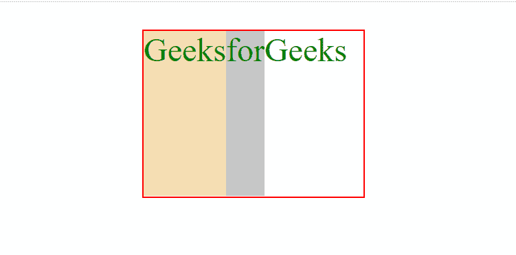
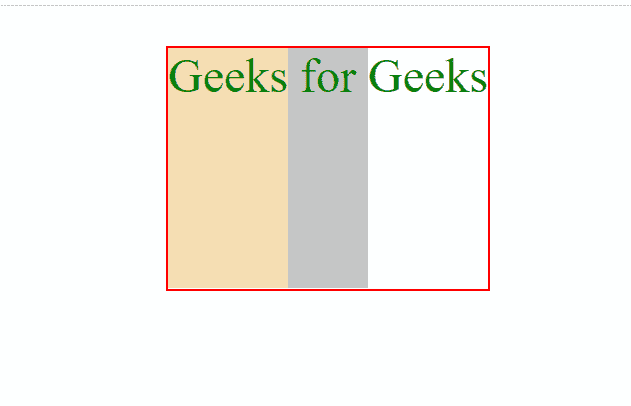

# 不管 CSS 中的内容如何，灵活的项目可以有多长？

> 原文:[https://www . geeksforgeeks . org/how-flexible-items-不管 css 中的内容如何，都可以是相同长度的项目/](https://www.geeksforgeeks.org/how-flexible-items-can-be-of-the-same-length-regardless-of-its-content-in-css/)

[**flex 属性**](https://www.geeksforgeeks.org/css-flex-property/) 用于设置灵活项目的长度，而不管它们在 CSS 中的内容如何。因此，为了使灵活的项目具有相同的长度，而不考虑它们在 CSS 中的内容，我们使用 flex 属性。它采用三个值:第一个是 flex-grow，它指定相对于剩余的灵活项目将增长多少个项目；第二个是 flex-shrink，它指定相对于剩余的灵活项目将收缩多少个项目；第三个是项目的长度。在本文中，我们将学习灵活的项目是如何相同长度的，而不管它们在 CSS 中的内容如何。

**语法:**

> flex:flex-grow flex-shrink flex-based | auto | initial | inherit；

**示例:**

## 超文本标记语言

```html
<!DOCTYPE html>
<html>

<head>
    <style>
        center {
            margin: 50px;
            color: green;
            font-size: 60px;
        }

        .parent {
            display: flex;
            border: solid 3px red;
            width: 400px;
            height: 300px;
        }

        .parent div {
            flex: 1;
        }

        .gfg1 {
            background-color: wheat;
        }

        .gfg2 {
            background-color: rgb(197, 197, 197);
        }

        .gfg3 {
            background-color: azure;
        }
    </style>
</head>

<body>
    <center>
        <div class="parent">
            <div class="gfg1">Geeks</div>
            <div class="gfg2">for</div>
            <div class="gfg3">Geeks</div>
        </div>
    </center>
</body>

</html>
```

**输出:**

**在应用弯曲属性之前:**



**应用弯曲属性后:**

