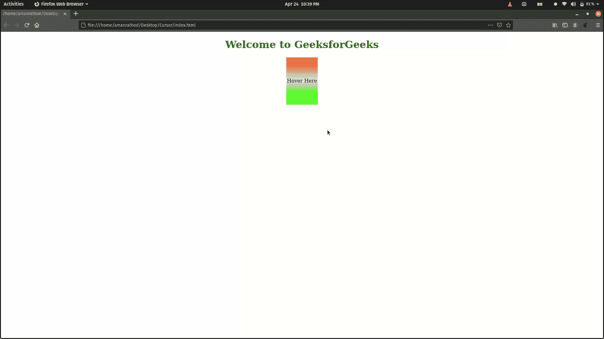
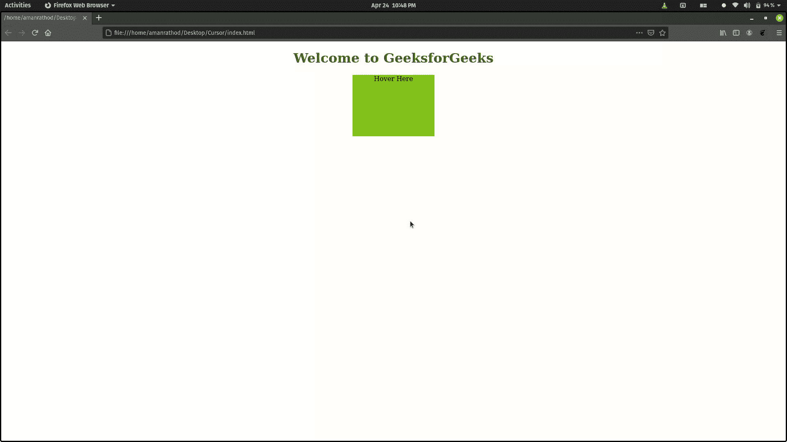

# 如何在 CSS 中将鼠标悬停在一个分割元素上来逐渐改变宽度？

> 原文:[https://www . geeksforgeeks . org/how-悬停在分割元素上以逐渐改变 css 中的宽度/](https://www.geeksforgeeks.org/how-hovering-over-a-division-element-to-gradually-change-the-width-in-css/)

你可以在 CSS 中使用 [**过渡属性**](https://www.geeksforgeeks.org/css-transition-property/) 来做一些过渡效果，比如改变元素的宽度。过渡效果可以使用伪类定义为两种状态(悬停和活动)，如:悬停或:活动或使用 JavaScript 动态设置的类。

**语法:**

```
transition: transition-property transition-duration
```

**注:**

*   **过渡属性:** t 指定应该应用过渡效果的 CSS 属性，如高度、宽度等。
*   **过渡-持续时间:**它指定过渡动画完成所需的时间长度。

**注意:**如果没有定义任何值，则浏览器采用默认值。

**例 1:**

## 超文本标记语言

```
<!DOCTYPE html>
<html>
<head>
<style> 
h1{
  color: green;
}
div {
  width: 100px;
  height: 150px;
  background: linear-gradient(
    0deg,
    rgb(65, 233, 14) 20%,
    rgb(229, 231, 229) 50%,
    rgb(255, 85, 7) 98%
  );
  transition: width 2s;

}
.text {

display: flex;
  align-items: center;
  justify-content: center 
}

div:hover {
  width: 300px;
}
</style>
</head>
<body>
<center>
<h1>Welcome to GeeksforGeeks</h1>

<div class="text">Hover Here</div>
</center>

</body>
</html>
```

**输出:**



**示例 2:** 下面的示例是在悬停时更改宽度、高度和颜色

## 超文本标记语言

```
<!DOCTYPE html>
<html>
<head>
<style> 
h1{
  color: green;
}
div {
  width: 200px;
  height: 150px;
  background:#81b214;
  transition: width 2s, height 2s;

}

div:hover {
  width: 500px;
  height: 100px;
  background:  #29bb89;

}
</style>
</head>
<body>
<center>
<h1>Welcome to GeeksforGeeks</h1>

<div class="text">Hover Here</div>
</center>

</body>
</html>
```

**输出:**

