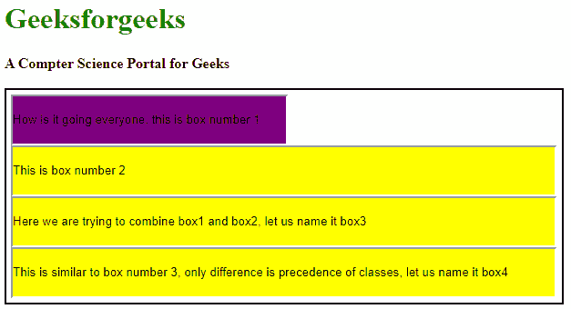

# CSS 中类的顺序是如何工作的？

> 原文:[https://www . geesforgeks . org/how-order-of-class-work-in-CSS/](https://www.geeksforgeeks.org/how-order-of-classes-work-in-css/)

许多开发人员都知道 CSS 中类覆盖的概念。嗯，是真的，但是当涉及到这些类如何被覆盖时，他们中的大多数人会感到困惑。类是前端开发的重要资产之一。因此，明确它们是非常重要的。需要包含在 HTML 元素中的样式属性在类中定义，然后可以使用标签中的“样式”属性来调用。style 属性支持您提供的尽可能多的值(类)，混乱就从这里开始了！

无论是在块内的同一个文件中定义类，还是从不同的 CSS 文件中调用类。这条规则保持不变。

> 它们工作的类的顺序不取决于它们在类属性中的写入顺序。而是由它们在块或。css 文件"

如果多个类由相似的属性组成，并且它们在同一个 HTML 元素中使用。然后，修改了最新的类将用于元素的样式。

下面的例子说明了类的顺序的概念:

**例**

## 超文本标记语言

```css
<!DOCTYPE html>
<html>

<head>
    <title>Specify the order of classes in CSS</title>
    <style type="text/css">
        h1 {
            color: green;
        }

        .container {
            width: 600px;
            padding: 5px;
            border: 2px solid black;
        }

        .box1 {
            width: 300px;
            height: 50px;
            background-color: purple;
        }

        .box2 {
            width: 595px;
            height: 50px;
            background-color: yellow;
        }
    </style>
</head>

<body>
    <h1>Geeksforgeeks</h1>
    <b>A Computer Science Portal for Geeks</b>
    <br>
    <br>
    <div class="container">
        <div>
            <input type="text" class="box1" value=
            "How is it going everyone, this is box number 1">
        </div>

        <div>
            <input type="text" class="box2" value=
            "This is box number 2">
        </div>

        <div>
            <input type="text" class="box1 box2" value=
"Here we are trying to combine box1 and box2, let us name it box3">
        </div>

        <div>
            <input type="text" class="box2 box1" value=
"This is similar to box number 3, only difference is
 precedence of classes, let us name it box4">
        </div>
    </div>
</body>

</html>
```

**输出:**

*   现在，如果您注意到分别代表类 box1 和 box2 的 **div1** 和 **div2** 会给您预期的结果。


*   但是在 **div3** 样式属性为**box 1**T4】box 2 的情况下，调用了多个 CSS 类。现在人们可能很容易混淆，因为**框 1** 首先写在 **div3** 的样式属性中，因此被称为 prior，然后一旦调用**框 2** ，就应该覆盖**框 1** 。但事实并非如此。如果在 styling.css 文件中仔细看的话， **box1{}** 是在 **box2{}** 之前定义的，这就是为什么 **box1** 被 **box2** 覆盖的原因。在 **div4** 的情况下，当我们在**盒 1** 之前调用**盒 2** 时。同样的机构工作，并在 **div4** 块中提供**盒 2** 的样式。



**注意:**记住内联 CSS 总是比外部和内部 CSS 有更高的优先级。因此，如果在 HTML 元素中使用内嵌样式，那么内嵌样式中定义的属性将覆盖预定义的类。如果你知道 [**，你可以忽略所有这些事情！重要**](http://!important) 关键词。