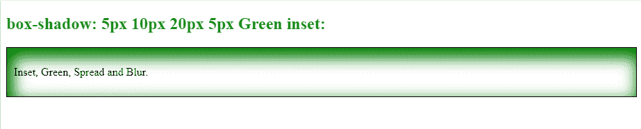

# 如何使用 CSS 设置嵌入阴影？

> 原文:[https://www . geesforgeks . org/how-set-the-inset-shadow-use-CSS/](https://www.geeksforgeeks.org/how-set-the-inset-shadow-using-css/)

在 CSS 中， [*框阴影*](https://www.geeksforgeeks.org/css-box-shadow-property/) 属性在元素的框架周围添加阴影效果。我们可以在用逗号分隔的元素周围设置多个效果。一个*框阴影*被定义为元素的 X 和 Y 相对偏移值，模糊和扩散半径，以及颜色。

在本文中，我们将学习如何使用 CSS 设置嵌入阴影。Inset 属性将外部阴影更改为内部阴影。

**注意:**默认情况下，阴影在框外生成，但是通过使用*嵌入*我们可以在框内创建阴影。

**语法:**

> 箱形阴影:h 偏移 v 偏移模糊扩散颜色|插图；

**方法:**要给元素添加*插图*阴影，我们将使用*框阴影*属性。在*框阴影*属性中，我们将定义 *h 偏移*值(对于水平阴影效果是强制的)，然后是 v 偏移值(对于垂直阴影效果是强制的)。

我们也可以给出*模糊*效果，并使用模糊和扩散值来扩散阴影。最后，我们将使用*插入*关键字来改变帧内的阴影。

**例 1:**

## 超文本标记语言

```css
<!DOCTYPE html>
<html>

<head>
    <style>
        #GFG {
            /* For providing border to the element */
            border: 1px solid;
            /* For Padding */
            padding: 10px;
            /* Defining box-shadow property inset */
            box-shadow: 5px 10px green inset;
        }

        h2 {
            color: green;
        }
    </style>
</head>

<body>

    <h2>Box-shadow: 5px 10px inset:</h2>
    <div id="GFG">

<p>Welcome to GeeksforGeeks</p>

    </div>
</body>

</html>
```

**输出:**


**说明:**在上例中，我们已经将 *h-offset* 值设置为 5px，v-offset 值设置为 10px，颜色设置为绿色。

**例 2:**

## 超文本标记语言

```css
<!DOCTYPE html>
<html>

<head>
    <style>
        #GFG {
            /* For providing border to the element */
            border: 1px solid;
            /* For Padding */
            padding: 10px;
            /* Defining box-shadow property as inset */
            box-shadow: 5px 10px 20px 5px Green inset;
        }

        h2 {
            color: green;
        }
    </style>
</head>

<body>

    <h2>box-shadow: 5px 10px 20px 5px Green inset:</h2>
    <div id="GFG">

<p>Inset, Green, Spread and Blur.</p>

    </div>

</body>

</html>
```

**输出:**



**说明:**在上例中，我们已经将 *h-offset* 值设置为 5px，v-offset 值设置为 10px，模糊值设置为 20px，扩散值设置为 5px，颜色设置为绿色。

**浏览器支持**

<figure class="table">

|  |
| --- |

</figure>