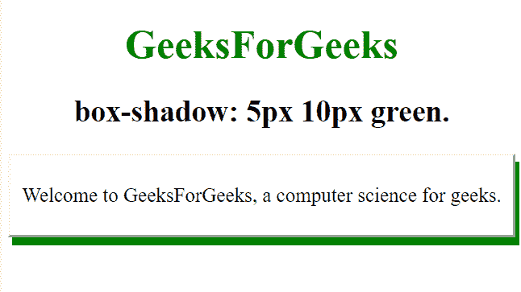
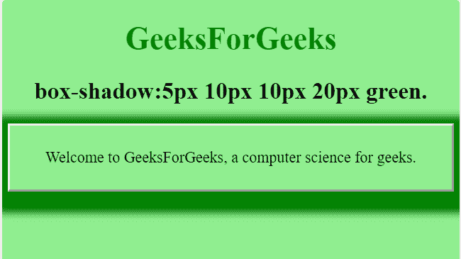

# 如何用 CSS 设置 div 的阴影颜色？

> 原文:[https://www . geeksforgeeks . org/how-set-shadow-of-color-div-using-CSS/](https://www.geeksforgeeks.org/how-set-the-shadow-color-of-div-using-css/)

在本文中，我们将看到如何使用 CSS 设置 div 的阴影颜色。就像人类有他们的阴影一样，我们可以使用 CSS 为 div 元素制作任何颜色的阴影。

**[方块阴影属性](https://www.geeksforgeeks.org/css-box-shadow-property/) :** 该属性用于为一个元素创建一个或多个阴影。

**进场:**

*   用 div 元素创建网页。
*   在 box-shadow 属性的帮助下，对 div 元素应用阴影。

**示例 1:** 在下面的示例中，我们在 box-shadow 属性的帮助下对 div 元素应用了一些阴影。

## 超文本标记语言

```css
<!DOCTYPE html>
<html>

<head>
  <style> 
    body{
        text-align:center;
        font-size:25px;
    }

    #test {
        border-style: outset;
        padding: 10px;
        box-shadow: 5px 10px green;
    }
  </style>
</head>

<body>
  <h1 style= "color:green">
      GeeksForGeeks
  </h1>

  <h2>box-shadow: 5px 10px green.</h2>
  <div id="test">

  <p>
    Welcome to GeeksForGeeks, a computer 
    science for geeks.
  </p>

  </div>
</body>

</html>
```

**输出:**



**例 2:**

## 超文本标记语言

```css
<!DOCTYPE html>
<html>

<head>
    <style> 
    body{
        text-align:center;
        font-size:22px;
        background-color:lightgreen;
    }

    #test {
        border-style: outset;
        padding: 10px;
        box-shadow: 5px 10px 10px 20px green;
        background-color:lightgreen;
    }
</style>
</head>

<body>
    <h1 style= "color:green">
        GeeksForGeeks
    </h1>

    <h2>box-shadow:5px 10px 10px 20px green.</h2>
    <div id="test">
        <p>
            Welcome to GeeksForGeeks, 
            a computer science for geeks.
        </p>

    </div>
</body>

</html>
```

**输出:**

