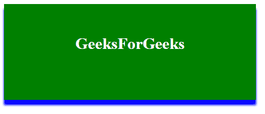
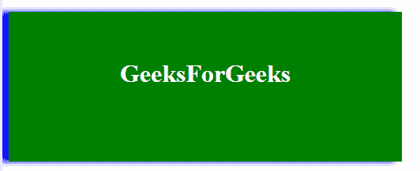
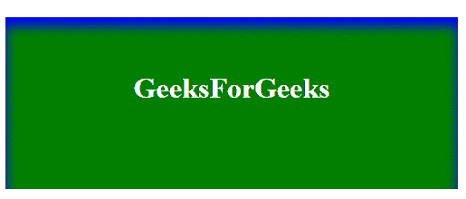

# 如何使用 CSS 在元素的一侧添加框阴影？

> 原文:[https://www . geesforgeks . org/如何使用 css 在元素的一面添加阴影框/](https://www.geeksforgeeks.org/how-to-add-a-box-shadow-on-one-side-of-an-element-using-css/)

[框阴影](https://www.geeksforgeeks.org/css-box-shadow-property/)属性用于设置元素一侧的框阴影。

**语法:**

```html
box-shadow: h-offset v-offset blur spread color;
```

**框阴影值:**

*   **h-offset:** 必选，用于水平设置阴影的位置。正值用于设置框右侧的阴影，负值用于设置框左侧的阴影。
*   **v-offset:** 必选，用于垂直设置阴影的位置。正值用于将下方的阴影设置为方框，负值用于将阴影设置为方框上方。
*   **模糊:**它是一个可选属性，这个属性的工作就是模糊盒子的阴影。
*   **扩散:**用于设置阴影的大小。利差的大小取决于利差的价值。
*   **颜色:**为可选属性，用于设置阴影的颜色。

**示例 1:** 本示例在框的底部设置框阴影。

```html
<!DOCTYPE html> 
<html> 

<head> 
    <title> 
        Box-shadow Property
    </title> 

    <!-- style to set box-shadow property -->
    <style>
        h1 {
            text-align: center;
            background: green;
            padding-top: 60px;
            color: white;
            width: 500px;
            height: 130px;
            box-shadow: 0 10px 10px blue; 
        }
    </style>
</head>

<body> 
    <h1>GeeksForGeeks</h1> 
</body> 

</html>                    
```

**输出:**


**例 2:** 本例在方框左侧设置方框阴影。

```html
<!DOCTYPE html> 
<html> 

<head> 
    <title> 
        Box-shadow Property
    </title> 

    <!-- style to set box-shadow property -->
    <style>
        h1 {
            text-align: center;
            background: green;
            padding-top: 60px;
            color: white;
            width: 500px;
            height: 130px;
            box-shadow: -10px 0px 10px blue; 
        }
    </style>
</head>

<body> 
    <h1>GeeksForGeeks</h1> 
</body> 

</html>                    
```

**输出:**


**嵌入:**默认情况下，阴影在框外生成，但嵌入值可用于在框内创建阴影。

**示例 3:** 本示例在框内创建阴影。

```html
<!DOCTYPE html> 
<html> 

<head> 
    <title> 
        Box-shadow Property
    </title> 

    <!-- style to set box-shadow property -->
    <style>
        h1 {
            text-align: center;
            background: green;
            padding-top: 60px;
            color: white;
            width: 500px;
            height: 130px;
            box-shadow: 0px 10px 20px blue inset; 
        }
    </style>
</head>

<body> 
    <h1>GeeksForGeeks</h1> 
</body> 

</html>                    
```

**输出:**
