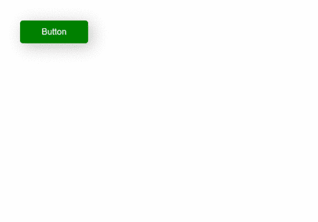
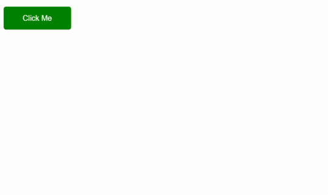

# 如何在 CSS 中增加按钮点击的按下效果？

> 原文:[https://www . geesforgeks . org/如何添加按钮点击效果 css/](https://www.geeksforgeeks.org/how-to-add-a-pressed-effect-on-button-click-in-css/)

在本教程中，我们将学习如何使用 CSS 在按钮上添加按压效果。这种效果是现代 UI 设计的一部分，在很多网站上都有使用。与正常行为相比，这种效果允许用户体验与按钮元素的交互。

我们就利用**主动**T2【伪类。当单击该类时，它会自动添加到 HTML 元素中。

**方法 1:**
我们可以使用 **CSS 变换属性**在按钮激活时为其添加一个按下效果。CSS [变换属性](https://www.geeksforgeeks.org/css-transform-property/)允许我们缩放、旋转、移动和倾斜元素。

**例 1:**

```css
<!DOCTYPE html>
<html>

<head>
    <style>
        /* Adding some basic styling to button */

        .btn {
            text-decoration: none;
            border: none;
            padding: 12px 40px;
            font-size: 16px;
            background-color: green;
            color: #fff;
            border-radius: 5px;
            box-shadow: 7px 6px 28px 1px rgba(0, 0, 0, 0.24);
            cursor: pointer;
            outline: none;
            transition: 0.2s all;
        }
        /* Adding transformation when the button is active */

        .btn:active {
            transform: scale(0.98);
            /* Scaling button to 0.98 to its original size */
            box-shadow: 3px 2px 22px 1px rgba(0, 0, 0, 0.24);
            /* Lowering the shadow */
        }
    </style>
</head>

<body>

    <!-- Button with a class 'btn' -->
    <button class="btn">Button</button>

</body>

</html>
```

**输出** :


**方法二:**
对于这个方法，我们可以玩一下 CSS 中的**翻译**功能。我们将在按钮的激活状态下使用`translateY(*length*)`功能。translateY()函数将 y 轴上的元素移动到给定的长度(以像素为单位)。

**例 2:**

```css
<!DOCTYPE html>
<html>

<head>
    <style>
        /* Adding basic styling to a button */

        .btn {
            padding: 15px 40px;
            font-size: 16px;
            text-align: center;
            cursor: pointer;
            outline: none;
            color: #fff;
            background-color: green;
            border: none;
            border-radius: 5px;
            box-shadow: box-shadow:
              7px 6px 28px 1px rgba(0, 0, 0, 0.24);
        }
        /* Adding styles on 'active' state */

        .btn:active {
            box-shadow: box-shadow:
              7px 6px 28px 1px rgba(0, 0, 0, 0.24);
            transform: translateY(4px);
            /* Moving button 4px to y-axis */
        }
    </style>
</head>

<body>

    <button class="btn">Click Me</button>

</body>

</html>
```

**输出** :


当`active` 伪类激活时，可以用其他方法玩，点击按钮时可以创建自己的效果。

CSS 是网页的基础，通过设计网站和网络应用程序用于网页开发。你可以通过以下 [CSS 教程](https://www.geeksforgeeks.org/css-tutorials/)和 [CSS 示例](https://www.geeksforgeeks.org/css-examples/)从头开始学习 CSS。