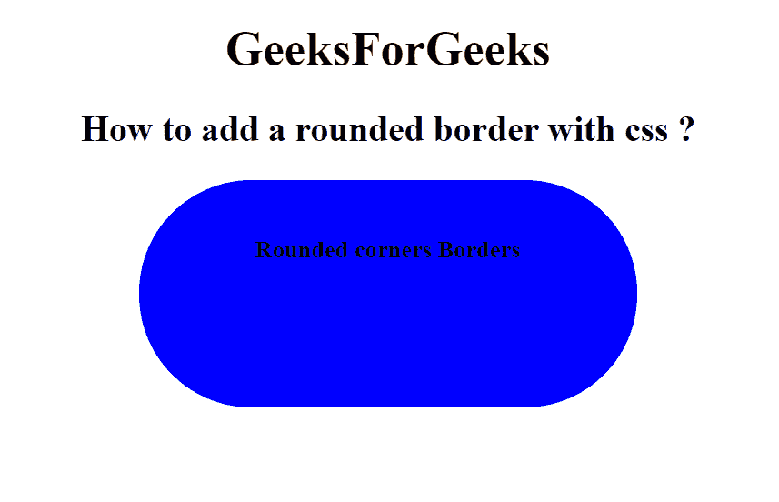

# 如何用 CSS 添加圆角边框？

> 原文:[https://www . geeksforgeeks . org/如何用 css 添加圆形边框/](https://www.geeksforgeeks.org/how-to-add-a-rounded-border-with-css/)

本文的目的是使用 CSS 中的*边框半径*属性给 HTML 元素添加一个圆角边框。它用于圆化元素的角。该属性为元素设置*边界半径*。

**语法:**

```html
border-radius: 1-4 length|% / 1-4 length|%|initial|inherit
```

**示例:**

```html
<!DOCTYPE html>
<html>

<head>
    <style>
        .GFG {
            border-radius: 75px 75px;
            background: blue;
            padding: 16px;
            text-align: center;
            width: 300px;
            height: 120px;
        }
    </style>
</head>

<body>
    <center>
        <h1>
            GeeksForGeeks
        </h1>
        <h2>
            How to add a rounded 
            border with css ?
        </h2>

        <div class="GFG">
            <h4>
                Rounded corners Borders
            </h4>
        </div>
    </center>
</body>

</html> 
```

输出:



**支持的浏览器:**

*   谷歌 Chrome
*   微软公司出品的 web 浏览器
*   火狐浏览器
*   歌剧
*   旅行队